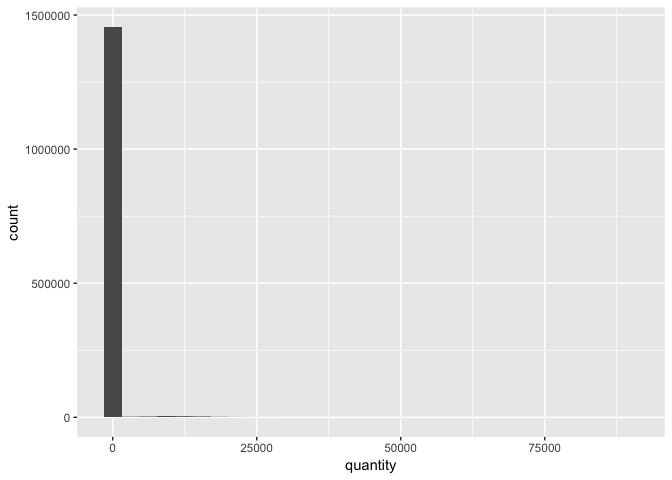
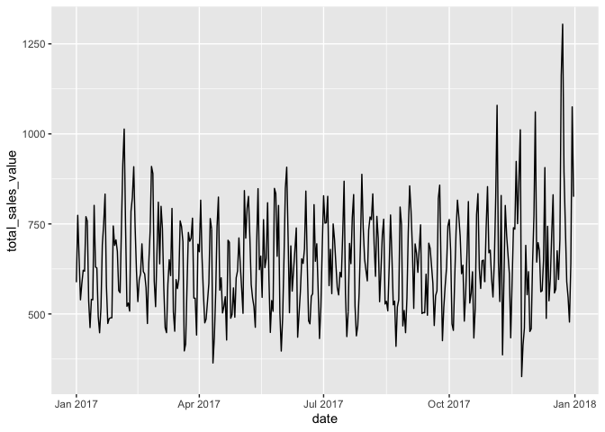
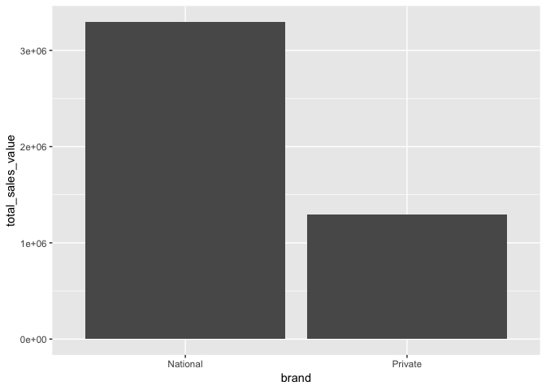
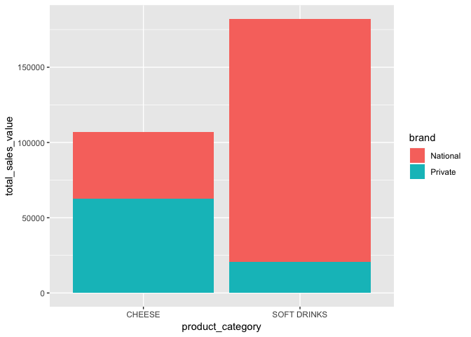
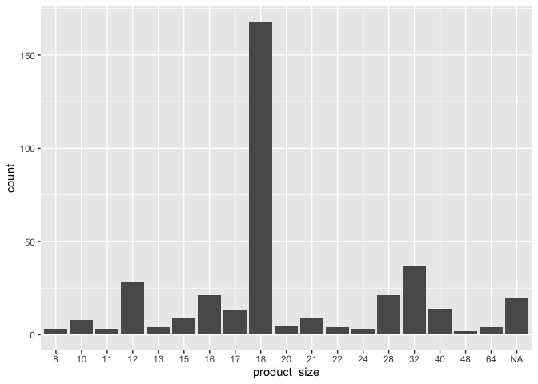

Day 1 Case Study Solutions
================

# Prerequisites

All of the exercises can be solved using the `tidyverse` and
`completejourney` packages. The `completejourney` package is an R data
package that has been created so the full suite of Complete Journey
datasets can be loaded as a library. In order to use the data you must
first install the package following these steps:

``` r
devtools::install_github('bradleyboehmke/completejourney')
```

**NOTE**: Installing packages from GitHub requires the installation of
the devtools package, which can be installed by running the following
command from the R console: `install.packages('devtools')`.

Go ahead and load the `tidyverse` and `completejourney` packages:

``` r
library(tidyverse)
library(completejourney)
```

The exercises that follow will use various data sets included in the
`completejourney` package to include:

``` r
transactions
products
```

# Data Transformation

The following five questions are based on concepts covered in the data
transformation (`dplyr`) slides. Answer them using `transactions` in the
Complete Journey data package modified with the following:

``` r
transactions <- transactions %>% 
  select(
    quantity,
    sales_value, 
    retail_disc, coupon_disc, coupon_match_disc,
    household_id, store_id, basket_id, product_id, 
    week, transaction_timestamp
  ) %>%
  mutate(date = lubridate::as_date(transaction_timestamp))
```

-----

**Question 1**: Change the discount variables (i.e., `retail_disc`,
`coupon_disc`, `coupon_match_disc`) from negative to positive.

**Hint:** Use the `abs()` function within `mutate()`.

This question is designed to strengthen your ability to use the `dplyr`
verb `mutate()` to overwrite an existing variable.

**Answer**:

``` r
transactions <- transactions %>% 
  mutate(
    retail_disc       = abs(retail_disc),
    coupon_disc       = abs(coupon_disc),
    coupon_match_disc = abs(coupon_match_disc)
  )
```

-----

**Question 2**: Create three new variables named `regular_price`,
`loyalty_price`, and `coupon_price` according to the following
logic:

``` r
regular_price = (sales_value + retail_disc + coupon_match_disc) / quantity
loyalty_price = (sales_value + coupon_match_disc) / quantity
coupon_price  = (sales_value - coupon_disc) / quantity
```

This question is designed to strengthen your ability to use the `dplyr`
verb `mutate()` to create new variables from existing ones. It should
also help you develop a better understanding of the discount variables
in `transactions`.

**Answer:**

``` r
(transactions <- transactions %>% 
  mutate(
    regular_price     = (sales_value + retail_disc + coupon_match_disc) / quantity,
    loyalty_price     = (sales_value + coupon_match_disc) / quantity,
    coupon_price      = (sales_value - coupon_disc) / quantity
  ) %>% 
  select(regular_price, loyalty_price, coupon_price, everything())
)
```

    ## # A tibble: 1,469,307 x 15
    ##    regular_price loyalty_price coupon_price quantity sales_value
    ##            <dbl>         <dbl>        <dbl>    <int>       <dbl>
    ##  1          0.5           0.5          0.5         1        0.5 
    ##  2          1.09          0.99         0.99        1        0.99
    ##  3          1.58          1.43         1.43        1        1.43
    ##  4          1.79          1.5          1.5         1        1.5 
    ##  5          1.79          1.39         1.39        2        2.78
    ##  6          5.99          5.49         5.49        1        5.49
    ##  7          1.79          1.5          1.5         1        1.5 
    ##  8          2.09          1.88         1.88        1        1.88
    ##  9          2.79          1.5          1.5         1        1.5 
    ## 10          2.69          2.69         2.69        1        2.69
    ## # ... with 1,469,297 more rows, and 10 more variables: retail_disc <dbl>,
    ## #   coupon_disc <dbl>, coupon_match_disc <dbl>, household_id <chr>,
    ## #   store_id <chr>, basket_id <chr>, product_id <chr>, week <dbl>,
    ## #   transaction_timestamp <dttm>, date <date>

-----

**Question 3**: `transactions` includes 68,509 unique product IDs. How
many of these products (not transactions\!) had a regular price of one
dollar or less? What does this count equal when loyalty price is one
dollar or less? How about when coupon price is one dollar or less?

**Hint:** After filtering, select the `product_id` column and count
unique products using the `n_distinct()` function.

This question is designed to strengthen your ability to use the `dplyr`
verbs `filter()` and `select()`.

**Answer:**

8,698 products had a regular price less than or equal to $1.00. This
count for loyalty price is 14,043 products. For coupon price, it’s
15,676. These numbers indicate that over 5,300 products were discounted
to a dollar or less with loyalty-card promotions or coupons.

``` r
transactions %>% 
  filter(regular_price <= 1) %>% 
  select(product_id) %>% 
  n_distinct()
```

    ## [1] 8698

``` r
transactions %>% 
  filter(loyalty_price <= 1) %>% 
  select(product_id) %>% 
  n_distinct()
```

    ## [1] 14043

``` r
transactions %>% 
  filter(coupon_price <= 1) %>% 
  select(product_id) %>% 
  n_distinct()
```

    ## [1] 15676

-----

**Question 4**: What proportion of baskets are over $10 in sales value?

**Hint:** You need to use `group_by()` and `summarize()`. Depending on
your approach you may or may not use `mutate()`.

This question is designed to strengthen your ability to use the `dplyr`
verbs `group_by()`, `summarize()` and `ungroup()`.

**Answer:**

Approximately 66% of baskets bring the retailer over $10 in value.

``` r
transactions%>%
  group_by(basket_id) %>%
  summarize(basket_value = sum(sales_value)) %>%
  summarize(proportion_over_10 = mean(basket_value > 10))
```

    ## # A tibble: 1 x 1
    ##   proportion_over_10
    ##                <dbl>
    ## 1              0.661

-----

**Question 5**: Which store with over $10K in total `sales_value`,
discounts its products the most for loyal customers?

**Hint:** You can calculate loyalty discount as a percentage of regular
price using the following logic:

``` r
pct_loyalty_disc = 1 - (loyalty_price / regular_price)
```

This question is designed to strengthen your ability to use the `dplyr`
verbs `filter()`, `mutate()`, `group_by()`, `summarize()`, and
`arrange()`.

**Answer:**

`store_id == 341` has, on average, a discount of 18.7% off regular price
for members of the retailer’s loyalty program. The code below returns
all stores in rank order to give a sense of how similar the discounting
is (not) between stores.

``` r
transactions %>%
  mutate(pct_loyalty_disc = 1 - (loyalty_price / regular_price)) %>%
  group_by(store_id) %>%
  summarize(
    total_sales_value    = sum(sales_value, na.rm = TRUE), 
    avg_pct_loyalty_disc = mean(pct_loyalty_disc, na.rm = TRUE)
  ) %>%
  filter(total_sales_value > 10000) %>%
  arrange(desc(avg_pct_loyalty_disc))
```

    ## # A tibble: 106 x 3
    ##    store_id total_sales_value avg_pct_loyalty_disc
    ##    <chr>                <dbl>                <dbl>
    ##  1 341                 24163.                0.187
    ##  2 306                 27890.                0.164
    ##  3 436                 29880.                0.157
    ##  4 31401               20265.                0.154
    ##  5 403                 32507.                0.153
    ##  6 422                 58873.                0.152
    ##  7 288                 21336.                0.152
    ##  8 370                 31398.                0.151
    ##  9 311                 37335.                0.150
    ## 10 443                 38471.                0.149
    ## # ... with 96 more rows

# Data Visualization

The following five questions are based on concepts covered in the data
visualization (`ggplot2`) slides. They can be answered using the
`transactions` and `products` datasets from the `completejourney`
package.

-----

**Question 1**: Create a histogram of the `quantity` variable in the
`transactions` data. What, if anything, do you find unusual about this
visualization?

This question is designed to strengthen your ability to use
`geom_histogram()`.

**Answer**:

The unusual aspect of the histogram is its extremely long tail. The
distance is so far that the histogram almost appears to be a single bar.
This distortion warrants further research and cleaning of the data
(e.g., `filter(quantity < 50)`).

``` r
ggplot(data = transactions) + 
  geom_histogram(mapping = aes(x = quantity))
```

<!-- -->

-----

**Question 2**: Use a line graph to plot total sales value by `date`.
What kind of patterns do you find?

This question is designed to strengthen your ability to use `dplyr`
verbs in combination with `geom_line()`.

**Answer**:

There is a definite weekly pattern to transactions; likely illustrating
how most folks buy the majority of their groceries on weekends. We also
see a few dates with very high and low amounts; likely related to
holidays.

``` r
transactions %>% 
  group_by(week, date) %>% 
  summarize(total_sales_value = sum(sales_value, na.rm = TRUE)) %>%
  ggplot() + 
  geom_line(mapping = aes(x = date, y = total_sales_value))
```

<!-- -->

-----

**Question 3**: Use a bar graph to compare the total sales values of
national and private-label brands.

**Hint**: Because `transactions` does not contain product metadata, run
the code below to create a new dataset with additional product
information in it. Use `my_transaction_data` for your
answer.

``` r
my_transaction_data <- left_join(transactions, products, by = 'product_id')
```

This question is designed to strengthen your ability to use `dplyr`
verbs in combination with `geom_col()`.

**Answer**:

``` r
my_transaction_data %>%
  group_by(brand) %>%
  summarize(total_sales_value = sum(sales_value)) %>%
  ggplot(aes(x = brand, y = total_sales_value)) + 
  geom_col()
```

<!-- -->

-----

**Question 4**: Building on Question 3, suppose you want to understand
whether the retailer’s customers’ preference for national brands
(compared to private-label brands) is stronger in the soft drink
category than it is in the cheese category. Examine this supposition by
using a stacked bar graph to compare the split between national and
private-label brands for soft drinks and cheeses.

**Hint**: Follow these three steps to create your plot:

  - Filter `my_transaction_data` to include only transactions with
    `product_category` equal to “SOFT DRINKS” or “CHEESE”
  - Calculate total sales value by `product_category` and `brand`
  - Create the bars using `geom_col` and include `fill = brand` within
    `aes()`

**Answer**:

``` r
my_transaction_data %>%
  filter(product_category %in% c('SOFT DRINKS', 'CHEESE')) %>%
  group_by(brand, product_category) %>%
  summarize(total_sales_value = sum(sales_value)) %>%
  ggplot(aes(x = product_category, y = total_sales_value, fill = brand)) + 
  geom_col()
```

<!-- -->

-----

**Question 5**: The code below filters `my_transaction_data` to include
only peanut better, jelly, and jam transactions. Then it creates a new
variable named `package_size` equal to product size in ounces. Create a
bar graph with `pb_and_j_data` to visualize the distribution of the
retailer’s PB\&J transactions by product size. Which two product sizes
are the most popular?

``` r
pb_and_j_data <- my_transaction_data %>% 
  filter(product_category == 'PNT BTR/JELLY/JAMS') %>%
  mutate(
    product_size = as.factor(as.integer(gsub('([0-9]+)([[:space:]]*OZ)', '\\1',
                                             package_size)))
  )
```

**Answer**:

The most popular product size for PB\&J products is 18oz. The runner-up
is 32oz.

``` r
ggplot(pb_and_j_data, aes(x = product_size)) + 
  geom_bar()
```

<!-- -->

This result can be confirmed numerically in the data:

``` r
pb_and_j_data %>% 
  count(product_size) %>% 
  arrange(-n)
```

    ## # A tibble: 22 x 2
    ##    product_size     n
    ##    <fct>        <int>
    ##  1 18            2926
    ##  2 32             737
    ##  3 12             559
    ##  4 16             498
    ##  5 28             470
    ##  6 <NA>           402
    ##  7 40             301
    ##  8 13             183
    ##  9 17             158
    ## 10 15             157
    ## # ... with 12 more rows
