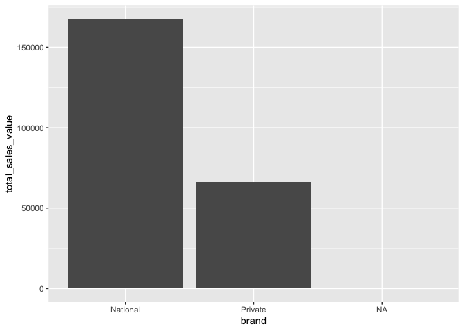

Day 1 Case Study Solutions
================

# Prerequisites

All of the exercises can be solved using the `tidyverse` and
`completejourney` packages. The `completejourney` package is an R data
package that has been created so the full suite of Complete Journey
datasets can be loaded as a library. You can find details about the data
and the variables at <http://bit.ly/completejourney>. In order to use
the data you must first install the package following these steps:

``` r
install.packages('completejourney')
```

Go ahead and load the `tidyverse` and `completejourney` packages:

``` r
library(tidyverse)
library(completejourney)
```

The exercises that follow will use various data sets included in the
`completejourney` package to
include:

``` r
transactions <- transactions_sample  # just using a sample of the entire data

transactions
## # A tibble: 75,000 x 11
##    household_id store_id basket_id product_id quantity sales_value
##    <chr>        <chr>    <chr>     <chr>         <dbl>       <dbl>
##  1 2261         309      31625220… 940996            1        3.86
##  2 2131         368      32053127… 873902            1        1.59
##  3 511          316      32445856… 847901            1        1   
##  4 400          388      31932241… 13094913          2       11.9 
##  5 918          340      32074655… 1085604           1        1.29
##  6 718          324      32614612… 883203            1        2.5 
##  7 868          323      32074722… 9884484           1        3.49
##  8 1688         450      34850403… 1028715           1        2   
##  9 467          31782    31280745… 896613            2        6.55
## 10 1947         32004    32744181… 978497            1        3.99
## # … with 74,990 more rows, and 5 more variables: retail_disc <dbl>,
## #   coupon_disc <dbl>, coupon_match_disc <dbl>, week <int>,
## #   transaction_timestamp <dttm>
products
## # A tibble: 92,331 x 7
##    product_id manufacturer_id department brand product_category
##    <chr>      <chr>           <chr>      <fct> <chr>           
##  1 25671      2               GROCERY    Nati… FRZN ICE        
##  2 26081      2               MISCELLAN… Nati… <NA>            
##  3 26093      69              PASTRY     Priv… BREAD           
##  4 26190      69              GROCERY    Priv… FRUIT - SHELF S…
##  5 26355      69              GROCERY    Priv… COOKIES/CONES   
##  6 26426      69              GROCERY    Priv… SPICES & EXTRAC…
##  7 26540      69              GROCERY    Priv… COOKIES/CONES   
##  8 26601      69              DRUG GM    Priv… VITAMINS        
##  9 26636      69              PASTRY     Priv… BREAKFAST SWEETS
## 10 26691      16              GROCERY    Priv… PNT BTR/JELLY/J…
## # … with 92,321 more rows, and 2 more variables: product_type <chr>,
## #   package_size <chr>
```

# Data Transformation

The following five exercises are based on concepts covered in the data
transformation (`dplyr`) slides.

-----

## Exercise 1

Create three new variables named `regular_price`, `loyalty_price`, and
`coupon_price` according to the following
logic:

``` r
regular_price = (sales_value + retail_disc + coupon_match_disc) / quantity
loyalty_price = (sales_value + coupon_match_disc) / quantity
coupon_price  = (sales_value - coupon_disc) / quantity
```

This question is designed to strengthen your ability to use the `dplyr`
verb `mutate()` to create new variables from existing ones. It should
also help you develop a better understanding of the discount variables
in `transactions`.

#### Answer

``` r
(transactions <- transactions %>% 
  mutate(
    regular_price     = (sales_value + retail_disc + coupon_match_disc) / quantity,
    loyalty_price     = (sales_value + coupon_match_disc) / quantity,
    coupon_price      = (sales_value - coupon_disc) / quantity
  ) %>% 
  select(regular_price, loyalty_price, coupon_price, everything())
)
## # A tibble: 75,000 x 14
##    regular_price loyalty_price coupon_price household_id store_id basket_id
##            <dbl>         <dbl>        <dbl> <chr>        <chr>    <chr>    
##  1          4.29          3.86         3.86 2261         309      31625220…
##  2          2.49          1.59         1.59 2131         368      32053127…
##  3          1.69          1            1    511          316      32445856…
##  4          7.38          5.94         5.94 400          388      31932241…
##  5          1.29          1.29         1.29 918          340      32074655…
##  6          2.99          2.5          2.5  718          324      32614612…
##  7          3.49          3.49         3.49 868          323      32074722…
##  8          3.79          2            2    1688         450      34850403…
##  9          5.50          3.28         3.28 467          31782    31280745…
## 10          3.99          3.99         3.99 1947         32004    32744181…
## # … with 74,990 more rows, and 8 more variables: product_id <chr>,
## #   quantity <dbl>, sales_value <dbl>, retail_disc <dbl>,
## #   coupon_disc <dbl>, coupon_match_disc <dbl>, week <int>,
## #   transaction_timestamp <dttm>
```

-----

## Exercise 2

`transactions` includes 20,902 unique product IDs. How many of these
products (not transactions\!) had a regular price of one dollar or less?
What does this count equal when loyalty price is one dollar or less? How
about when coupon price is one dollar or less?

**Hint:** After filtering, select the `product_id` column and count
unique products using the `n_distinct()` function.

This question is designed to strengthen your ability to use the `dplyr`
verbs `filter()` and `select()`.

#### Answer

2,748 products had a regular price less than or equal to $1.00. This
count for loyalty price is 4,648 products. For coupon price, it’s 4,844.
These numbers indicate that over 2,000 products were discounted to a
dollar or less with loyalty-card promotions or coupons.

``` r
# how many products had a regular price of $1 or less
transactions %>% 
  filter(regular_price <= 1) %>% 
  select(product_id) %>% 
  n_distinct()
## [1] 2748

# how many products had a loyalty price of $1 or less
transactions %>% 
  filter(loyalty_price <= 1) %>% 
  select(product_id) %>% 
  n_distinct()
## [1] 4648

# how many products had a coupon price of $1 or less
transactions %>% 
  filter(coupon_price <= 1) %>% 
  select(product_id) %>% 
  n_distinct()
## [1] 4844
```

-----

## Exercise 3

What proportion of baskets are over $10 in sales value?

**Hint:** You need to use `group_by()` and `summarize()`. Depending on
your approach you may or may not use `mutate()`.

This question is designed to strengthen your ability to use the `dplyr`
verbs `group_by()`, and `summarize()`.

#### Answer

Approximately 11% of baskets bring the retailer over $10 in value.

``` r
transactions%>%
  group_by(basket_id) %>%
  summarize(basket_value = sum(sales_value)) %>%
  summarize(proportion_over_10 = mean(basket_value > 10))
## # A tibble: 1 x 1
##   proportion_over_10
##                <dbl>
## 1              0.107
```

-----

## Exercise 4

Which stores had the largest total `sales_value` (hint:
`sum(sales_value, na.rm = TRUE)`? Which stores had the largest average
loyalty discount as defined below?

**Hint:** You can calculate loyalty discount as a percentage of regular
price using the following logic:

``` r
pct_loyalty_disc = 1 - (loyalty_price / regular_price)
```

This question is designed to strengthen your ability to use the `dplyr`
verbs `mutate()`, `group_by()`, `summarize()`, and `arrange()`.

#### Answer

`store_id == 367` has has the largest total sales value and `store_id
== 224` has the largest average loyalty discount percentage.

``` r
transactions %>%
  group_by(store_id) %>%
  summarize(total_sales_value = sum(sales_value, na.rm = TRUE)) %>%
  arrange(-total_sales_value)
## # A tibble: 293 x 2
##    store_id total_sales_value
##    <chr>                <dbl>
##  1 367                  7713.
##  2 406                  6034.
##  3 429                  4702.
##  4 343                  4471.
##  5 361                  4061.
##  6 356                  3807.
##  7 381                  3746.
##  8 292                  3702.
##  9 31782                3684.
## 10 321                  3515.
## # … with 283 more rows
```

``` r
transactions %>%
  mutate(pct_loyalty_disc = 1 - (loyalty_price / regular_price)) %>%
  group_by(store_id) %>%
  summarize(avg_pct_loyalty_disc = mean(pct_loyalty_disc, na.rm = TRUE)) %>%
  arrange(desc(avg_pct_loyalty_disc))
## # A tibble: 293 x 2
##    store_id avg_pct_loyalty_disc
##    <chr>                   <dbl>
##  1 224                     0.576
##  2 62                      0.501
##  3 779                     0.475
##  4 3163                    0.433
##  5 784                     0.430
##  6 2950                    0.418
##  7 572                     0.401
##  8 65                      0.390
##  9 486                     0.388
## 10 2839                    0.373
## # … with 283 more rows
```

# Data Visualization

The following five questions are based on concepts covered in the data
visualization (`ggplot2`) slides. They can be answered using the
`transactions` and `products` datasets.

-----

## Exercise 5

Create a histogram of the `quantity` variable in the `transactions`
data. What, if anything, do you find unusual about this visualization?

This question is designed to strengthen your ability to use
`geom_histogram()`.

#### Answer

The unusual aspect of the histogram is its extremely long tail. The
distance is so far that the histogram almost appears to be a single bar.
This distortion warrants further research and cleaning of the data
(e.g., `filter(quantity < 50)`).

``` r
ggplot(data = transactions, aes(x = quantity)) + 
  geom_histogram()
```

<!-- -->

-----

## Exercise 6

Use a line graph to plot total sales value by `date` (I have included a
mutate statement that parses the YYY-MM-DD from the
`transaction_timestamp` variable and names it `date`). What kind of
patterns do you find?

This question is designed to strengthen your ability to use `dplyr`
verbs in combination with `geom_line()`.

#### Answer

There is a definite weekly pattern to transactions; likely illustrating
how most folks buy the majority of their groceries on weekends. We also
see a few dates with very high and low amounts; likely related to
holidays.

``` r
transactions %>% 
  mutate(date = lubridate::as_date(transaction_timestamp)) %>%
  group_by(date) %>% 
  summarize(total_sales_value = sum(sales_value, na.rm = TRUE)) %>%
  ggplot(aes(x = date, y = total_sales_value)) + 
  geom_line()
```

<!-- -->

-----

## Exercise 7

Use a bar graph to compare the total sales values of national and
private-label brands.

**Hint**: Because `transactions` does not contain product metadata, run
the code below to create a new dataset with additional product
information in it. Use `my_transaction_data` for your
answer.

``` r
my_transaction_data <- left_join(transactions, products, by = 'product_id')
```

This question is designed to strengthen your ability to use `dplyr`
verbs in combination with `geom_col()`.

#### Answer

``` r
my_transaction_data %>%
  group_by(brand) %>%
  summarize(total_sales_value = sum(sales_value)) %>%
  ggplot(aes(x = brand, y = total_sales_value)) + 
  geom_col()
```

<!-- -->

-----

## Exercise 8

Building on the previous exercise, suppose you want to understand
whether the retailer’s customers’ preference for national brands
(compared to private-label brands) is stronger in the soft drink
category than it is in the cheese category. Examine this supposition by
using a stacked bar graph to compare the split between national and
private-label brands for soft drinks and cheeses.

**Hint**: Follow these three steps to create your plot:

  - Filter `my_transaction_data` to include only transactions with
    `product_category` equal to “SOFT DRINKS” or “CHEESE”
  - Calculate total sales value by `product_category` and `brand`
  - Create the bars using `geom_col` and include `fill = brand` within
    `aes()`

#### Answer

``` r
my_transaction_data %>%
  filter(product_category %in% c('SOFT DRINKS', 'CHEESE')) %>%
  group_by(brand, product_category) %>%
  summarize(total_sales_value = sum(sales_value)) %>%
  ggplot(aes(x = product_category, y = total_sales_value, fill = brand)) + 
  geom_col()
```

<!-- -->

-----

## Exercise 9

The code below filters `my_transaction_data` to include only peanut
better, jelly, and jam transactions. Then it creates a new variable
named `package_size` equal to product size in ounces. Create a bar graph
with `pb_and_j_data` to visualize the distribution of the retailer’s
PB\&J transactions by product size. Which two product sizes are the most
popular?

``` r
pb_and_j_data <- my_transaction_data %>% 
  filter(product_category == 'PNT BTR/JELLY/JAMS') %>%
  mutate(
    product_size = as.factor(as.integer(gsub('([0-9]+)([[:space:]]*OZ)', '\\1',
                                             package_size)))
  )
```

#### Answer

The most popular product size for PB\&J products is 18oz. The runner-up
is 32oz.

``` r
ggplot(pb_and_j_data, aes(x = product_size)) + 
  geom_bar()
```

<!-- -->

This result can be confirmed numerically in the data below:

``` r
pb_and_j_data %>% 
  count(product_size) %>% 
  arrange(-n)
## # A tibble: 19 x 2
##    product_size     n
##    <fct>        <int>
##  1 18             168
##  2 32              37
##  3 12              28
##  4 16              21
##  5 28              21
##  6 <NA>            20
##  7 40              14
##  8 17              13
##  9 15               9
## 10 21               9
## 11 10               8
## 12 20               5
## 13 13               4
## 14 22               4
## 15 64               4
## 16 8                3
## 17 11               3
## 18 24               3
## 19 48               2
```
