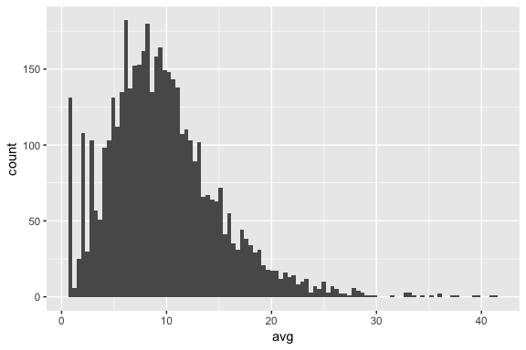
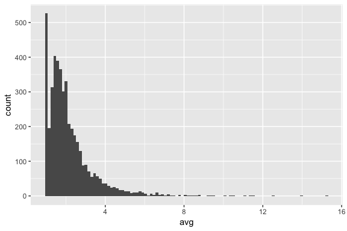
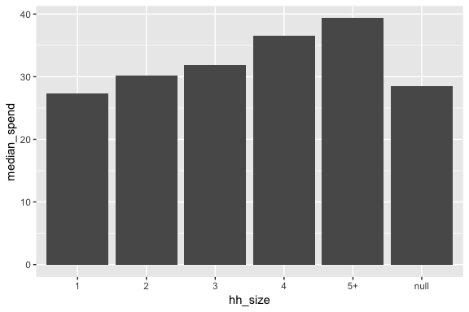
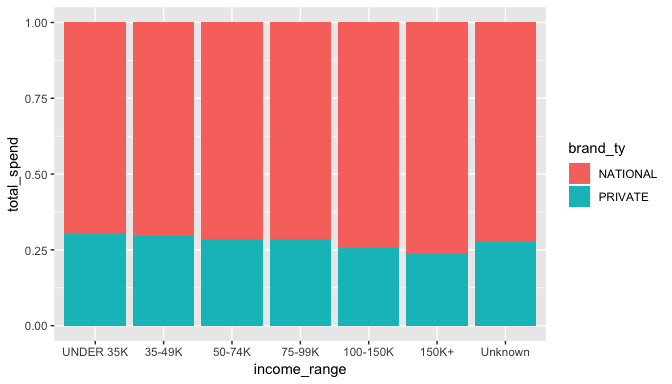
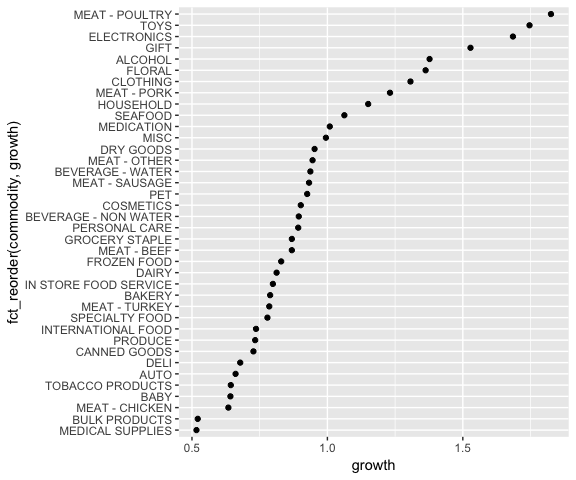

Day 2 Case Study Solutions
================

The following 6 exercises are based on concepts covered over the last
two days. They can be answered using the transactions.csv, products.csv,
and households.csv data sets. Start by loading the `tidyverse` and
importing the three .csv data sets.

``` r
# load tidyverse
library(tidyverse)

# import data
transactions <- data.table::fread("../data/transactions.csv", data.table = FALSE) %>% as_tibble()
products     <- data.table::fread("../data/products.csv", data.table = FALSE) %>% as_tibble()
households   <- data.table::fread("../data/households.csv", data.table = FALSE) %>% as_tibble()
```

## Exercise 1

How many unique households exist in the transactions data, and how many
of these households have demographic data in the households data?

Suggested steps:

1.  Use `distinct()` to create a tibble of unique `hshd_num` values.
2.  Use `nrow()` or `tally()` to count these households.
3.  Use an inner join to match transactions observations with households
    data.
4.  Use distinct() and nrow() to count the rows that remain.

#### Answer

``` r
# How many unique households exist in the transactions data
transactions %>%
  distinct(hshd_num) %>%
  tally()
## # A tibble: 1 x 1
##       n
##   <int>
## 1  4509

# How many of these households have demographic data in the households data
transactions %>%
  inner_join(households) %>%
  distinct(hshd_num) %>%
  tally()
## # A tibble: 1 x 1
##       n
##   <int>
## 1  4509
```

## Exercise 2

Compute the average number of unique products each household purchases
per week. Plot this distribution. Now do the same to identify the
average number of baskets each household has per week. This represents
the approximate number of store visits each household has per week.

Suggested steps:

1.  In both cases you want to group by household number and week
2.  For the first task you want to compute the number of distinct
    products (`prod_num`) and for the second you want to compute the
    number of distinct baskets (`basket_num`).
3.  In the second summarize function compute the mean of the number of
    distinct items that you computed in the first summarize.
4.  The x attribute in ggplot should be the average that you computed.
5.  Try adjusting the `bins = 100` to see how this affects your
    histogram.

#### Answer

``` r
# average number of unique products households buy per week
transactions %>% 
  group_by(hshd_num, week_num) %>% 
  summarize(n = n_distinct(product_num))  %>% 
  summarize(avg = mean(n)) %>% 
  ggplot(aes(avg)) + 
  geom_histogram(bins = 100)
```



``` r

# average number of visits each household has per week
transactions %>% 
  group_by(hshd_num, week_num) %>% 
  summarize(n = n_distinct(basket_num))  %>% 
  summarize(avg = mean(n)) %>% 
  ggplot(aes(avg)) + 
  geom_histogram(bins = 100)
```



## Exercise 3

Let’s compare how different household sizes spend. To do so, we’ll
compute the total spend per week for each household and then compute the
median for the different household sizes. Fill in the code chunk below.

Suggested steps:

1.  Group by household number and week
2.  Compute the total sum of spend
3.  Join this result with the households data
4.  Now group by household size
5.  Compute the median of the total spend
6.  Plot the result with household size on the x-axis and median total
    spend on the y-axis

#### Answer

``` r
transactions %>%
  # this part computes median spend per household
  group_by(hshd_num, week_num) %>%
  summarize(total_spend = sum(spend, na.rm = TRUE)) %>%
  # now join with households data and
  inner_join(households) %>%
  # compute the median by household size
  group_by(hh_size) %>%
  summarize(median_spend = median(total_spend, na.rm = TRUE)) %>%
  # plot the results
  ggplot(aes(x = hh_size, y = median_spend)) + 
  geom_col()
```



## Exercise 4

Are baskets with diapers in them more likely than average to have beer
in them too? Legend has it that placing these two product categories
closer together can increase beer sales
([Powers 2002](https://www.theregister.co.uk/2006/08/15/beer_diapers/)).
Although our data is not at this level of fidelity, we can compute if
baskets with *baby* products in them are more likely than average to
have *alcohol* in them too\!

Suggested steps:

1.  Join the transactions and products data
2.  Create two new variables representing logical TRUE/FALSE if
    `commodity` equals “BABY” or “ALCOHOL”
      - `baby_stuff = commodity == 'BABY'`
      - `alcohol = commodity == 'ALCOHOL'`
3.  Now group by basket and summarize if the basket does or does not
    contain baby stuff and alcohol. An easy way to do this is with use
    `basket_has_baby_stuff = max(baby_stuff)` within the summarize
    function. This will return a 0 or 1 for each basket number signally
    if baby products were present.
4.  Now compute the proportion of baskets that contain just alcohol
    versus both baby stuff and alcohol

#### Answer

``` r
transactions %>%
  # join with products data
  inner_join(products) %>% 
  # create two new variables representing TRUE/FALSE if commodity equals "BABY" or "ALCOHOL"
  mutate(
    baby_stuff = commodity == 'BABY', 
    alcohol    = commodity == 'ALCOHOL'
  ) %>%
  # summarize by basket number if it does/does not contain baby stuff and alcohol 
  group_by(basket_num) %>%
  summarize(
    basket_has_baby_stuff = max(baby_stuff), 
    basket_has_alcohol    = max(alcohol)
  ) %>%
  # now compute the proportion of baskets that contain just alcohol versus both baby stuff and alcohol
  summarize(
    prop_both   = sum(basket_has_baby_stuff * basket_has_alcohol == 1) / 
                  sum(basket_has_baby_stuff == 1),
    prob_beer   = mean(basket_has_alcohol),
    diaper_lift = prop_both / prob_beer
  )
## # A tibble: 1 x 3
##   prop_both prob_beer diaper_lift
##       <dbl>     <dbl>       <dbl>
## 1    0.0801    0.0775        1.03
```

## Exercise 5

Using a stacked bar chart that’s partitioned by income level (i.e.,
`income_range`), visualize the total amount of money customers spent on
national-brand products versus private-label products (`brand_ty`).
Since you will be presenting this to the CEO, be sure to properly adjust
the `income_range` so they are plotted in their natural order.

Suggested steps:

1.  Join the transactions, products, and households data
2.  Group the data by brand and income range and
3.  Compute the total spend
4.  Next, you probably want to adjust the levels of the income range
    variable with `fct_relevel` and or `fct_recode` so that they are in
    their natural order
5.  Plot the results. Use `fill = brand_ty` in `aes()` to fill the bars
    by brand and try including and excluding `position = 'fill'` in the
    `geom_col()` function to see how the resulting plot differs.

#### Answer

``` r
transactions %>%
  inner_join(products) %>%
  inner_join(households) %>%
  group_by(brand_ty, income_range) %>%
  summarize(total_spend = sum(spend, na.rm = TRUE)) %>%
  mutate(
    income_range = fct_recode(income_range, Unknown = "null"),
    income_range = fct_relevel(income_range,
                               "UNDER 35K", "35-49K", "50-74K",
                               "75-99K", "100-150K", "150K+", "Unknown")
) %>%
  ggplot(aes(income_range, total_spend, fill = brand_ty)) +
  geom_col(position = "fill")
```



## Exercise 6

Using the transactions and products datasets, determine which product
category (i.e., commodity) grew the most in terms of spend. Only
consider products that are not in the “HOLIDAY”, “SEASONAL PRODUCTS”, or
“OUTDOOR” commodity categories. Also, only consider products that have
revenue in both week 53 (first week in the data) and week 104 (last week
in the data).

Suggested steps:

1.  Join the transactions and products data
2.  Group by commodity and week
3.  Compute total spend
4.  Now group by only commodity
5.  Filter for products that are not in the “HOLIDAY”, “SEASONAL
    PRODUCTS”, or “OUTDOOR” commodity categories
6.  Filter for products that have revenue in weeks 53 and 104
7.  Get the total spend for weeks 53 and 104 for each product
8.  Compute the percent difference (using `spread` may be helpful here)
9.  Plot the results

#### Answer

``` r
transactions %>%
  inner_join(products) %>%
  group_by(commodity, week_num) %>%
  summarize(spend = sum(spend, na.rm = TRUE)) %>%
  group_by(commodity) %>%
  filter(
    !(commodity %in% c("HOLIDAY", "SEASONAL PRODUCTS", "OUTDOOR")),
    min(week_num) == 53 & max(week_num) == 104,
    week_num %in% c(53, 104)
    ) %>%
  spread(week_num, spend) %>%
  mutate(growth = `104` / `53`) %>%
  ggplot(aes(growth, fct_reorder(commodity, growth))) +
  geom_point()
```


