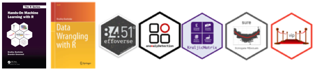
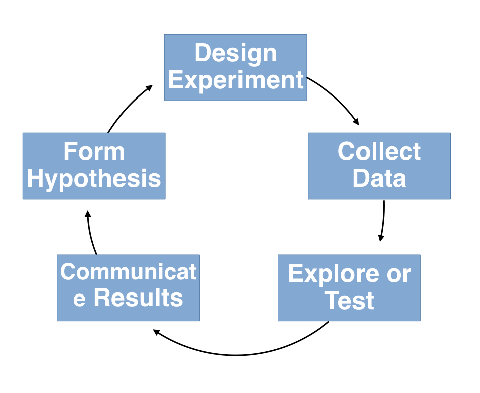
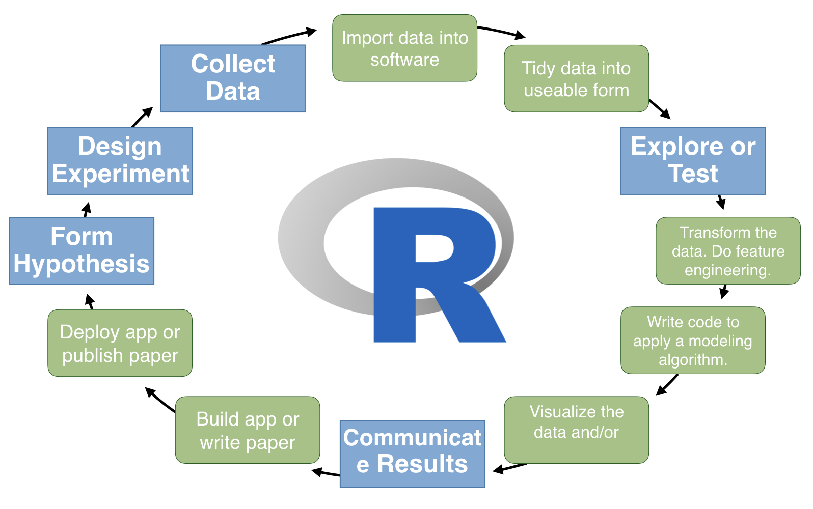
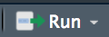
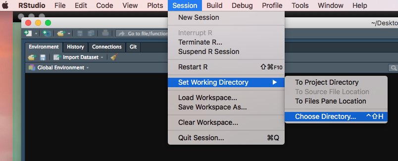
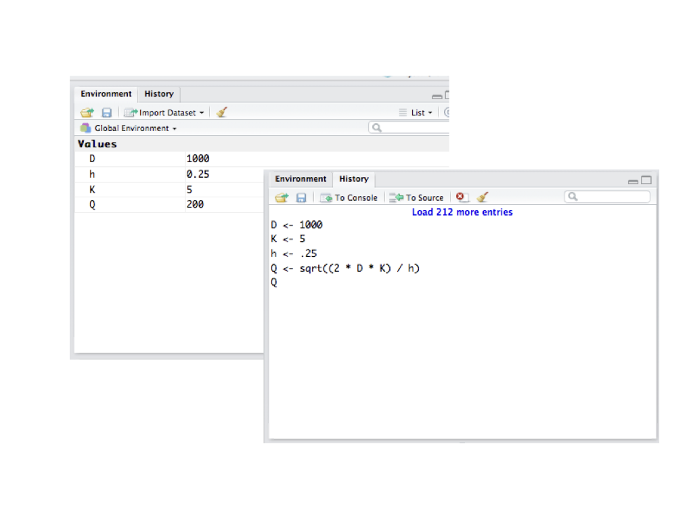
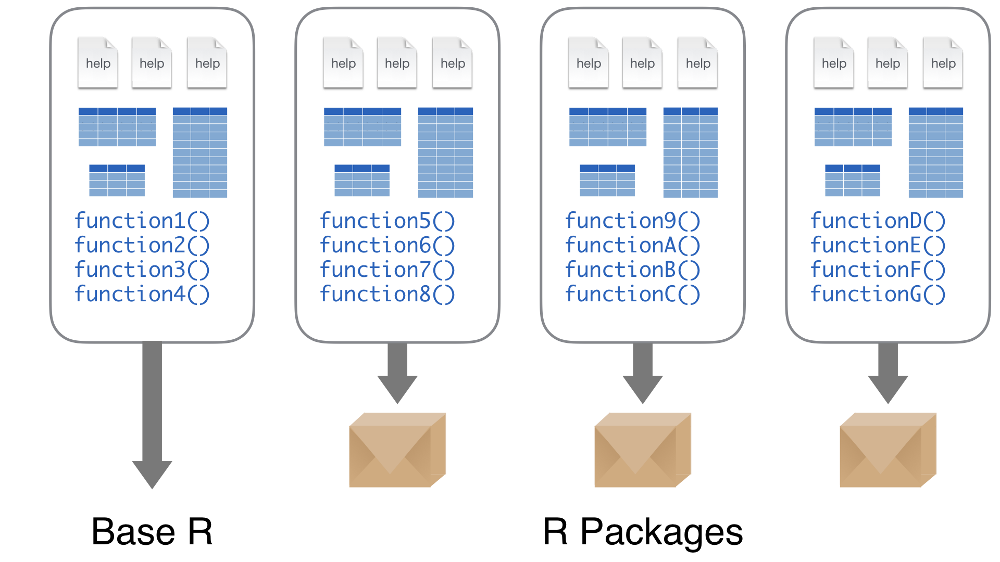
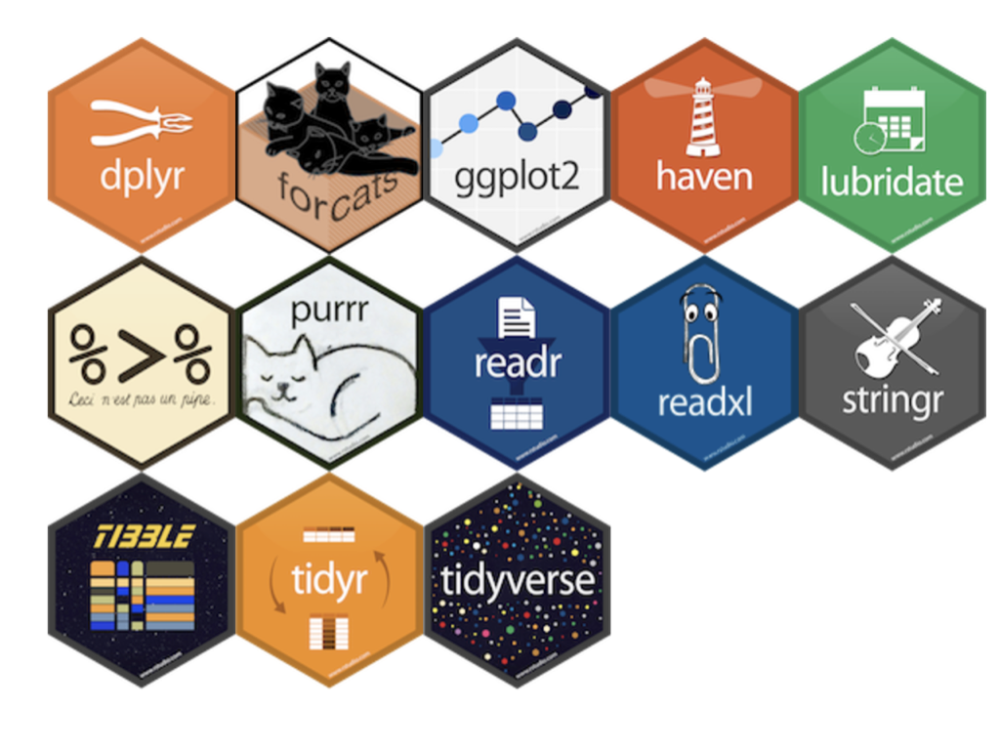
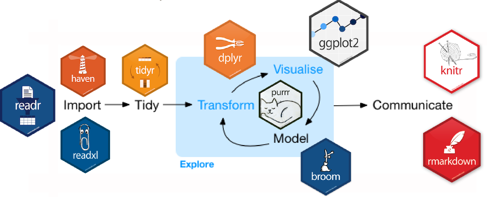

```{r setup, include=FALSE, cache=FALSE}
# Set global R options
options(htmltools.dir.version = FALSE, servr.daemon = TRUE)

# Set global knitr chunk options
knitr::opts_chunk$set(
  fig.align = "center", 
  cache = TRUE,
  error = FALSE,
  message = FALSE, 
  warning = FALSE, 
  collapse = TRUE 
)

# This is good for getting the ggplot background consistent with
# the html background color
library(ggplot2)
thm <- theme_bw()
theme_set(thm)
```

class: title-slide   
<a href="https://github.com/uc-r/Intro-R"></a>


<br><br><br><br>
# An .red[Incomplete] Introduction to `r anicon::faa("r-project", animate = 'pulse', speed = 'slow', color = 'steelblue')`

## .font70[.italic['Success is stumbling from failure to failure with no loss of enthusiasm'] - Winston Churchill]

### Brad Boehmke
### Dec 13-14, 2018


---

class: clear, center, middle


background-image: url(images/introductions.jpg)
background-size: cover

<br><br><br><br><br><br><br><br>

.pull-left-narrow[
.font200.white[Introductions]
]
---

# About me

.pull-left[

```{r name-tag, echo=FALSE}
knitr::include_graphics("images/name-tag.png")
```

* [`r fontawesome::fa("globe", fill = "steelblue")`](http://bradleyboehmke.github.io/) bradleyboehmke.github.io
* [`r fontawesome::fa("github", fill = "steelblue")`](https://github.com/bradleyboehmke/) @bradleyboehmke
* [`r fontawesome::fa("twitter", fill = "steelblue")`](https://twitter.com/bradleyboehmke) @bradleyboehmke
* [`r fontawesome::fa("linkedin", fill = "steelblue")`](https://www.linkedin.com/in/brad-boehmke-ph-d-9b0a257/) @bradleyboehmke
* [`r fontawesome::fa("envelope", fill = "steelblue")`](mailto:bradleyboehmke@gmail.com) bradleyboehmke@gmail.com

]


.pull-right[

#### Family 

* Dayton, OH
* Kate, Alivia (9), Jules (6)


#### Professional 

* 84.51° - Data Science Enabler 

#### Academic

* University of Cincinnati 
* Air Force Institute of Technology

#### R Community



]

---

# Data science

```{r, echo=FALSE, out.width="60%"}

```

---

# Data science

```{r, echo=FALSE, out.width="80%"}

```

---

# Data science

```{r, echo=FALSE, out.width="95%"}
knitr::include_graphics("images/applied-data-science.gif")
```

---

# Data science courses

<br><br><br>

.pull-left[

| Course | Dates |
|:------|:------:|
| Intro to R | Oct 17-18 |
| Intermediate R | Nov 21-22 |
| Machine Learning with R | Jan/Feb ?? |
| Deep Learning with R | Jan 20-21 |

]

.pull-right[

```{r ds-class-options, echo=FALSE}
knitr::include_graphics("images/data-science-flow-overall.png")
```

]

---

# Course objectives!

.font110[Provide an intensive, hands-on introduction to the `r anicon::faa("r-project", colour = "steelblue", size = 1, animate = FALSE)` programming language:]

.font90[

.pull-left[

.center[.bold[Day 1]]

| Topic | Time |
|:------|:------:|
| Fundamentals | 9:00 - 10:00 |
| Importing data | 10:00 - 10:30 |
| Break | 10:30 - 10:45 |
| Data transformation | 10:45 - 12:00 |
| Lunch | 12:00 - 1:00 |
| Review | 1:00-1:30 |
| Data visualization | 1:30-2:30 |
| Break | 2:30-2:45 |
| Case study | 2:45-4:00 |
| Q&A | 4:00-4:30 |

]
]

--

.font90[

.pull-right[

.center[.bold[Day 2]]
 
| Topic | Time |
|:------|:------:|
| Review | 9:00-10:00 |
| Data types | 10:00-10:45 |
| Break | 10:45 - 11:00 |
| Tidy data | 11:00-12:00 |
| Lunch | 12:00 - 1:00 |
| Joining data | 1:00-1:45 |
| Data structures | 1:45-2:30 |
| Break | 2:30-2:45 |
| Case study | 2:45-4:00 |
| Q&A | 4:00-4:30 |

]
]

---

# A hands-on learning environment

.pull-left[

### You may be overwhelmed

```{r drowning, echo=FALSE, out.height="400"}
knitr::include_graphics("images/drowning.gif")
```

]

--

.pull-right[

### So work together

```{r helping, echo=FALSE, out.height="400"}
knitr::include_graphics("images/dogs-helping.gif")
```

]

---

# Class material

<a href="https://github.com/uc-r/Intro-R" class="github-corner" aria-label="View source on Github"><svg width="80" height="80" viewBox="0 0 250 250" style="fill:#fff; color:#151513; position: absolute; top: 0; border: 0; right: 0;" aria-hidden="true"><path d="M0,0 L115,115 L130,115 L142,142 L250,250 L250,0 Z"></path><path d="M128.3,109.0 C113.8,99.7 119.0,89.6 119.0,89.6 C122.0,82.7 120.5,78.6 120.5,78.6 C119.2,72.0 123.4,76.3 123.4,76.3 C127.3,80.9 125.5,87.3 125.5,87.3 C122.9,97.6 130.6,101.9 134.4,103.2" fill="currentColor" style="transform-origin: 130px 106px;" class="octo-arm"></path><path d="M115.0,115.0 C114.9,115.1 118.7,116.5 119.8,115.4 L133.7,101.6 C136.9,99.2 139.9,98.4 142.2,98.6 C133.8,88.0 127.5,74.4 143.8,58.0 C148.5,53.4 154.0,51.2 159.7,51.0 C160.3,49.4 163.2,43.6 171.4,40.1 C171.4,40.1 176.1,42.5 178.8,56.2 C183.1,58.6 187.2,61.8 190.9,65.4 C194.5,69.0 197.7,73.2 200.1,77.6 C213.8,80.2 216.3,84.9 216.3,84.9 C212.7,93.1 206.9,96.0 205.4,96.6 C205.1,102.4 203.0,107.8 198.3,112.5 C181.9,128.9 168.3,122.5 157.7,114.1 C157.9,116.9 156.7,120.9 152.7,124.9 L141.0,136.5 C139.8,137.7 141.6,141.9 141.8,141.8 Z" fill="currentColor" class="octo-body"></path></svg></a><style>.github-corner:hover .octo-arm{animation:octocat-wave 560ms ease-in-out}@keyframes octocat-wave{0%,100%{transform:rotate(0)}20%,60%{transform:rotate(-25deg)}40%,80%{transform:rotate(10deg)}}@media (max-width:500px){.github-corner:hover .octo-arm{animation:none}.github-corner .octo-arm{animation:octocat-wave 560ms ease-in-out}}</style>

.pull-left[

### Source code 

- `r anicon::faa("github", animate = "pulse", anitype="hover", rtext=" GitHub")`: [https://github.com/uc-r/Intro-R](https://github.com/uc-r/Intro-R)

   - `r anicon::faa("slideshare", animate = "pulse", anitype="hover", rtext=" Slides")`

   - `r anicon::faa("code", animate = "pulse", anitype="hover", rtext=" Student Script")`

   - `r anicon::faa("database", animate = "pulse", anitype="hover", rtext=" Data")`

]

--

.pull-right[

### UC R Programming Guide 

- http://uc-r.github.io

```{r effo, echo=FALSE, out.width="500"}
knitr::include_graphics("images/uc-guide.png")
```

]

---
class: yourturn
# Your Turn!

<br>
## .font150[Meet your neighbors:]

.font140[
1. What is their experience with R?

2. What programming experience other than R do they have?

3. How are they using, or how do they plan to use, R in their job?
]


---

class: clear, center, middle


background-image: url(images/prereqs.jpg)
background-size: cover

<br><br><br><br><br><br><br><br>

.pull-left-narrow[
.font200[Prerequisites]
]

---

# Software

.pull-left[

### R (programming language) `r fontawesome::fa("r-project", fill = "steelblue")`

1. Go to https://cran.r-project.org/
2. Click "Download R for Mac/Windows"
3. Download the appropriate file:
   - Windows users click Base, and download the installer for the latest R version
   - Mac users select the file R-3.X.X that aligns with your OS version
4. Follow the instructions of the installer   

]

.pull-right[

### RStudio (IDE) 

1. Go to RStudio for desktop https://www.rstudio.com/products/rstudio/download/#download
2. Select the install file for your OS
3. Follow the instructions of the installer  

]

<br>
<br>

.center[
.content-box-gray[.bold[You should have R version 3.4.5 or greater installed.]]
]


---

# Questions about the class

<br>

```{r questions, echo=FALSE, out.height="450", out.width="450"}
knitr::include_graphics("images/questions.png")
```

---

class: clear, center, middle


background-image: url(images/fundamentals.png)
background-size: cover

---

# Understanding the RStudio IDE

```{r IDE, echo=FALSE}
knitr::include_graphics("images/RStudio-console.png")
```

.center[Learn more IDE features: `Help >> Cheatsheets >> RStudio IDE Cheat Sheet`]

---
class: yourturn
# Your Turn!

<br><br>
.font130[
(1) Open .R script for this module (`day-1a-intro.R`)
]
.pull-left[
.font130[
(2) Execute the following code in the .R script and identify where in the IDE the outputs can be found:
]]

.pull-right[

```{r, eval=FALSE}
mtcars
?sum
hist(mtcars$mpg)
random_numbers <- runif(25)
history()
```
]

<br>

.center[.content-box-gray[.bold[Run the code with `cmd + enter` or selecting run button .]]]

---

# Getting help

.pull-left[

### In general

* __Google__: just add "with R" at the end of any search
* __Stack Overflow__: focused on programming questions
* __Cross Validated__: focused on statistical questions

### FOMO

* __R-bloggers__: blog aggregator
* __Twitter__: #rstats

]

.pull-right[

### Within R

```{r, eval=FALSE}
# provides details for specific function
help(sqrt)
?sqrt #<<

# provides examples for said function
example(sqrt)
```


]

---

# Setting your working directory

.font130[.bold[Keeping your files `r anicon::faa("copy", animate = 'pulse', speed = 'slow', anitype="hover")` organized is critical!]]

.pull-left[
```{r, eval=FALSE}
# get your current working directory
getwd()
## [1] "/Users/b294776/Desktop/Training"

# set your working directory
setwd("/Users/b294776/Desktop/Training/intro-r")

getwd()
## [1] "/Users/b294776/Desktop/Training/intro-r"
```

]

.pull-right[

```{r, echo=FALSE}

```

]

<br><br><br><br>
.center[.bold[.content-box-gray[.red[Set your working directory to the location you want to work in for this training.]]]]

---

# Some basics

.pull-left[

### R as a calculator `r anicon::faa("calculator", animate = 'pulse', speed = 'slow', anitype="hover")`

```{r}
# uses PEMDAS convention for order of operations
4 + 3 / 10 ^ 2
(4 + 3) / 10 ^ 2
(4 + 3 / 10) ^ 2

# calculations with NA produces NA
4 + 3 / 10 ^ NA 
```

]

--

.pull-right[

### Assigning & evaluating

```{r, error=TRUE}
x <- 4 + 3 / 10 ^ 2   # Good
x = 4 + 3 / 10 ^ 2    # Works but not idiomatic

# we can increment (build onto) existing objects
x
x <- x + 1
x

# evaluation is case sensitive
X
```


]

---

class: yourturn

# Your Turn!

.pull-left[

### Economic Order Quantity Model

$$Q = \sqrt{\frac{2DK}{h}}$$

Calculate *Q* where:

* $D=1000$
* $K=5$
* $h=0.25$

Save the result to an object called *Q*.

]

--

.pull-right[

### Solution

```{r}
D <- 1000
K <- 5
h <- .25

Q <- sqrt(2 * D * K / h)
Q
```


]

---

# Workspace environment

.pull-left[
* You should now have 4 objects in your global environment
* History tab will show your recent code
* To list and remove these objects from your global environment:

```{r, eval=FALSE}
# list all objects
ls()
## [1] "D" "h" "K" "Q"

# remove a single object
rm(D)

# remove all objects
rm(list = ls())
```

]

.pull-right[

```{r, echo=FALSE}

```


]

---

# Packages `r emo::ji("package")`

The fundamental unit of shareable code is the .bold[package].

* CRAN: 13,500+
* Bioconductor: 1,500+
* GitHub: Many more plus beta versions for updated packages not yet published

```{r, echo=FALSE, out.width="60%"}

```


---

# Packages `r emo::ji("package")`

The fundamental unit of shareable code is the .bold[package].

* CRAN: 13,500+
* Bioconductor: 1,500+
* GitHub: Many more plus beta versions for updated packages not yet published

.blue[So how do we install these packages?]

```{r, eval=FALSE}
# install packages from CRAN
install.packages("packagename") #<<

# install packages from GitHub
install.packages("devtools")                            # only required the first time
devtools::install_github("username/packagename")
```

---

# Packages `r emo::ji("package")`


.pull-left[

### Downloads files to computer

```{r, eval=FALSE}
install.packages("packagename")
```

.center[.content-box-gray[.bold[1x per computer]]]

]

.pull-right[

### Loads package to use

```{r, eval=FALSE}
library(packagename)
```

.center[.content-box-gray[.bold[1x per R session]]]

]

---

class: yourturn

# Your Turn!

.pull-left[

1. Download these packages from CRAN:
   * tidyverse
   * nycflights13
   
2. Load both packages to use in your current R session   

]

--

.pull-right[
.bold[.font120[Solution:]]

```{r, eval=FALSE}
# install packages
install.packages("tidyverse")
install.packages("nycflights13")


# alternative
install.packages(c("tidyverse", "nycflights13"))

# load packages to use
library(tidyverse)
library(nycflights13)
```


]

<br><br><br><br>
.center[.content-box-gray[For a list of useful packages see this guide:  http://bit.ly/1x9vkzV]]

---

# What is tidyverse?

--

.pull-left[

.bold[A collection of packages...]

```{r what-is-tidyverse, echo=FALSE}

```

]

.pull-right[

.bold[designed to simplify data analysis]

<br>

```{r tidyverse-process, echo=FALSE}

```

]

---

# What is tidyverse?

.scrollable90[
.pull-left[

```{r, eval=FALSE}
install.packages("tidyverse")
```


.bold[does the equivalent of...]

```{r, eval=FALSE}
install.packages("ggplot2")
install.packages("tibble")
install.packages("tidyr")
install.packages("readr")
install.packages("purrr")
install.packages("dplyr")
install.packages("stringr")
install.packages("forcats")
install.packages("hms")
install.packages("lubridate")
install.packages("DBI")
install.packages("haven")
install.packages("httr")
install.packages("jsonlite")
install.packages("readxl")
install.packages("rvest")
install.packages("xml2")
install.packages("modelr")
install.packages("broom")
```

]
]

---

# What is tidyverse?

.scrollable90[
.pull-left[

```{r, eval=FALSE}
install.packages("tidyverse")
```


.bold[does the equivalent of...]

```{r, eval=FALSE}
install.packages("ggplot2") #<<
install.packages("tibble") #<<
install.packages("tidyr") #<<
install.packages("readr") #<<
install.packages("purrr") #<<
install.packages("dplyr") #<<
install.packages("stringr") #<<
install.packages("forcats") #<<
install.packages("hms")
install.packages("lubridate")
install.packages("DBI")
install.packages("haven")
install.packages("httr")
install.packages("jsonlite")
install.packages("readxl")
install.packages("rvest")
install.packages("xml2")
install.packages("modelr")
install.packages("broom")
```

]

.pull-right[

```{r, eval=FALSE}
library(tidyverse)
```

.bold[does the equivalent of...]


```{r, eval=FALSE}
library(ggplot2) 
library(tibble) 
library(tidyr) 
library(readr) 
library(purrr) 
library(dplyr) 
library(stringr) 
library(forcats) 
```

]

]

---

# Questions before moving on?

<br>

```{r questions-fundamentals, echo=FALSE, out.height="450", out.width="450"}
knitr::include_graphics("images/questions.png")
```

.center[[Back to training repo](https://github.com/uc-r/Intro-R)]
