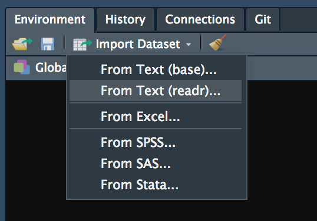

```{r setup, include=FALSE, cache=FALSE}
# Set global R options
options(htmltools.dir.version = FALSE, servr.daemon = TRUE)

# Set global knitr chunk options
knitr::opts_chunk$set(
  fig.align = "center", 
  cache = TRUE,
  error = FALSE,
  message = FALSE, 
  warning = FALSE, 
  collapse = TRUE 
)

# This is good for getting the ggplot background consistent with
# the html background color
library(ggplot2)
thm <- theme_bw()
theme_set(thm)
```

class: clear, center, middle


background-image: url(https://www.golegal.co.za/wp-content/uploads/2017/06/parallel-imports.jpg)
background-size: cover

<br><br><br><br><br><br><br><br><br><br><br><br>

.font200.white[Importing Data]

---

# First task in applied data science

<br><br>
```{r, echo=FALSE}
knitr::include_graphics("images/importing-task.jpeg")
```

---

# Importing packages `r emo::ji("package")`

```{r, echo=FALSE, out.width="90%"}
knitr::include_graphics("images/importing-pkgs.png")
```

---

# readr for delimited files (i.e. .csv, .tsv. txt)

```{r import-csv}
# load readr library (or tidyverse)
library(readr)

# import data
products <- read_csv(file = "data/products.csv")
products
```

.center[.content-box-gray[.bold[The products data has 151,141 observations (rows) and 5 features (columns)]]]

---

# readxl for Excel files

.pull-left-60[

```{r import-excel}
# load readxl
library(readxl)

# read workbook sheets
excel_sheets(path = "data/products.xlsx")
```
]

.pull-right-40[


- First, we read in the worksheet names with .red[`excel_sheets()`] so we know which sheet to import

- .white[Then we read in the worksheet with `read_excel()`]
 
]

---

# readxl for Excel files

.pull-left-60[

```{r import-excel2}
# load readxl
library(readxl)

# read workbook sheets
excel_sheets(path = "data/products.xlsx")

# import sheet of interest
products <- read_excel(path = "data/products.xlsx", sheet = "products data")
products
```

]

.pull-right-40[

- .gray[.opacity[First, we read in the worksheet names with `excel_sheets()` so we know which sheet to import]]
 
- Then we read in the worksheet with .red[`read_excel()`]

]

---

# Additional arguments

.font120[Both readr & readxl have many arguments that allow you to...]

.pull-left[

### readr

* read .tsv, .txt, .fwf, and other flat files
* change column names
* change data types
* skip lines
* re-label missing values
]

.pull-right[

### readxl

* read a specified range from the spreadsheet
* change column names
* change data types
* skip lines
* re-label missing values

]

<br><br>

.center[.content-box-gray[.bold[But these are more advanced options you can learn on your own (`?read_csv`, `?read_excel`)]]]

---

# What if we have a .bold[`r anicon::nia("big", animate = "pulse", colour = "red")`] file?

.pull-left-40[

### Actual data set at work

* 840,861 observations
* 723 variables
* equates to 607,942,503 elements
* 2.7 GB

]

--

.pull-right-60[

### data.table::fread to the rescue `r anicon::cia("https://emojis.slackmojis.com/emojis/images/1471045870/910/rock.gif?1471045870", animate = FALSE)`

```{r, eval=FALSE}
# time to import with base R (27 minutes)
system.time(ynb1 <- read.csv("data/ynb_cheese.csv"))
##    user  system elapsed 
## 317.349 1159.192 1678.552

# time to import with readr (10 minutes)
system.time(ynb2 <- readr::read_csv("data/ynb_cheese.csv"))
##    user   system  elapsed 
## 500.954  71.776 594.505

# time to import with data.table::fread (1 minute)
system.time(ynb3 <- data.table::fread("data/ynb_cheese.csv", data.table = FALSE)) #<<
##   user  system elapsed #<<
## 40.174   9.861  64.625 #<<

```


]


---
class: yourturn

# Your Turn!

Read in the __transactions.csv__ file and save as `transactions`

--

### Solution

```{r}
transactions <- data.table::fread("data/transactions.csv", data.table = FALSE)
transactions
```

---

# Wait, that looks different...

```{r, echo=FALSE, out.width="70%"}
knitr::include_graphics("images/wait-one-sec.gif")
```


---

# Tibbles

.scrollable90[
.pull-left[

### data frame 

```{r}
transactions <- data.table::fread("data/transactions.csv", data.table = FALSE)
transactions
```

]

.pull-right[

### tibble 

```{r}
transactions <- read_csv("data/transactions.csv")
transactions
```

]
]

---

# Tibbles

.scrollable90[
.pull-left[

### data frame $\rightarrow$ tibble 

```{r, echo=FALSE}
library(tibble)
```


```{r}
transactions <- data.table::fread("data/transactions.csv", data.table = FALSE)
transactions <- tibble::as_tibble(transactions) #<<

transactions
```

]

.pull-right[

<br><br><br>

```{r, echo=FALSE}
knitr::include_graphics("images/i-like.gif")
```

]
]

---

# Alternative approaches to be aware of

.center.font120[
`r anicon::faa("exclamation-triangle", speed = "slow", colour = "red")``r anicon::faa("exclamation-triangle", speed = "slow", colour = "red")``r anicon::faa("exclamation-triangle", speed = "slow", colour = "red")`  
These methods do not incorporate the code to import the data. Unless you remember to add the code, your script will not be reproducible!  
`r anicon::faa("exclamation-triangle", speed = "slow", colour = "red")``r anicon::faa("exclamation-triangle", speed = "slow", colour = "red")``r anicon::faa("exclamation-triangle", speed = "slow", colour = "red")`
]

.pull-left[

.center.bold.font120[`file.choose()`]

- allows interactive file selction

- Try:

```{r file-choose, eval=FALSE}
read_csv(file.choose())
```

]

.pull-left[

.center.bold.font120[RStudio Option]

- allows interactive file selction
- allows importing options
- provides code used for importing


```{r rstudio-import-option, echo=FALSE, out.height="50%", out.width="50%"}

```

]

---

# Get to know your data

.font120[Try these functions on your __transactions__ data:]

```{r get-to-know-data, eval=FALSE}
# dimensions (rows x columns)
dim(transactions)

# get a quick glimpse of the data
str(transactions)   # or...
dplyr::glimpse(transactions)

# get the names of all the variables
names(transactions)

# how many missing values exist
sum(is.na(transactions))

# omit all observations with missing values
clean_data <- na.omit(transactions)

# view the data in a spreadsheet like viewer
View(transactions)
```

--
.center[.content-box-gray[.bold[.red[So we have our data, now what?]]]]

---
class: clear, center, middle

background-image: url(images/transformer.gif)
background-size: cover

.font200.white.bold[Data Transformation ([Slides](https://uc-r.github.io/Intro-R/day-1c-transform.html))]