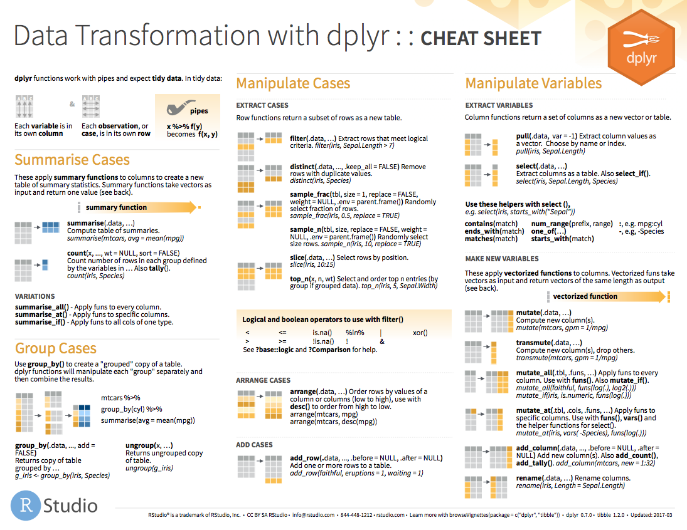

```{r setup, include=FALSE, cache=FALSE}
# Set global R options
options(htmltools.dir.version = FALSE, servr.daemon = TRUE)

# Set global knitr chunk options
knitr::opts_chunk$set(
  fig.align = "center", 
  cache = TRUE,
  error = FALSE,
  message = FALSE, 
  warning = FALSE, 
  collapse = TRUE 
)

# This is good for getting the ggplot background consistent with
# the html background color
library(ggplot2)
thm <- theme_bw()
theme_set(thm)
```

class: clear, center, middle

background-image: url(images/transformer.gif)
background-size: cover

.font200.white.bold[Transforming Data]

---

# Data transformation task

<br><br>
```{r, echo=FALSE}
knitr::include_graphics("images/transform-task.png")
```

---

# dplyr

You are going to learn six key .bold[dplyr] functions that allow you to solve the vast majority of your data manipulation challenges:

.pull-left[

* .bold[`filter`]: pick observations based on values

* .bold[`select`]: pick variables

* .bold[`summarize`]: compute statistical summaries 

* .bold[`group_by`]: perform operations at different levels of your data

* .bold[`arrange`]: reorder data

* .bold[`mutate`]: create new variables

]

.pull-right[

<br>
```{r dplyr-hex, echo=FALSE, out.height="50%", out.width="50%"}
knitr::include_graphics("images/dplyr.png")
```
<br>
]

---

# Basics

.font130[All functions work similarly:]
.font120[
* The first argument is a data frame
* Subsequent arguments describe what to do
* Output is a new data frame
]

<br>

```{r data-frame-in-and-out, echo=FALSE}

```

---
# Prerequisites

.pull-left[

### Packages

```{r}
library(dplyr) # or library(tidyverse)
```


]

.pull-right[

### Data

```{r}
transactions <- data.table::fread("data/transactions.csv", data.table = FALSE) %>% as.tibble()
transactions
```

]

---

# Filtering variables

.bold[We can filter our data set based on given conditions for one or more variables with .font140.grey[`filter()`]]

<br><br>

.center[.font200[.grey[`filter(`].blue[`data`]`,` .red[`...`] .grey[`)`]]]

<br>

.white[.center[.content-box-grey-dark[dplyr function] .content-box-blue-dark[data frame to transform] .content-box-red-dark[conditions to filter data]]]

---

# Filtering variables

.bold[We can filter our data set based on given conditions for one or more variables with .font140.grey[`filter()`]]

.scrollable90[

```{r filter-obs}
# filter for all observations for household 3780
filter(transactions, hshd_num == "3708") #<<

# filter for all observations for household 3780 with spending over $3
filter(transactions, hshd_num == "3708", spend > 3) #<<

# filter for household 3780 with spending over $3 for all products except 85383
filter(transactions, hshd_num == "3708", spend > 3, product_num != 85383) #<<
```

]

---

# Save new data frame

.bold[dplyr functions .red[do not] over-write data; must save to a new data frame object.]

```{r save-filter-output}
hshd_3708 <- filter(transactions, hshd_num == "3708")
hshd_3708
```

---

# Comparison operators

.bold[We can use multiple comparison operators for our condition statements]

.pull-left[

.center[.font120[.bold[`?Comparison`]]]

.font90[
Function  | Description
:-----: | ------
`<` | less than
`>` | greater than
`==` | equal to
`<=` | less than or equal to
`>=` | greater than or equal to
`!=` | not equal to
`%in%` | group membership
`is.na` | is missing
`!is.na` | is not missing
]
]

--

.pull-right[

.center[.font120[.bold[What will these produce?]]]

```{r, eval=FALSE}
filter(transactions, week_num == 12)
filter(transactions, week_num != 12)
filter(transactions, week_num %in% c(1, 5, 10))
filter(transactions, spend <= 5)
filter(transactions, !(spend <= 5))
filter(transactions, is.na(spend))
```

]

---

# Multiple comparison operators

.bold[And we can combine multiple comparison operators]

.pull-left-40[

.center[.font120[.bold[`?base::Logic`]]]

Function  | Description
:------: | ------------
`&` | boolean and
&#x7c; | boolean or
`!` | not
`any` | any are true
`all` | all are true

]

--

.pull-right-60[

.center[.font120[.bold[What will these produce?]]]

```{r, eval=FALSE}
# set 1
filter(transactions, week == 1, store_r == "SOUTH")
filter(transactions, week == 1 & store_r == "SOUTH")

# set 2
filter(transactions, store_r == "SOUTH" | store_r == "NORTH")
filter(transactions, store %in% c("SOUTH", "NORTH"))

# set 3 --> are these the same?
filter(transactions, !(week_num < 50 | spend > 2))
filter(transactions, week_num >= 50, spend <= 2)
```

]

---

# Two common mistakes `r anicon::faa("exclamation-triangle", colour = "red", animate = 'pulse', speed = 'slow')`

.pull-left[

.center.font130[Using .red[=] instead of .green[==]]

```{r, eval=FALSE}
# wrong
filter(transactions, store_r = "SOUTH")

# correct
filter(transactions, store_r == "SOUTH")
```


]

.pull-right[

.center.font130[Forgetting quotes]

```{r, eval=FALSE}
# wrong
filter(transactions, store_r == SOUTH)

# correct
filter(transactions, store_r == "SOUTH")
```

]

---
class: yourturn

# Your Turn!

.pull-left[

### Challenge
.font110[
1. Import the transactions.csv file.

2. Filter for transactions with greater than 2 units.

3. Filter for transactions with greater than 2 units during week 101 that occurred in the south region.

4. Filter for transactions with greater than 2 units during week 101 that occurred in the south or central regions.
]
]

--

.pull-right[

### Solution

```{r filter-your-turn, eval=FALSE}
# 1: import the data
transactions <- read_csv("data/transactions.csv")

# 2: filter for transactions with greater than 2 units
filter(transactions, units > 2)

# 3: for transactions with greater than 2 units during week 101 that occurred in the south region.
filter(transactions, units > 2, week_num == 101, store_r == "SOUTH")

# 4: for transactions with greater than 2 units during week 101 that occurred in the south or central regions.
filter(transactions, units > 2, week_num == 101, store_r %in% c("SOUTH", "CENTRAL"))
```

]

---

# Selecting variables

.bold[We can select variables of interest with the .font130.grey[`select()`] function]

<br><br>

.center[.font200[.grey[`select(`].blue[`data`]`,` .red[`...`] .grey[`)`]]]

<br>

.white[.center[.content-box-grey[dplyr function] .content-box-blue[data frame to transform] .content-box-red-dark[names of columns to extract]]]

---

# Selecting variables

.bold[We can select variables of interest with the .font130.grey[`select()`] function]

.scrollable90[

```{r}
select(transactions, product_num, spend, units, store_r, week_num)

# produces same as above
select(transactions, product_num:week_num)
```


.center[.content-box-gray[.bold[You can also deselect variables: `select(transactions -(product_num:week_num))`]]]

]

---

# Select .red[helper] functions

.bold[The real beauty of .font130[`select()`] is in the helper functions.]
.scrollable90[
.pull-left[

### Helper functions

Function  | Description
:------: | ------------
`starts_with()` | select columns whose name starts with
`ends_with()` | select columns whose name ends with
`contains()` | select columns whose name contains with
`matches()` | select columns whose name matches a regular expression

...and more (see `?tidyselect::select_helpers`)

]

.pull-right[

### Examples

```{r select-helpers}
# starts with example
select(transactions, ends_with("num"))

# ends with example
select(transactions, contains("_"))

# combining different select helpers
select(transactions, c(year, ends_with("num"), contains("_")))
```


]
]

---
class: yourturn

# Your Turn!


.pull-left[

### Challenge

1. Import the __households.csv__ data and...

2. Select all columns that contain "_" and...

3. Filter for those observations that fall in the "75-99K" income range. 

]

--

.pull-right[

### Solution

```{r select-your-turn-solution}
# 1. Import the __households.csv__ data
households <- read_csv("data/households.csv")

# 2. Select all columns that contain "_"
reduced_df <- select(households, contains("_"))

#3. Filter for those observations that fall in the "75-99K" income range
filter(reduced_df, income_range == "75-99K")
```

]

---

# Arranging data based on values

.bold[We can select variables of interest with the .font130.grey[`arrange()`] function]

<br><br>

.center[.font200[.grey[`arrange(`].blue[`data`]`,` .red[`...`] .grey[`)`]]]

<br>

.white[.center[.content-box-grey[dplyr function] .content-box-blue[data frame to transform] .content-box-red-dark[one or more columns to order by]]]

---

# Arranging data based on values

.bold[We can select variables of interest with the .font130.grey[`arrange()`] function]

.pull-left[

### Ascending order

```{r}
arrange(transactions, spend)
```


]

.pull-right[

### Descending order

```{r}
arrange(transactions, desc(spend))
```

]

---

# Arrange .red[.bold[always]] places missing values at bottom

.pull-left[

```{r}
(df <- tibble(x = c(5, 2, 5, NA)))
```

]

.pull-right[

```{r}
arrange(df, x)
arrange(df, desc(x))
```

]

---
class: yourturn

# Your Turn!

.pull-left[

### Challenge

1. Arrange __transactions__ by `week_num` in ascending order.

2. Arrange __transactions__ by `week_num` in ascending order and `spend` in descending order.

3. What happens when you arrange an alphabetical variable such as `store_r`?

]

--

.pull-right[

### Solution

```{r arrange-your-turn, eval=FALSE}
# 1: arrange transactions by week_num in ascending order
arrange(transactions, week_num)

# 2: arrange transactions by week_num in ascending order and spend in descending order
arrange(transactions, week_num, desc(spend))

# 3: What happens when you arrange an alphabetical variable such as store_r?
arrange(transactions, desc(store_r))
```

]

---

# Compute summary statistics

.bold[We can compute summary statistics with the .font130.grey[`summarize()`] function]


<br><br>

.center[.font200[.grey[`summarize(`].blue[`data`]`,` .red[`...`] .grey[`)`]]]

<br>

.white[.center[.content-box-grey[dplyr function] .content-box-blue[data frame to transform] .content-box-red-dark[one or more summary statistics to compute]]]

---

# Compute summary statistics

.bold[We can compute summary statistics with the .font130.grey[`summarize()`] function]

.pull-left[

### single statistic

```{r}
summarize(transactions, avg_spend = mean(spend, na.rm = TRUE))
```

.center[.content-box-grey[.bold[What does `na.rm` do?]]]

]

--

.pull-right[

### multiple statistics

```{r}
summarize(transactions, 
  spend_avg = mean(spend, na.rm = TRUE),
  spend_sd  = sd(spend, na.rm = TRUE),
  n = n()
)
```

]

---

# Summarize .red[helper] functions

.bold[There are a wide variety of functions you can use within .font130[`summarize()`]]


<br>

.pull-left[

.font80[
Function  | Description
:-----: | ------
`min()`, `max()` | min, max values in vector
`mean()` | mean value
`median()` | median value
`sum()` | sum of all vector values
`var()`, `sd()` | variance/std of vector
`first()`, `last()` | first/last value in vector
`nth()` | nth value in vector
`n()` | number of values in vector
`n_distinct()` | number of distinct values in vector

]
]

.pull-right[
<br>
```{r summarize-functions, echo=FALSE, out.height="100%", out.width="100%"}

```

]

---


# Summarizing .red[grouped] data

.bold[Summary statistics become more powerful when we can compute and compare at different aggregated levels]

.pull-left[

#### Avg spend by week

```{r}
# group data
by_week <- group_by(transactions, week_num)

# compute summary stat
summarize(by_week, spend_avg = mean(spend, na.rm = TRUE))
```

]

.pull-right[

#### Variability of spend by store region

```{r}
# group data
by_region <- group_by(transactions, store_r)

# compute summary stat
summarize(by_region, delay_sd = sd(spend, na.rm = TRUE))
```

]


---
class: yourturn

# Your Turn!

.pull-left[

### Challenge

1. Compute the average `spend` by `hshd_num` and arrange in descending order to find the household with the largest average spend.

2. Find the products (`product_num`) with the largest median spend.

]

--

.pull-right[

### Solution

```{r summarize-your-turn, eval=FALSE}
# 1: Compute the average `spend` by `hshd_num` and arrange in descending order to find the household with the largest average spend.
hshd_group <- group_by(transactions, hshd_num)
hshd_spend <- summarize(hshd_group, spend_avg = mean(spend, na.rm = TRUE))
arrange(hshd_spend, desc(spend_avg))

# 2: Find the `product_num`s with the largest median spend.
prod_group <- group_by(transactions, product_num)
prod_spend <- summarize(prod_group, spend_median = median(spend, na.rm = TRUE))
arrange(prod_spend, desc(spend_median))
```

]

---

# The pipe operator .red[`%>%`]

Going back to our last problem, our code was doing three things:

.pull-left[

.font120[
1. .blue[grouping by product number]

2. .orange[summarizing spend]

3. .purple[sorting spend by greatest to least]
]
]

.pull-right[


```{r, eval=FALSE}
# 1 grouping by product number
prod_group <- group_by(transactions, product_num)

# 2 summarizing spend
prod_spend <- summarize(prod_group, spend_median = median(spend, na.rm = TRUE))

# 3 sorting spend by greatest to least
arrange(prod_spend, desc(spend_median))
```

]

<br><br><br>

.center[.content-box-gray[.bold[Surely we can streamline our code and make it more efficient and legible!]]]


---

# The pipe operator .red[`%>%`]

An alternative approach to perform these thing things:

.pull-left[

### Traditional approach

```{r echo=FALSE, fig.align='left', out.height="80%", out.width="80%"}

```


```{r, eval=FALSE}
prod_group <- group_by(transactions, product_num)
prod_spend <- summarize(prod_group, spend_median = median(spend, na.rm = TRUE))
arrange(prod_spend, desc(spend_median))
```

]

.pull-right[

### pipe (`%>%`) approach

```{r echo=FALSE, fig.align='left',out.height="90%", out.width="90%"}

```

```{r, eval=FALSE}
transactions %>%
  group_by(product_num) %>%
  summarize(spend_median = median(spend, na.rm = TRUE)) %>%
  arrange(desc(spend_median))
```

]

---

class: yourturn

# Your Turn!

.pull-left[

### Challenge
.font90[
Using the pipe operator follow these steps with the __transactions__ data:

1. filter for southern region stores only

2. group by product

3. compute the average spend

4. sort this output to find the product with the largest average spend
]
]

--

.pull-right[

### Solution

```{r}
transactions %>%
  filter(store_r == "SOUTH") %>%
  group_by(product_num) %>%
  summarize(spend_avg = mean(spend, na.rm = TRUE)) %>%
  arrange(desc(spend_avg))
```

]

---

# Mutate variables

.bold[We can create new variables with the .font130.grey[`mutate()`] function]


<br><br>

.center[.font200[.grey[`mutate(`].blue[`data`]`,` .red[`...`] .grey[`)`]]]

<br>

.white[.center[.content-box-grey[dplyr function] .content-box-blue[data frame to transform] .content-box-red-dark[one or more new variables to create]]]

---

# Mutate variables

.bold[We can create new variables with the .font130.grey[`mutate()`] function]

```{r}
mutate(transactions, price_per_unit = spend / units) %>% #<<
  select(spend, units, price_per_unit, everything())
```

---

# Mutate variables

.bold[We can create .red[multiple] variables within one .font130.grey[`mutate()`] function]

```{r}
transactions %>%
  group_by(week_num) %>%
  summarize(
    spend = sum(spend, na.rm = TRUE),
    units = sum(units, na.rm = TRUE)
  ) %>% 
  mutate( #<<
    avg_spend_per_unit = spend / units, #<<
    wow_perc_growth    = (avg_spend_per_unit / lag(avg_spend_per_unit)) - 1, #<<
    wtd_net_spend      = cumsum(spend), #<<
    wtd_net_units      = cumsum(units) #<<
  ) #<<
```

---

# Mutate helper functions

.bold[There are a wide variety of functions you can use within .font130.grey[`mutate()`]]

_.blue[Must be vectorized functions - meaning the function must take a vector of values as input and return the same number of values as output.]_
.scrollable[
.pull-left[

.font80[
Function  | Description
:-----: | ------
`+,-,*,/,^` | arithmetic
`x / sum(x)` | arithmetic w/aggregation
`%/%, %%` | modular arithmetic
`log, exp, sqrt` | transformations
`lag, lead` | offsets
`cumsum, cumprod, cum...` | cum/rolling aggregates
`>, >=, <, <=, !=, ==` | logical comparisons
`min_rank, dense_rank` | ranking
`between` | are values between a and b?
`ntile` | bin values into n buckets
]
]

.pull-right[

```{r}
# mean center data
transmute(transactions, center_spend = spend / mean(spend, na.rm = TRUE))

# transform values
transmute(transactions,
  log_spend = log(spend),
  exp_spend = exp(spend))

# lag and cumsum values
transmute(transactions,
  spend     = spend,
  lag_spend = lag(spend),
  sum_spend = cumsum(spend))
```

]
]

---

class: yourturn

# Your Turn!

.pull-left[

### Challenge
.font90[
Using what you've learned thus far, can you find the store region and week that experienced the greatest week over week growth in the number of units sold?

Hint:

```{r, eval=FALSE}
transactions %>%
  group_by(______, ______) %>% # group by region and week
  summarize(______) %>%        # compute sum of units
  mutate(______) %>%           # create WoW difference (check out lag())
  arrange(______)              # arrange in descending order
```

]
]

--

.pull-right[

### Solution

```{r}
transactions %>%
  group_by(store_r, week_num) %>%
  summarize(units = sum(units)) %>%
  mutate(
    wow_units = units - lag(units),
    wow_perc  = (units / lag(units) - 1)
    ) %>%
  arrange(desc(wow_perc))
```

]

---

# Key things to remember

.pull-left[

* .bold[`filter`]: pick observations based on values

* .bold[`select`]: pick variables

* .bold[`summarize`]: compute statistical summaries 

* .bold[`group_by`]: perform operations at different levels of your data

* .bold[`arrange`]: reorder data

* .bold[`mutate`]: create new variables

<br>

.center[.content-box-gray[knit them all together with .bold[%>%]]]

]

.pull-right[

<br><br>
```{r, echo=FALSE}

```


]

---

# Key things to remember

.pull-left[

```{r, echo=FALSE}

```


]

.pull-right[

<br><br>
```{r, echo=FALSE}

```

<br>

]

.center[.content-box-gray[.bold[`Help >> Cheatsheets >> Data Transformation with dplyr`]]]

---

# Questions?

<br>

```{r questions-dplyr, echo=FALSE, out.height="450", out.width="450"}
knitr::include_graphics("images/questions.png")
```
