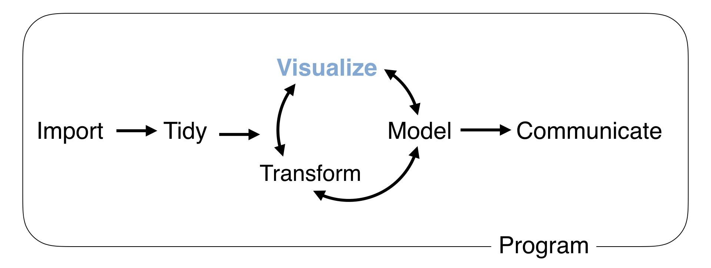
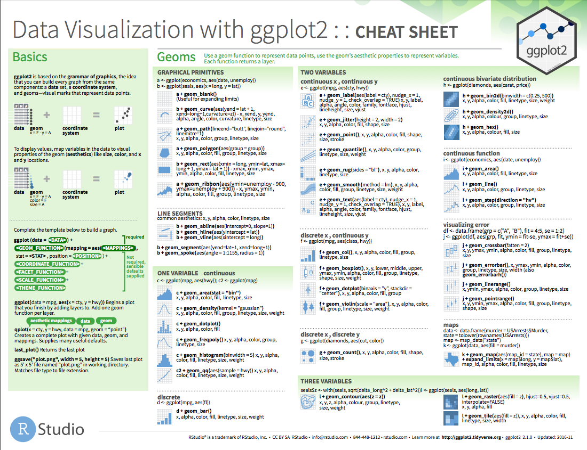

```{r setup, include=FALSE, cache=FALSE}
# Set global R options
options(htmltools.dir.version = FALSE, servr.daemon = TRUE)

# Set global knitr chunk options
knitr::opts_chunk$set(
  fig.align = "center", 
  cache = TRUE,
  error = FALSE,
  message = FALSE, 
  warning = FALSE, 
  collapse = TRUE 
)

# This is good for getting the ggplot background consistent with
# the html background color
library(ggplot2)
thm <- theme_bw()
theme_set(thm)

library(dplyr)
library(tibble)
transactions <- data.table::fread("data/transactions.csv", data.table = FALSE) %>% 
  sample_frac(0.25) %>%
  as_tibble()
```

class: clear, center, middle


background-image: url(https://raw.githubusercontent.com/bradleyboehmke/Dayton-Weather-2018/master/Dayton_Weather.png)
background-size: cover

<br><br><br><br><br><br><br><br><br><br><br><br>

.font200.bold[`r anicon::nia("Visualizing Data", animate = "flash", speed = "slow")`]

---

# Data visualization task

<br><br>
```{r, echo=FALSE}

```

---

# ggplot
<br>
.pull-left[
<br>
* R has several systems for making graphs

* `ggplot2` is the most elegant and versatile

* Implements the grammar of graphics theory behind data visualization
]

.pull-right[

```{r ggplot-hex, echo=FALSE, out.height="50%", out.width="50%"}
knitr::include_graphics("images/ggplot2.png")
```

]

---

# Basics

`ggplot2` works with a layer based mentality:

.pull-left[
```{r eval=FALSE}
ggplot(data, aes(x, y)) +
  geom_xxx() +
  scale_xxx() +
  facet_xxx() +
  ggtitle()
```
]

--

.pull-right[

```{r example-ggplot, fig.height=4, fig.width=7}
ggplot(data = txhousing, aes(x = volume, y = median)) + 
  geom_point(alpha = .1) +
  scale_y_continuous(name = "Median Sales Price", labels = scales::dollar) +
  scale_x_log10(name = "Total Sales Volume", labels = scales::comma) +
  ggtitle("Texas Housing Sales", subtitle = "Sales data from 2000-2010 provided by the TAMU real estate center")
```

]

---


# Prerequisites

.pull-left[
### Packages

```{r}
library(ggplot2) # or library(tidyverse)
library(dplyr)   # for other data wrangling tasks
```

]

.pull-right[

### Example Data

```{r, eval=FALSE}
# built-in data set
mpg
```

### Exercise Data

```{r, eval=FALSE}
transactions <- data.table::fread("data/transactions.csv", data.table = FALSE) %>% 
  sample_frac(0.25) %>%
  as_tibble()
transactions 
```

]

---

# Canvas layer

.bold[We can create a "canvas" for our plot with...]

.pull-left[

```{r, fig.height=4, fig.width=4}
ggplot(data = mpg)
```


]

.pull-right[

```{r, fig.height=4.5, fig.width=4.5}
ggplot(data = mpg, aes(x = displ, y = hwy))
```

]

.center[.content-box-gray[.bold[We use .red[aes()] to map attributes to our plot]]]

---

# Plotting our data with .red[geoms]

.pull-left[
* We display data with geometric shapes

* ~ 30 built-in geoms (with many more offered by other pkgs)
   - `geom_point()`
   - `geom_line()`
   - `geom_histogram()`
   - `geom_density()`
   - `geom_freqpoly()`
   - `geom_boxplot()`
   - `geom_violin()`
   - `geom_bar()`
   - `geom_count()`
   - `geom_smooth()`

.center[.content-box-gray[.bold[See full list with `geom_` + tab]]]
]

---

# Plotting our data with .red[geoms]

.pull-left[
* We display data with geometric shapes

* ~ 30 built-in geoms (with many more offered by other pkgs)
   - `geom_point()`
   - `geom_line()`
   - .blue[.bold[`geom_histogram()`]]
   - .blue[.bold[`geom_density()`]]
   - .blue[.bold[`geom_freqpoly()`]]
   - `geom_boxplot()`
   - `geom_violin()`
   - `geom_bar()`
   - `geom_count()`
   - `geom_smooth()`

.center[.content-box-gray[.bold[See full list with `geom_` + tab]]]
]

.pull-right[
<br><br>
```{r, eval=FALSE}
ggplot(data = mpg, aes(x = hwy)) +
  geom_histogram()

ggplot(data = mpg, aes(x = hwy)) +
  geom_freqpoly()

ggplot(data = mpg, aes(x = hwy)) +
  geom_density()
```

```{r, echo=FALSE, fig.height=3}
p1 <- ggplot(data = mpg, aes(x = hwy)) +
  geom_histogram()

p2 <- ggplot(data = mpg, aes(x = hwy)) +
  geom_freqpoly()

p3 <- ggplot(data = mpg, aes(x = hwy)) +
  geom_density()

gridExtra::grid.arrange(p1, p2, p3, nrow = 1)
```

]

---

# Plotting our data with .red[geoms]

.pull-left[
* We display data with geometric shapes

* ~ 30 built-in geoms (with many more offered by other pkgs)
   - `geom_point()`
   - `geom_line()`
   - `geom_histogram()`
   - `geom_density()`
   - `geom_freqpoly()`
   - .blue[.bold[`geom_boxplot()`]]
   - .blue[.bold[`geom_violin()`]]
   - .blue[.bold[`geom_bar()`]]
   - `geom_count()`
   - `geom_smooth()`

.center[.content-box-gray[.bold[See full list with `geom_` + tab]]]
]

.pull-right[
<br><br>
```{r, eval=FALSE}
ggplot(data = mpg, aes(x = displ, y = hwy)) +
  geom_point()

ggplot(data = mpg, aes(x = class, y = hwy)) +
  geom_boxplot()

ggplot(data = mpg, aes(x = class, y = hwy)) +
  geom_violin()
```

```{r, echo=FALSE, fig.height=3}
p1 <- ggplot(data = mpg, aes(x = displ, y = hwy)) +
  geom_point()

p2 <- ggplot(data = mpg, aes(x = class, y = hwy)) +
  geom_boxplot()

p3 <- ggplot(data = mpg, aes(x = class, y = hwy)) +
  geom_violin()

gridExtra::grid.arrange(p1, p2, p3, nrow = 1)
```

]

---

# Plotting our data with .red[geoms]

.pull-left[
* We display data with geometric shapes

* ~ 30 built-in geoms (with many more offered by other pkgs)
   - .blue[.bold[`geom_point()`]]
   - `geom_line()`
   - .blue[.bold[`geom_histogram()`]]
   - `geom_density()`
   - `geom_freqpoly()`
   - `geom_boxplot()`
   - `geom_violin()`
   - `geom_bar()`
   - `geom_count()`
   - `geom_smooth()`

]

.pull-right[
<br><br>
```{r, eval=FALSE}
ggplot(data = mpg, aes(x = displ, y = hwy)) + #<<
  geom_point()

ggplot(data = mpg, aes(x = hwy)) + #<<
  geom_histogram()
```

```{r, echo=FALSE, fig.height=3}
p1 <- ggplot(data = mpg, aes(x = displ, y = hwy)) +
  geom_point()

p2 <- ggplot(data = mpg, aes(x = hwy)) +
  geom_histogram()

gridExtra::grid.arrange(p1, p2, nrow = 1)
```

.center[.content-box-gray[.bold[Some geoms only require .font130[`x`], others .font130[`x`] & .font130[`y`]]]]

]

---

class: yourturn

# Your Turn!

.pull-left[

### Challenge

Using the __transactions__ data:

1. Create a chart that illustrates the distribution of the spend variable.

2. Create a chart that shows the counts for each store region

3. Create a scatter plot of units vs spend 
]

--

.pull-right[

### Solutions

```{r, eval=FALSE}
#1: distribution of spend variable
ggplot(data = transactions, aes(x = spend)) +
    geom_histogram()

#2: distribution of store region variable
ggplot(data = transactions, aes(x = store_r)) +
 geom_bar()

#3: scatter plot for units vs spend
ggplot(data = transactions, aes(x = units, y = spend)) +
 geom_point()
```

```{r, echo=FALSE, echo=FALSE, fig.height=2.25}
#1: distribution of spend variable
p1 <- ggplot(data = transactions, aes(x = spend)) +
    geom_histogram()

#2: distribution of store region variable
p2 <- ggplot(data = transactions, aes(x = store_r)) +
 geom_bar()

#3: scatter plot for units vs spend
p3 <- ggplot(data = transactions, aes(x = units, y = spend)) +
 geom_point()

gridExtra::grid.arrange(p1, p2, p3, nrow = 1)
```

]

---

# Non-mapping aesthetics

.pull-left[

We can also change other visual aesthetics in our plots:

* .blue[c].orange[o].gray[l].purple[o].red[r]

* .font70[s].font120[i]z.font110[e] 

* sh&#9653;pe (0-25 `?pch`)

* .opacity[opacity]
]

--

.pull-right[
<br>
```{r, fig.height=3.5}
ggplot(data = mpg, aes(x = displ, y = hwy)) +
  geom_point(color = "blue", size = 2, shape = 17, alpha = .5)
```

.center[.content-box-gray[.bold[But why are some points darker? `r emo::ji("thinking")`]]]

]

---

# Non-mapping aesthetics

.pull-left[

We can also change other visual aesthetics in our plots:

* .blue[c].orange[o].gray[l].purple[o].red[r]

* .font70[s].font120[i]z.font110[e] 

* sh&#9653;pe (0-25 `?pch`)

* .opacity[opacity]
]


.pull-right[
<br>
```{r, fig.height=3.5}
ggplot(data = mpg, aes(x = displ, y = hwy)) +
  geom_jitter(color = "blue", size = 2, shape = 17, alpha = .5, width = .5) #<<
```

.center[.content-box-gray[.bold[Ahhhhhh, I see `r emo::ji("smiling face with sunglasses")`]]]

]


---

# Adding a 3<sup>rd</sup> dimension

.bold[By moving the color argument to within .font120.gray[`aes()`], we can map a 3rd variable to our plot]

.pull-left[

#### Non-mapping color aesthetic

```{r, fig.height=3.5}
ggplot(data = mpg, aes(x = displ, y = hwy)) +
  geom_point(color = "blue") #<<
```

]

.pull-right[

#### Mapping color aesthetic to class variable

```{r mapping-ggplot, fig.height=3.5}
ggplot(data = mpg, aes(x = displ, y = hwy, color = class)) + #<<
  geom_point()
```

]

---
class: yourturn

# Your Turn!

.pull-left[

### Challenge

1. Create a scatter plot of `units` vs `spend` and color all points blue.

2. Create a scatter plot of `units` vs `spend` and color all points based on store region.
]

--

.pull-right[

### Solution

```{r, eval=FALSE}
#1 left
ggplot(transactions, aes(x = units, y = spend)) + 
  geom_point(color = "blue")

#2 right
ggplot(transactions, aes(x = units, y = spend, color = store_r)) + 
  geom_point()
```

```{r, echo=FALSE, fig.height=3}
#1
p1 <- ggplot(transactions, aes(x = units, y = spend)) + 
  geom_point(color = "blue")

#2
p2 <- ggplot(transactions, aes(x = units, y = spend, color = store_r)) + 
  geom_point()

gridExtra::grid.arrange(p1, p2, nrow = 1)
```

]

---

# Creating small multiples with .red[facets]

.bold[The .font120.gray[`facet_xxx()`] functions provide a simple way to create small multiples.]

--
.scrollable90[
.pull-left[

.bold[`facet_wrap()`]: primarily used to create small multiples based on a single variable

```{r, fig.height=4}
ggplot(data = mpg, aes(x = displ, y = hwy)) + 
  geom_point() + 
  facet_wrap(~ class, nrow = 2) #<<
```

]

.pull-right[

.bold[`facet_grid()`]: primarily used to create small multiples grid based on two variables

```{r, fig.height=4}
ggplot(data = mpg, aes(x = displ, y = hwy)) + 
  geom_point() + 
  facet_grid(drv ~ cyl) #<<
```

]
]

---

class: yourturn

# Your Turn!

.pull-left[

### Challenge

1. Compute total spend by store region and week.  Plot the week vs total spend and use facetting to compare store regions.

]

--

.pull-right[

### Solution

```{r, fig.height=3.5}
transactions %>%
  group_by(store_r, week_num) %>%
  summarize(spend = sum(spend, na.rm = TRUE)) %>%
  ggplot(aes(x = week_num, y = spend)) +
  geom_line() + 
  facet_wrap(~ store_r)
```

]

---

# Titles & Axes

.bold[We can add titles with .font120.gray[`ggtitle()`] or with .font120.gray[`labs()`]]

--

.pull-left[

```{r, fig.height=4}
ggplot(data = mpg, aes(x = displ, y = hwy)) + 
  geom_jitter() +
  ggtitle("Displacement vs Highway MPG", #<<
          subtitle = "Data from 1999 & 2008") #<<
```


]

.pull-right[

```{r, fig.height=4}
ggplot(data = mpg, aes(x = displ, y = hwy)) + 
  geom_jitter() +
  labs( #<<
    title = "Displacement vs Highway MPG", #<<
    subtitle = "Data from 1999 & 2008", #<<
    caption = "http://fueleconomy.gov" #<<
    ) #<<
```


]

---

# Titles & Axes

.bold[We can add adjust axes with various .font120.gray[`scale_xxxx()`] functions]

--

.pull-left[

```{r, fig.height=4}
ggplot(data = txhousing, aes(x = volume, y = median)) + 
  geom_point(alpha = .25) +
  scale_x_log10() #<<

```


]

.pull-right[

```{r, fig.height=4}
ggplot(data = txhousing, aes(x = volume, y = median)) + 
  geom_point(alpha = .25)  +
  scale_y_continuous(name = "Median Sales Price", labels = scales::dollar) + #<<
  scale_x_log10(name = "Total Sales Volume", labels = scales::comma) #<<
```

]

---

# Putting it all together...

```{r, fig.height=4.5, fig.width=10}
ggplot(data = txhousing, aes(x = volume, y = median)) + 
  geom_point(alpha = .15) +
  scale_y_continuous(name = "Median Sales Price", labels = scales::dollar) +
  scale_x_log10(name = "Total Sales Volume", labels = scales::comma) +
  labs(
    title = "Texas Housing Sales",
    subtitle = "Sales data from 2000-2010 provided by the TAMU real estate center",
    caption = " http://recenter.tamu.edu/"
    )
```

---
class: yourturn

# Your Turn!

.pull-left[

### Challenge

Complete this code to plot the relationship between total basket spend and units.  See if you can adjust the x and y axis titles and also add a main title.

```{r, eval=FALSE}
transactions %>%
    group_by(basket_num) %>%
    summarize(
        spend = sum(spend, na.rm = TRUE),
        units = sum(units, na.rm = TRUE)
    ) %>%
  ggplot(aes(x = units, y = spend)) +
  geom_point() + 
  scale_x_log10(______) +
  scale_y_log10(______) + 
  ggtitle(______)
```


]

--

.pull-right[


```{r, fig.height=3.5}
transactions %>%
    group_by(basket_num) %>%
    summarize(
        spend = sum(spend, na.rm = TRUE),
        units = sum(units, na.rm = TRUE)
    ) %>%
  ggplot(aes(x = units, y = spend)) +
  geom_point(alpha = .01) + 
  scale_x_log10("Total basket units") +
  scale_y_log10("Total basket spend", labels = scales::dollar) + 
  ggtitle("Total Spend-to-Units Relationship")
```


]

---

# Overplotting

.bold[Working in a layer mentality allows us to add multiple geoms, which can highlight certain patterns.]

--

.scrollable90[

.pull-left[

```{r eval=FALSE}
ggplot(data = txhousing, aes(x = volume, y = median)) + 
  geom_point(alpha = .1)  +
  scale_x_log10() +
  geom_smooth() #<<

ggplot(data = txhousing, aes(x = volume, y = median)) + 
  geom_point(alpha = .1)  +
  scale_x_log10() +
  geom_smooth(method = "lm") #<<
```

```{r echo=FALSE, fig.height=3}
p1 <- ggplot(data = txhousing, aes(x = volume, y = median)) + 
  geom_point(alpha = .1)  +
  scale_x_log10() +
  geom_smooth() 

p2 <- ggplot(data = txhousing, aes(x = volume, y = median)) + 
  geom_point(alpha = .1)  +
  scale_x_log10() +
  geom_smooth(method = "lm")

gridExtra::grid.arrange(p1, p2, nrow = 1)
```

]

.pull-right[

```{r fig.height=4.25}
ggplot(data = txhousing, aes(x = volume, y = median)) + 
  geom_point(alpha = .1)  +
  scale_x_log10() +
  geom_smooth(method = "lm") + #<<
  facet_wrap(~ month) #<<
```

]
]

---

# Global vs local

.bold[Where we add our mapping aesthetics determines if the information flows through proceeding layers.]

.pull-left[

### Global `r anicon::faa("globe", animate = FALSE)`

```{r, fig.height=3.5}
ggplot(data = mpg, aes(x = displ, y = hwy, color = drv)) + #<<
  geom_point() + 
  geom_smooth()
```

]

.pull-right[

### Local `r anicon::faa("map-pin", animate = FALSE)`

```{r, fig.height=3.5}
ggplot(data = mpg, aes(x = displ, y = hwy)) +
  geom_point() + 
  geom_smooth(mapping = aes(color = drv)) #<<
```

]

---

# Is that all?

```{r, echo=FALSE, out.width="65%"}

```


---

# Coolness is unlimited with ggplot extensions `r emo::ji("smiling face with sunglasses")`

.pull-left[

.center.font130.bold[`ggmap`]

```{r, echo=FALSE, fig.height=5.25}
library(dplyr)
library(forcats)
library(ggmap)

# define helper
`%notin%` <- function(lhs, rhs) !(lhs %in% rhs)

# reduce crime to violent crimes in downtown houston
violent_crimes <- crime %>% 
  filter(
    offense %notin% c("auto theft", "theft", "burglary"),
    -95.39681 <= lon & lon <= -95.34188,
     29.73631 <= lat & lat <=  29.78400
  ) %>% 
  mutate(
    offense = fct_drop(offense),
    offense = fct_relevel(offense, 
      c("robbery", "aggravated assault", "rape", "murder")
    )
  )

# use qmplot to make a scatterplot on a map
p <- qmplot(lon, lat, data = violent_crimes, maptype = "toner-lite", color = I("red"))
p
```


]


.pull-left[

.center.font130.bold[`plotly`]

```{r, echo=FALSE, fig.height=5.5}
plotly::ggplotly(p)
```

]


---

# Coolness is unlimited with ggplot extensions `r emo::ji("smiling face with sunglasses")`


.pull-left[

.center.font130.bold[`gganimate`]

```{r, echo=FALSE, fig.height=5.5}
library(gganimate)
p <- transactions %>%
  group_by(store_r, week_num) %>%
  summarize(spend = sum(spend, na.rm = TRUE)) %>%
  ggplot(aes(week_num, spend, color = store_r)) +
  geom_line(show.legend = FALSE) +
  scale_y_continuous("Total spend", labels = scales::dollar) +
  xlab("Week") +
  transition_reveal(id = store_r, along = week_num)
animate(p, renderer = gifski_renderer(), device = "png")
```


]


.pull-left[

.center.font130.bold[And many more!]

<br><br><br><br><br>

.center[https://exts.ggplot2.tidyverse.org/]


]

---

# Key things to remember

.pull-left[

* .bold[`ggplot()`]: create canvas

* .bold[`aes()`]: map variables to plot aesthetics

* .bold[`geom_xxx()`]: display data with different geometric shapes 

* .bold[`facet_xxx()`]: create small multiples

* .bold[`ggtitle()`, `labs()`, `scale_xxx()`]: adjust titles & axes

<br>

.center[.content-box-gray[Great resource: [ggplot2.tidyverse.org](ggplot2.tidyverse.org)]]

]

.pull-right[

```{r, echo=FALSE, out.width="80%"}

```


]

---

# Key things to remember

.pull-left[

```{r, echo=FALSE}

```


]

.pull-right[

```{r, echo=FALSE, out.width="80%"}

```

<br>
]

.center[.content-box-gray[.bold[`Help >> Cheatsheets >> Data Visualization with ggplot2`]]]

---

# Questions?

<br>

```{r questions-ggplot, echo=FALSE, out.height="450", out.width="450"}
knitr::include_graphics("images/questions.png")
```

