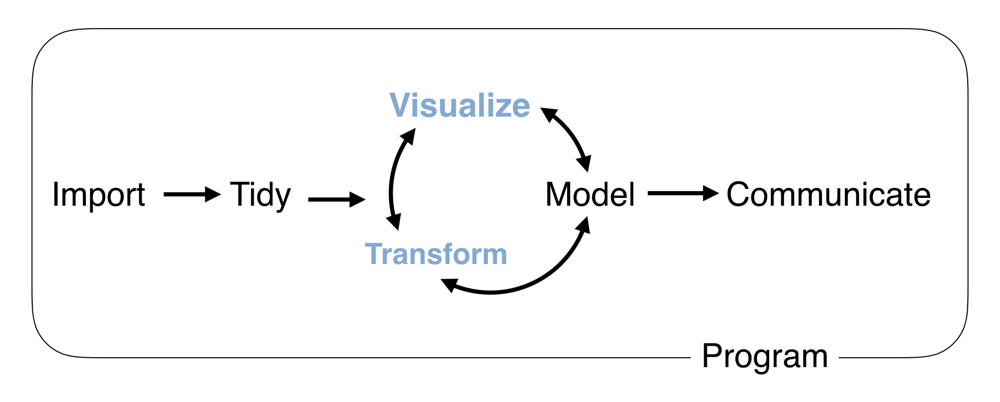

```{r setup, include=FALSE, cache=FALSE}
# Set global R options
options(htmltools.dir.version = FALSE, servr.daemon = TRUE)

# Set global knitr chunk options
knitr::opts_chunk$set(
  fig.align = "center", 
  cache = TRUE,
  error = FALSE,
  message = FALSE, 
  warning = FALSE, 
  collapse = TRUE 
)

# This is good for getting the ggplot background consistent with
# the html background color
library(ggplot2)
thm <- theme_bw()
theme_set(thm)
```

class: clear, center, middle

background-image: url(images/data-types-icon.png)

<br><br><br><br><br><br><br><br><br><br><br><br>
.font200.bold[Data Types]

---

# Data types

.font120.center[Data types are involved in nearly every task in the data science flow; however, most relevant to you today will be in the visualization and transformation tasks.]

```{r ds-task, echo=FALSE}

```

---

class: yourturn
# Your Turn!

.center.font130.bold.blue[What types of data are in this data set?]


```{r types-of-data, echo=FALSE}
library(tidyverse)

completejourney::transactions %>%
  sample_n(1000) %>%
  inner_join(completejourney::products) %>%
  select(household_id, basket_id, brand, product_category, transaction_timestamp, quantity) %>%
  mutate(multi_items = quantity > 1) %>%
  as.data.frame() %>%
  slice(1:15) %>%
  kableExtra::kable() %>%
  kableExtra::kable_styling()
```

---

# Packages to work with these data types

.pull-left[

```{r, eval=FALSE}
install.packages("tidyverse")
```

.bold[does the equivalent of...]

```{r, eval=FALSE}
install.packages("ggplot2")
install.packages("tibble")
install.packages("tidyr")
install.packages("readr")
install.packages("purrr")
install.packages("dplyr")
install.packages("stringr") #<<
install.packages("forcats") #<<
install.packages("lubridate") #<<
install.packages("hms") #<<
install.packages("DBI")
install.packages("haven")
install.packages("httr")
install.packages("jsonlite")
install.packages("readxl")
install.packages("rvest")
install.packages("xml2")
install.packages("modelr")
install.packages("broom")
```

]

.pull-right[

```{r, eval=FALSE}
library(tidyverse)
```

.bold[does the equivalent of...]

```{r, eval=FALSE}
library(ggplot2) 
library(tibble) 
library(tidyr) 
library(readr) 
library(purrr) 
library(dplyr) 
library(stringr) #<<
library(forcats) #<<
```

]


---

# Requirements

.pull-left[

### Packages

```{r load-pkgs}
library(tidyverse)
library(forcats)   # to work with factors
library(lubridate) # to work with dates
library(hms)       # to work with dates
```


]

.pull-right[

### Data sets

```{r load-data}
# complete journey data
transactions <- completejourney::transactions
products <- completejourney::products

# imported data
households <- data.table::fread("data/households.csv", data.table = FALSE) %>% as_tibble()
```

]

---

class: clear, center, middle


background-image: url(images/logical-icon.jpg)
background-size: cover

.font300.bold[Logicals]

---

# Logicals

R's data type for .blue[boolean values] (i.e. TRUE and FALSE)

.pull-left[

```{r booleans}
typeof(TRUE)

typeof(FALSE)

typeof(c(TRUE, TRUE, FALSE))
```

]

.pull-right[

```{r compute-boolean}
transactions %>%
  select(basket_id, coupon_disc) %>% 
  mutate(used_coupon = coupon_disc > 0) #<<
```

]

---

# Most useful skill... .red[math with logicals]

When you do math with logicals, .blue[TRUE becomes 1] and .blue[FALSE becomes 0.]

--

.pull-left[

The .bold[sum] of a logical vector is the .bold[count of TRUEs]
<br><br>

```{r sum-trues}
# logical comparison
x <- c(1, 2, 3, 4) < 4
x

# sum of elements that meet that condition
sum(x)
```

]

.pull-right[

The .bold[mean] of a logical vector is the .bold[proportion of TRUEs]

```{r mean-trues}
# proportion of elements that meet that condition
mean(x)
```

]

---
class: yourturn
# Your Turn!

.pull-left[

### Challenge

Using the __completejourney::transactions__ data and the `coupon_disc` variable

1. How many transactions used a coupon?
2. What proportion of transactions used a coupon?

]

--

.pull-right[

### Solution

```{r yourturn-logicals}
transactions %>% 
  mutate(coupon_used = coupon_disc > 0) %>%
  summarise(
    count = sum(coupon_used),
    prop  = mean(coupon_used)
    )
```


]

---

class: clear, center, middle


background-image: url(images/character_string.png)
background-size: cover

.font300.bold.grey[Character Strings]

---

# Working with character strings <a href="https://stringr.tidyverse.org/"></a>

.pull-left[

<br>

* Often, we have character strings in our data that are long (i.e. description fields), messy (i.e. manual user input), and/or inconsistent

* Working with strings in base R can be a little frustrating primarily because of syntax inconsistencies

* The [__stringr__](https://stringr.tidyverse.org/index.html) package allows you to work with strings easily

]

.pull-right[

```{r stringr, echo=FALSE, out.width="80%", out.height="80%"}
knitr::include_graphics("images/stringr-large.png")
```

]

---

# stringr functions <a href="https://stringr.tidyverse.org/"></a>

.center[

.font200[All __stringr__ functions start with .bold.grey[`str_`]]

.font130[.grey[`str_`].blue[`sub()`]]

.font130[.grey[`str_`].blue[`count()`]]

.font130[.grey[`str_`].blue[`replace()`]]

.font130[.grey[`str_`].blue[`detect()`]]

.font130[.grey[`str_`].blue[`remove()`]]

.font130[...]

.content-box-grey[.bold[Check out all the options with `stringr::str_ + tab`]]

]

---

# stringr functions <a href="https://stringr.tidyverse.org/"></a>

.scrollable90[

.pull-left[

Let's look at the variety of meat products:

```{r meat-products, echo=FALSE}
products %>%
  select(product_id, product_category) %>%
  filter(str_detect(product_category, "MEAT")) %>%
  distinct(product_category) %>%
  as.data.frame() %>%
  kableExtra::kable() %>%
  kableExtra::kable_styling()
```

]

.pull-right[

```{r}
# character string vector
x <- c("FROZEN MEAT", "FRZN MEAT/MEAT DINNERS", "MEAT - MISC", "CEREAL")

# force to lower case
str_to_lower(x)

# extract first 4 characters
str_sub(x, start = 1, end = 4)

# detect if "meat" is in each element
str_detect(x, pattern = "MEAT")

# replace first "MEAT" in each element with "NON-VEGGIE
str_replace(x, pattern = "MEAT", replacement = "NON-VEGGIE")

# replace all "MEAT" in each element with "NON-VEGGIE
str_replace_all(x, pattern = "MEAT", replacement = "NON-VEGGIE")
```

]
]

---

# Most useful skills <a href="https://stringr.tidyverse.org/"></a>

<br>

.font200[

1. How to find matches for patterns

2. How to extract / replace substrings

3. Regular expressions

]

<br>
.center[.content-box-grey[.bold[We will only hit the basics here, I cover this more thoroughly in Intermediate R]]]

---

# Find matches for patterns <a href="https://stringr.tidyverse.org/"></a>

What if we wanted to analyze transactions for all .bold[meat] products?

.pull-left[

- `str_detect()` returns TRUE/FALSE
- use with `filter()` to return only TRUEs

```{r detect-meat-products}
products %>% 
  select(product_id, product_category) %>%
  filter(str_detect(product_category, "MEAT")) #<<
```

]

--

.pull-right[

How many products are meat products?

```{r}
products %>%
  distinct(product_id, product_category) %>%
  mutate(meat_product = str_detect(product_category, "MEAT")) %>% #<<
  summarize(
    count = sum(meat_product, na.rm = TRUE),
    prop  = mean(meat_product, na.rm = TRUE)
  )
```


]

---

# Extract/ replace substrings <a href="https://stringr.tidyverse.org/"></a>

What if we wanted to analyze transactions for all .bold[frozen food] products?

.pull-left[

Notice that we have products categorized as .bold.blue["FROZEN"] and .bold.blue["FRZN"]

```{r frozen-frzn-foods, echo=FALSE}
products %>%
  filter(str_detect(product_category, regex("FROZEN|FRZN"))) %>%
  distinct(product_category) %>%
  as.data.frame() %>%
  kableExtra::kable() %>%
  kableExtra::kable_styling()
```

]

.pull-right[

- We can .blue[replace] all "FRZN" instances with .blue[`str_replace`]
- Often, we want to replace ___all___ instances, not just the first

```{r frzn-replace}
products %>%
  mutate(product_category = str_replace_all(product_category, pattern = "FRZN", replacement = "FROZEN")) %>% #<<
  filter(str_detect(product_category, "FROZEN")) %>%
  distinct(product_category)
```

]

---

# Regular expressions <a href="https://stringr.tidyverse.org/"></a>

- What we have been doing is finding very simple .blue[___regular expressions___]

- REGEX provides a concise way to identify patterns within character strings

- We cover this more in-depth in the Intermediate R course

```{r}
# all products the start with "FROZEN", "FRZN", or end with the word "ICE"
products %>%
  filter(str_detect(product_category, regex("(^FROZEN|FRZN|//bICE$)"))) %>%
  distinct(product_category)
```


---


class: yourturn
# Your Turn!

.pull-left[

### Challenge

Using the __completejourney::products__ data and `product_category` variable

1. How many products contain "SEAFOOD"
2. What is the proportion of products that contain "SEAFOOD"

__Hint:__

```{r, eval=FALSE}
products %>%
  distinct(product_category) %>%
  mutate(seafood = _____) %>%
  summarise(
    count = _____,
    prop  = _____
    )
```


]

--

.pull-right[

### Solution

```{r yourturn-characters}
products %>%
  distinct(product_category) %>%
  mutate(seafood = str_detect(product_category, pattern = "SEAFOOD")) %>%
  summarise(
    count = sum(seafood, na.rm = TRUE),
    prop  = mean(seafood, na.rm = TRUE)
    )
```


]

---

class: clear, center, middle


background-image: url(images/factor-icon.jpg)
background-size: cover

<br><br><br>
.font300.bold.grey[Factors]

---

# Working with factors <a href="https://forcats.tidyverse.org/"></a>

.pull-left[

<br>

* Factors are a useful data structure; particularly for modeling and visualizations because they control the order of levels

* Working with factors in base R can be a little frustrating because of syntax inconsistencies and a handful of missing tools

* The [__forcats__](https://forcats.tidyverse.org/index.html) package allows you to modify factors with minimal pain

]

.pull-right[

```{r forcats, echo=FALSE, out.width="80%", out.height="80%"}
knitr::include_graphics("images/forcats-large.png")
```

]

---

# Working with factors <a href="https://forcats.tidyverse.org/"></a>

R’s representation of categorical data. Consists of:

- A set of discrete values
- An ordered set of valid levels

```{r example-factors}
eyes <- factor(x = c("blue", "green", "green"), levels = c("blue", "brown", "green"))
eyes
```

--

Stored as an integer vector with a levels attribute

```{r}
unclass(eyes)
```


---

# Working with factors <a href="https://forcats.tidyverse.org/"></a>

Categorical variables can have levels that are ordered, unordered, collapsable, etc.  Consider:

.pull-left[

```{r factors-distinct-marital-status}
households %>% distinct(marital)
```


]

.pull-right[

```{r factors-distinct-income-levels}
households %>% distinct(income_range)
```

]

<br><br>
.center[.content-box-gray[.bold[Why would we care about changeing these levels? `r emo::ji("thinking")`]]]

---
# Working with factors <a href="https://forcats.tidyverse.org/"></a>

Often, we want to adjust the categories or the ordering of categories for a categorical variable.  Consider:

.pull-left[

```{r, fig.height=4.5}
ggplot(households, aes(marital)) +
  geom_bar()
```


]

.pull-right[

```{r, fig.height=4.5}
ggplot(households, aes(income_range)) +
  geom_bar()
```

]

---
# Most useful skills... <a href="https://forcats.tidyverse.org/"></a>

.pull-left[
.font150[

<br>

- Reorder the levels

- Recode the levels

- Collapse levels

]
]

.pull-right[

.font150[

<br>

All __forcats__ functions start with .grey[`fct_`]

- .grey[`fct_`].blue[`relevel()`]
- .grey[`fct_`].blue[`recode()`]
- .grey[`fct_`].blue[`collapse()`]
- .grey[`fct_`].blue[`unique()`]

]
]

---
# Reorder the levels <a href="https://forcats.tidyverse.org/"></a>

We can .blue[reorder] factor levels with .blue[`fct_relevel()`]

.pull-left[

```{r relevel-income-range}
households <- households %>% 
  mutate(income_range = fct_relevel(income_range, "UNDER 35K", "35-49K", "50-74K", "75-99K", "100-150K", "150K+", "null")) #<<

households %>% count(income_range)
```

]

.pull-right[

```{r plot-releveled-income, fig.height=4}
ggplot(households, aes(income_range)) +
  geom_bar()
```

]

---
# Recode the levels <a href="https://forcats.tidyverse.org/"></a>

We can .blue[recode] factor levels with .blue[`fct_recode()`]

.pull-left[

```{r recode-income}
households <- households %>%
  mutate(income_range = fct_recode(income_range, Unknown = "null")) #<<

households %>% count(income_range)
```


]

.pull-right[

```{r recode-income-plot, fig.height=4}
ggplot(households, aes(income_range)) +
  geom_bar()
```

]

---
# Collapse the levels <a href="https://forcats.tidyverse.org/"></a>

We can .blue[collapse] factor levels with .blue[`fct_collapse()`]

.pull-left[

```{r collapse-marital-status}
households <- households %>%
  mutate(
    marital = fct_collapse(marital, Unknown = c("null", "Unknown")), #<<
    marital = fct_relevel(marital, "Unknown", after = Inf)
    )

households %>% count(marital)
```

]

.pull-right[

```{r collapse-marital-status-plot, fig.height=4}
ggplot(households, aes(marital)) +
  geom_bar()
```

]

---

# Working with factors <a href="https://forcats.tidyverse.org/"></a>

Sometimes you just want to .blue[reorder a factor for plotting purposes] rather than to permanently change the factor.  .blue[`fct_infreq()`], .blue[`fct_rev()`], and .blue[`fct_reorder()`] can be helpful.

--

.pull-left[

```{r, fig.height=4}
households %>%
  mutate(homeowner = fct_collapse(homeowner, Unknown = c("Unknown", "null"))) %>%
  ggplot(aes(fct_infreq(homeowner))) + #<<
  geom_bar()
```


]

.pull-right[

```{r, fig.height=4}
households %>%
  mutate(homeowner = fct_collapse(homeowner, Unknown = c("Unknown", "null"))) %>%
  ggplot(aes(fct_rev(homeowner))) + #<<
  geom_bar()
```

]

---


# Working with factors <a href="https://forcats.tidyverse.org/"></a>

Sometimes you just want to .blue[reorder a factor for plotting purposes] rather than to permanently change the factor.  .blue[`fct_infreq()`], .blue[`fct_rev()`], and .blue[`fct_reorder()`] can be helpful.

.pull-left[

```{r fct-reorder-example}
prod_count <- products %>% 
  count(department) %>%
  drop_na()

prod_count
```

]

.pull-right[

```{r fct-reorder-plot, fig.height=5}
ggplot(prod_count, aes(n, fct_reorder(department, n))) + #<<
  geom_point()
```


]

---

class: yourturn
# Your Turn!

.pull-left[

### Challenge

Using the __households__ data

1. Recode the `hh_size` factor so that "null" is now "Unknown"

2. Relevel the `hh_size` factor so that "Unknown" is at the end

3. Use a bar chart to illustrate the distribution of `hh_size` in our data

]

.pull-right[

### Solution

```{r yourturn-factors, fig.height=3.5}
households %>% 
  mutate(
    hh_size = fct_recode(hh_size, Unknown = "null"),
    hh_size = fct_relevel(hh_size, "Unknown", after = Inf)
    ) %>%
  ggplot(aes(hh_size)) +
  geom_bar()
```

]

---

background-image: url(images/date-time-icon.jpg)
background-size: cover

# Dates & Times

---

# Working with dates & times <a href="https://lubridate.tidyverse.org/"></a>

.pull-left[

<br>

* Dates come in many different forms:
   - 2017/02/03
   - February 3, 2017
   - 03-Feb-2017

* Working with dates in R can be a bit convoluted and cumbersome

* The [__lubridate__](https://lubridate.tidyverse.org/index.html) package allows us to easily handle/manipulate date-time variables

]

.pull-right[

```{r lubridate, echo=FALSE, out.width="80%", out.height="80%"}
knitr::include_graphics("images/lubridate-large.png")
```

]

---

# Most useful skills... <a href="https://lubridate.tidyverse.org/"></a>

.font200[

- Creating dates/times (i.e. parsing)

- Access and change parts of a date

- .opacity20[Deal with time zones]

- .opacity20[Do math with instants and time spans]

]

---

# Creating dates/times <a href="https://lubridate.tidyverse.org/"></a>

__lubridate__ has a series of parsing functions that will .blue[create dates] based on the existence and order of the date-time components

.pull-left[

.font130[
- `ymd_hms()`, `ymd_hm()`, `ymd_h()`, `ymd()`
- `ydm_hms()`, `ydm_hm()`, `ydm_h()`, `ydm()`
- `dmy_hms()`, `dmy_hm()`, `dmy_h()`, `dmy()`
- `mdy_hms()`, `mdy_hm()`, `mdy_h()`, `mdy()`
- and more!

]
]

.pull-right[

```{r}
# year, month, day
ymd("2018-12-02")

# year, month, day, hour
ymd_h("2018-12-02 01")

# year, month, day, timestamp
ymd_hms("2018-12-02 01:31:27")
```

and __lubridate__ does not care about format

```{r}
ymd("2018-12-02")
ymd("2018/12/02")
mdy("February 02, 2018")
```

]

---
# Accessing components <a href="https://lubridate.tidyverse.org/"></a>

__lubridate__ has a series of functions to .blue[extract components] of dates

.pull-left[

.font130[
- `year()`
- `quarter()`
- `month()`
- `week()`
- `wday()`
- `hour()`
- and more!

]
]

.pull-right[

```{r}
# get year
year("2018-12-02 01:31:27")

# get quarter
quarter("2018-12-02 01:31:27")

# get month
month("2018-12-02 01:31:27", label = TRUE)

# get weekday
wday("2018-12-02 01:31:27", label = TRUE, abbr = FALSE)
```

]

---

# Accessing components <a href="https://lubridate.tidyverse.org/"></a>

- Just like __stringr__, we can use the __lubridate__ functions inside `filter()` and `mutate()`

.pull-left[

Use `filter()` to get all transactions that occur on weekends

```{r get-weekend-transactions}
transactions %>%
  filter(wday(transaction_timestamp) %in% 6:7) %>% #<<
  select(basket_id, transaction_timestamp)
```

]

.pull-right[

Use `mutate()` to create a new variable for the day of week

```{r make-weekday-variable}
transactions %>%
  mutate(weekday = wday(transaction_timestamp, label = TRUE)) %>% #<<
  select(basket_id, transaction_timestamp, weekday)
```

]

---

class: yourturn
# Your Turn!

.pull-left[

### Challenge

Using the __completejourney::transactions__ data set

1. Make a bar chart showing the total number of transactions by weekday. Which weekday experiences the most traffic?

2. Make a line chart showing the total daily sales value (`sum(sales_value)`) for each day of the year (hint: use `yday()`).  Is there any obvious trend in the daily total sales value?

]

--

.pull-right[

### Solution

```{r yourturn-lubridate-1, fig.height=4}
# 1
transactions %>%
  mutate(weekday = wday(transaction_timestamp, label = TRUE)) %>% 
  ggplot(aes(weekday)) +
  geom_bar()
```

]

---
class: yourturn
# Your Turn!

.pull-left[

### Challenge

Using the __completejourney::transactions__ data set

1. Make a bar chart showing the total number of transactions by weekday. Which weekday experiences the most traffic?

2. Make a line chart showing the total daily sales value (`sum(sales_value)`) for each day of the year (hint: use `yday()`).  Is there any obvious trend in the daily total sales value?

]

.pull-right[

### Solution

```{r yourturn-lubridate-2, fig.height=3}
# 2
transactions %>%
  mutate(day = yday(transaction_timestamp)) %>% 
  group_by(day) %>%
  summarise(total_sales = sum(sales_value, na.rm = TRUE)) %>%
  ggplot(aes(x = day, y = total_sales)) +
  geom_line()
```

]

---

# Questions?

.font120.center[We can do a lot with data types, and the packages reviewed here can do much more than what we covered; however, this gets you started with manipulating data types for analytic purposes.]

```{r questions-data-types, echo=FALSE, out.height="400", out.width="400"}
knitr::include_graphics("images/questions.png")
```


