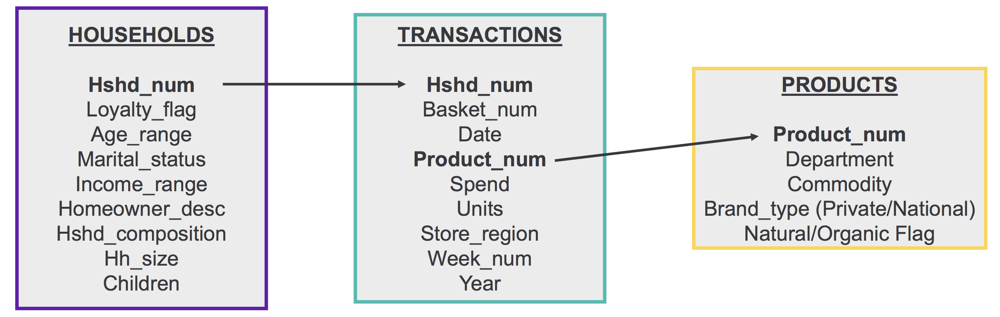
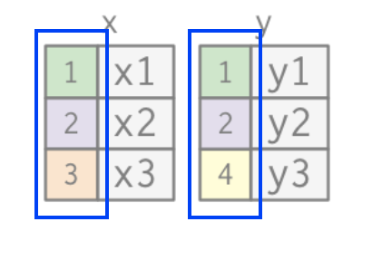
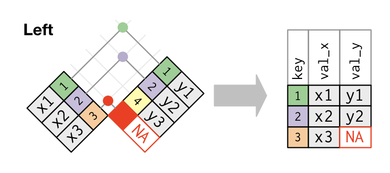
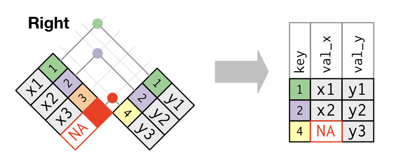
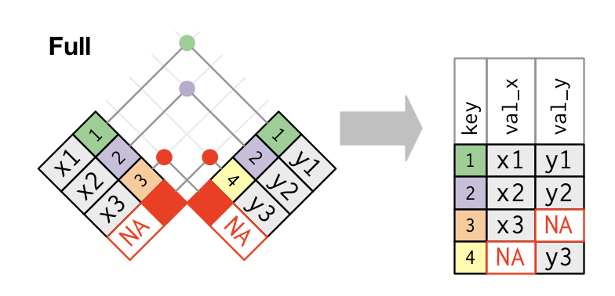

```{r setup, include=FALSE, cache=FALSE}
# Set global R options
options(htmltools.dir.version = FALSE, servr.daemon = TRUE)

# Set global knitr chunk options
knitr::opts_chunk$set(
  fig.align = "center", 
  cache = TRUE,
  error = FALSE,
  message = FALSE, 
  warning = FALSE, 
  collapse = TRUE 
)

# This is good for getting the ggplot background consistent with
# the html background color
library(ggplot2)
thm <- theme_bw()
theme_set(thm)
```

class: clear, center, middle

background-image: url(images/relational-nycflights.png)
background-size: cover

.font300.bold[Relational Data]

---

# Joining data is part of...

<br><br>

```{r joins-task, echo=FALSE}
knitr::include_graphics("images/transform-task.png")
```

---

# What is relational data

.pull-left[
<br>

_.font120[“It’s rare that a data analysis involves only a single table of data. .blue[Typically you have many tables of data, and you must combine them] to answer the questions that you’re interested in.”_ 

--- Garrett Grolemund

]
]

.pull-right[
<br>

```{r nycflights, echo=FALSE}
knitr::include_graphics("images/relational-nycflights.png")
```

]

---

# Types of joins

To work with relational data you need join operations that work with pairs of tables.  There are two families of verbs designed to work with relational data:

.pull-left[

* __Mutating joins__: add new variables to one data frame by matching observations in another.

* __Filter joins__:  filter observations from one data frame based on whether or not they match an observation in the other table.

]

.pull-right[

```{r dplyr-hex, echo=FALSE, out.height="60%", out.width="60%"}
knitr::include_graphics("images/dplyr.png")
```

]

---

# Prerequisites

.pull-left[

### Packages

```{r pkgs}
library(tidyverse) # or library(dplyr)
```

]

.pull-right[

### Example data

```{r join-setup}
x <- tribble(
  ~key, ~val_x,
     1, "x1",
     2, "x2",
     3, "x3"
)
y <- tribble(
  ~key, ~val_y,
     1, "y1",
     2, "y2",
     4, "y3"
)
```

```{r join-setup-image, echo=FALSE, out.width="35%"}
knitr::include_graphics("images/join-setup.png")
```

]

---

# Prerequisites

.pull-left[

### Exercise data

```{r exercises-data}
transactions <- data.table::fread("data/transactions.csv", data.table = F) %>% as_tibble()
products     <- data.table::fread("data/products.csv", data.table = F) %>% as_tibble()
households   <- data.table::fread("data/households.csv", data.table = F) %>% as_tibble()
```

]

.pull-right[

### Exercise data connections

```{r exercise-data-connections, echo=FALSE}

```

]

---

# Keys `r anicon::faa("key", animate = FALSE, colour = "red")`

.font120[

- __keys__ are variables that connect pairs of tables
- A primary key uniquely identifies an observation in its own table
- A foreign key uniquely identifies an observation in another table

]
--

.pull-left[

.center.font120.bold[Example data keys]

```{r example-data-keys, echo=FALSE, out.width="60%"}

```

]

.pull-left[

.center.font120.bold[Exercise data keys]

```{r exercise-data-keys, echo=FALSE}

```

]

---
class: clear, center, middle

.font300.bold[Mutating Joins]


---

# Inner join

<br>
.font120[

- Simplest type of join
- Keeps all observations where key values match
- Discards observatoins that don't match
- Add variables from y to x
]

--

.pull-left[

```{r inner-join}
x %>% inner_join(y, by = "key")
```

]

.pull-right[

```{r inner-join-image, echo=FALSE}
knitr::include_graphics("images/join-inner.png")
```

]

---

# Outer joins

<br>
.font120[

- Outer joins keep ___all___ observations that appear in at least one of the tables
- There are 3 types of outer joins:
]

--

.pull-left[

.center.font120[.blue.bold[left join]: keeps all observations in x]

```{r left-join}
x %>% left_join(y, by = "key")
```

]

.pull-right[

```{r left-join-image, echo=FALSE}

```

]

<br>

.center[.content-box-grey[.bold[Note how missing values get filled in with `NA`]]]

---

# Outer joins

<br>
.font120[

- Outer joins keep ___all___ observations that appear in at least one of the tables
- There are 3 types of outer joins:
]

.pull-left[

.center.font120[.blue.bold[right join]: keeps all observations in y]

```{r right-join}
x %>% right_join(y, by = "key")
```

]

.pull-right[

```{r right-join-image, echo=FALSE}

```

]

<br>

.center[.content-box-grey[.bold[Note how missing values get filled in with `NA`]]]

---

# Outer joins

<br>
.font120[

- Outer joins keep ___all___ observations that appear in at least one of the tables
- There are 3 types of outer joins:
]


.pull-left[

.center.font120[.blue.bold[full join]: keeps all observations in x & y]

```{r full-join}
x %>% full_join(y, by = "key")
```

]

.pull-right[

```{r full-join-image, echo=FALSE}

```

]

<br>

.center[.content-box-grey[.bold[Note how missing values get filled in with `NA`]]]

---

# Outer joins

<br>
.font120[

- Outer joins keep ___all___ observations that appear in at least one of the tables
- There are 3 types of outer joins:
]

.pull-left[

<br>
.font120[
- left join: keeps all observations in x
- right join: keeps all observations in y
- full join: keeps all observations in x & y
] 
]

.pull-right[

```{r outer-join-image, echo=FALSE, out.width="50%"}
knitr::include_graphics("images/join-outer.png")
```

]

---
class: yourturn

# Your Turn!

.pull-left[

### Challenge

1. Join the transactions and products data using `inner_join()`

2. Join the transactions, products, and households data using two `inner_join()`s

]

--

.pull-right[

### Solution

.code70[

```{r your-turn-1}
# 1
trans_prod <- transactions %>% inner_join(products, by = "product_num")

# 2
combined <- transactions %>% 
  inner_join(products, by = "product_num") %>%
  inner_join(households, by = "hshd_num")

head(combined)
```

]
]

---
class: clear, center, middle

.font300.bold[Filtering Joins]

---

# Filtering joins

<br>
.font120[

* Filtering joins affect the observations rather than adding variables

* Use when wanting to filter one data set based on foreign key variables in another data set

* There are 2 types of filtering joins:

   - .bold.font120[`semi_join()`]
   - .bold.font120[`anti_join()`]
   
]   

---

# Filtering joins


.pull-left[

.font110[.bold.blue[Semi joins] keep all observations in x that have a match in y]

```{r semi-join}
x %>% semi_join(y, by = "key")
```


```{r semi-join-image, echo=FALSE, out.width="80%"}
knitr::include_graphics("images/join-semi.png")
```

]

--

.pull-right[

.font110[.bold.blue[Anti joins] keep all observations that don't have a match]

```{r anti-join}
x %>% anti_join(y, by = "key")
```


```{r anti-join-image, echo=FALSE, out.width="80%"}
knitr::include_graphics("images/join-anti.png")
```

]


---
class: yourturn

# Your Turn!

.pull-left[

### Challenge

1. Of the 5000 households in our __households__ data, how many do we transaction data for?

2. Of the 151,141 products in our __products__ data, how many are not represented in our __transactions__ data?

<br>

.center[_Hint: after you use the right join functions, pipe the result into `tally()`_]
]

--

.pull-right[

### Solution

```{r yourturn-2}
# 1
households %>% 
  semi_join(transactions) %>% #<<
  tally()

# 2
products %>%
  anti_join(transactions) %>% #<<
  tally()
```

]

---

# Quick tip: defining keys

.center.font130[What if our key names don’t match?]

.pull-left[

.center.font120.bold[x]

```{r, echo=FALSE}
x <- tribble(
  ~key1, ~val_x,
     1, "x1",
     2, "x2",
     3, "x3"
)

x  %>%
  kableExtra::kable(align = "cc") %>%
  kableExtra::kable_styling(font_size = 25) %>%
  kableExtra::column_spec(1:2, width = "1in") 
```

]

.pull-right[

.center.font120.bold[y]

```{r, echo=FALSE}
y <- tribble(
  ~key2, ~val_y,
     1, "y1",
     2, "y2",
     4, "y3"
)
y  %>%
  kableExtra::kable(align = "cc") %>%
  kableExtra::kable_styling(font_size = 25) %>%
  kableExtra::column_spec(1:2, width = "1in")
```

]

<br>

--

```{r}
x %>% inner_join(y, by = c("key1" = "key2"))
```

---

# Things to remember

<br>

* .bold[mutating joins]: add new variables to one data frame by matching key values in another. Includes `inner_join`, `left_join`, `right_join`, `full_join`

* .bold[filtering joins]: filter observations from one data frame based on whether or not they match a key value in the other table. Includes `semi_join` and `anti_join`

---
class: clear, center, middle

background-image: url(images/your-killing-me-smalls.webp)
background-size: cover

.font300.bold.white[One last challenge!]

---
class: yourturn

# Your Turn!

### Challenge

Compute the total `spend` by `commodity` for household (`hshd_num`) 3708.  See if you can plot the results in rank order. 

--

### Solution

.pull-left[

```{r final-challenge, eval=FALSE}
households %>%
  filter(hshd_num == 3708) %>%
  inner_join(transactions) %>%
  inner_join(products) %>%
  group_by(commodity) %>%
  summarize(total = sum(spend, na.rm = TRUE)) %>%
  ggplot(aes(total, reorder(commodity, total))) +
  geom_point()
```

]

.pull-right[

```{r final-challenge-plot, echo=FALSE, fig.height=4}
households %>%
  filter(hshd_num == 3708) %>%
  inner_join(transactions) %>%
  inner_join(products) %>%
  group_by(commodity) %>%
  summarize(total = sum(spend, na.rm = TRUE)) %>%
  ggplot(aes(total, reorder(commodity, total))) +
  geom_point()
```

]

---

# Questions?

<br>

```{r questions-tidyr, echo=FALSE, out.height="450", out.width="450"}
knitr::include_graphics("images/questions.png")
```
