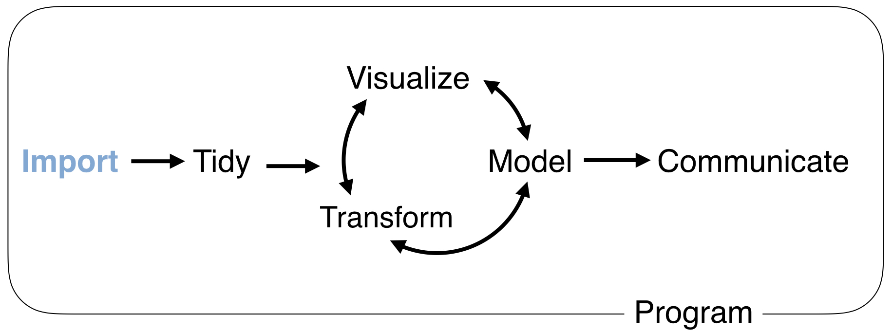
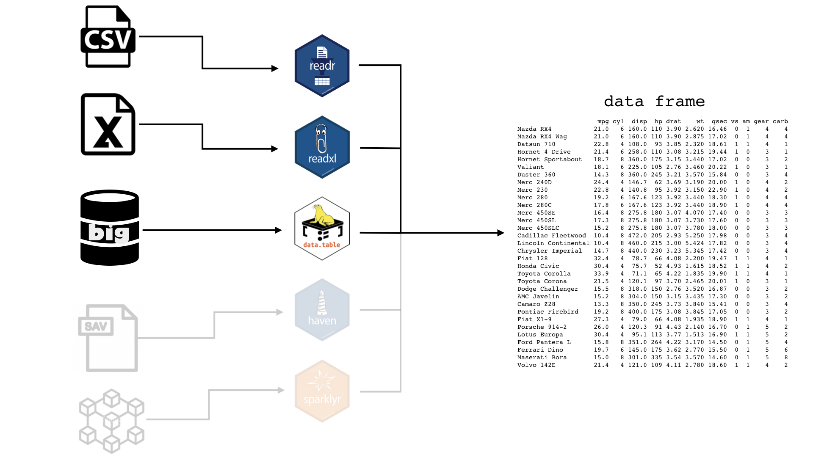

```{r setup, include=FALSE, cache=FALSE}
# Set global R options
options(htmltools.dir.version = FALSE, servr.daemon = TRUE)

# Set global knitr chunk options
knitr::opts_chunk$set(
  fig.align = "center", 
  cache = TRUE,
  error = FALSE,
  message = FALSE, 
  warning = FALSE, 
  collapse = TRUE 
)

# This is good for getting the ggplot background consistent with
# the html background color
library(ggplot2)
thm <- theme_bw()
theme_set(thm)
```

class: title-slide   
<a href="https://github.8451.com/b294776/"></a>


<br><br><br><br>
# An .red[Incomplete] Introduction to `r anicon::faa("r-project", animate = 'pulse', speed = 'slow', color = 'steelblue')`

## .font70[.italic['Success is stumbling from failure to failure with no loss of enthusiasm'] - Winston Churchill]

### Brad Boehmke
### Dec 13-14, 2018

### Slides: TBD
### Script: TBD
### Data: TBD

---

class: clear, center, middle


background-image: url(images/introductions.jpg)
background-size: cover

<br><br><br><br><br><br><br><br>

.pull-left-narrow[
.font200.white[Introductions]
]
---

# About me

.pull-left[

```{r name-tag, echo=FALSE}
knitr::include_graphics("images/name-tag.png")
```

* [`r fontawesome::fa("globe", fill = "steelblue")`](http://bradleyboehmke.github.io/) bradleyboehmke.github.io
* [`r fontawesome::fa("github", fill = "steelblue")`](https://github.com/bradleyboehmke/) @bradleyboehmke
* [`r fontawesome::fa("twitter", fill = "steelblue")`](https://twitter.com/bradleyboehmke) @bradleyboehmke
* [`r fontawesome::fa("linkedin", fill = "steelblue")`](https://www.linkedin.com/in/brad-boehmke-ph-d-9b0a257/) @bradleyboehmke
* [`r fontawesome::fa("envelope", fill = "steelblue")`](mailto:bradleyboehmke@gmail.com) bradleyboehmke@gmail.com

]


.pull-right[

#### Family 

* Dayton, OH
* Kate, Alivia (9), Jules (6)


#### Professional 

* 84.51° - Data Science Enabler 

#### Academic

* University of Cincinnati 
* Air Force Institute of Technology

#### R Community


]

---

# Data science

```{r, echo=FALSE, out.width="60%"}
knitr::include_graphics("images/data-science.png")
```

---

# Data science

```{r, echo=FALSE, out.width="80%"}
knitr::include_graphics("images/data-science-2.png")
```

---

# Data science

```{r, echo=FALSE, out.width="95%"}
knitr::include_graphics("images/applied-data-science.gif")
```

---

# Course objectives!

.font110[Provide an intensive, hands-on introduction to the `r anicon::faa("r-project", colour = "steelblue", size = 1, animate = FALSE)` programming language:]

.pull-left[

.center[.bold[Day 1]]

| Topic | Time |
|:------|------|
| Fundamentals | 9:00 - 10:00 |
| Importing data | 10:00 - 10:30 |
| Break | 10:30 - 10:45 |
| Data transformation | 10:45 - 12:00 |
| Lunch | 12:00 - 1:00 |
| Review | 1:00-1:30 |
| Data visualization | 1:30-2:30 |
| Break | 2:30-2:45 |
| Case study | 2:45-4:00 |
| Q&A | 4:00-4:30 |

]

.pull-right[

.center[.bold[Day 2]]
 
| Topic | Time |
|:------|------|
| Review | 9:00-10:00 |
| Tidying & cleaning | 10:00-10:45 |
| Break | 10:45 - 11:00 |
| Tidying & cleaning | 11:00-12:00 |
| Lunch | 12:00 - 1:00 |
| Joining data | 1:00-1:45 |
| Data structures | 1:45-2:30 |
| Break | 2:30-2:45 |
| Exploratory data analysis | 2:45-4:00 |
| Q&A | 4:00-4:30 |

]

---

# A hands-on learning environment

.pull-left[

### You may be overwhelmed

```{r drowning, echo=FALSE, out.height="400"}
knitr::include_graphics("images/drowning.gif")
```

]

--

.pull-right[

### So work together

```{r helping, echo=FALSE, out.height="400"}
knitr::include_graphics("images/dogs-helping.gif")
```

]

---

# Class material

<a href="https://github.8451.com/b294776/analytics-connect-intro-r" class="github-corner" aria-label="View source on Github"><svg width="80" height="80" viewBox="0 0 250 250" style="fill:#fff; color:#151513; position: absolute; top: 0; border: 0; right: 0;" aria-hidden="true"><path d="M0,0 L115,115 L130,115 L142,142 L250,250 L250,0 Z"></path><path d="M128.3,109.0 C113.8,99.7 119.0,89.6 119.0,89.6 C122.0,82.7 120.5,78.6 120.5,78.6 C119.2,72.0 123.4,76.3 123.4,76.3 C127.3,80.9 125.5,87.3 125.5,87.3 C122.9,97.6 130.6,101.9 134.4,103.2" fill="currentColor" style="transform-origin: 130px 106px;" class="octo-arm"></path><path d="M115.0,115.0 C114.9,115.1 118.7,116.5 119.8,115.4 L133.7,101.6 C136.9,99.2 139.9,98.4 142.2,98.6 C133.8,88.0 127.5,74.4 143.8,58.0 C148.5,53.4 154.0,51.2 159.7,51.0 C160.3,49.4 163.2,43.6 171.4,40.1 C171.4,40.1 176.1,42.5 178.8,56.2 C183.1,58.6 187.2,61.8 190.9,65.4 C194.5,69.0 197.7,73.2 200.1,77.6 C213.8,80.2 216.3,84.9 216.3,84.9 C212.7,93.1 206.9,96.0 205.4,96.6 C205.1,102.4 203.0,107.8 198.3,112.5 C181.9,128.9 168.3,122.5 157.7,114.1 C157.9,116.9 156.7,120.9 152.7,124.9 L141.0,136.5 C139.8,137.7 141.6,141.9 141.8,141.8 Z" fill="currentColor" class="octo-body"></path></svg></a><style>.github-corner:hover .octo-arm{animation:octocat-wave 560ms ease-in-out}@keyframes octocat-wave{0%,100%{transform:rotate(0)}20%,60%{transform:rotate(-25deg)}40%,80%{transform:rotate(10deg)}}@media (max-width:500px){.github-corner:hover .octo-arm{animation:none}.github-corner .octo-arm{animation:octocat-wave 560ms ease-in-out}}</style>

.pull-left[

### Source code 

- `r anicon::faa("slideshare", animate = "pulse", anitype="hover", rtext=" Slides")`: TBD

- `r anicon::faa("code", animate = "pulse", anitype="hover", rtext=" Student Script")`: TBD

- `r anicon::faa("database", animate = "pulse", anitype="hover", rtext=" Data")`: TBD

- `r anicon::faa("github", animate = "pulse", anitype="hover", rtext=" GitHub")`: TBD

]

--

.pull-right[

### UC R Programming Guide 

- http://uc-r.github.io

```{r effo, echo=FALSE, out.width="500"}
knitr::include_graphics("images/uc-guide.png")
```

]

---
class: yourturn
# Your Turn!

<br>
## .font150[Meet your neighbors:]

.font140[
1. What is their experience with R?
2. What programming experience other than R do they have?
2. How are they using, or how do they plan to use, R in their job?
]


---

class: clear, center, middle


background-image: url(images/prereqs.jpg)
background-size: cover

<br><br><br><br><br><br><br><br>

.pull-left-narrow[
.font200[Prerequisites]
]

---

# Software

.pull-left[

### R (programming language) `r fontawesome::fa("r-project", fill = "steelblue")`

1. Go to https://cran.r-project.org/
2. Click "Download R for Mac/Windows"
3. Download the appropriate file:
   - Windows users click Base, and download the installer for the latest R version
   - Mac users select the file R-3.X.X that aligns with your OS version
4. Follow the instructions of the installer   

]

.pull-right[

### RStudio (IDE) 

1. Go to RStudio for desktop https://www.rstudio.com/products/rstudio/download/#download
2. Select the install file for your OS
3. Follow the instructions of the installer  

]

<br>
<br>

.center[
.content-box-gray[.bold[You should have R version 3.4.5 or greater installed.]]
]


---

# Questions about the class

<br>

```{r questions, echo=FALSE, out.height="450", out.width="450"}
knitr::include_graphics("images/questions.png")
```

---

class: clear, center, middle


background-image: url(images/fundamentals.png)
background-size: cover

---

# Understanding the RStudio IDE

```{r IDE, echo=FALSE}
knitr::include_graphics("images/RStudio-console.png")
```

.center[Learn more IDE features: `Help >> Cheatsheets >> RStudio IDE Cheat Sheet`]

---
class: yourturn
# Your Turn!

<br><br>
.font130[
(1). Open .R script for this class (`intro-r-student-script.R`)
]
.pull-left[
.font130[
(2) Write and execute the following code in the .R script and identify where in the IDE the outputs can be found:
]]

.pull-right[

```{r, eval=FALSE}
mtcars
?sum
hist(mtcars$mpg)
random_numbers <- runif(25)
history()
```
]

<br>

.center[.content-box-gray[.bold[Run the code with `cmd + enter` or selecting run button .]]]

---

# Getting help

.pull-left[

### In general

* __Google__: just add "with R" at the end of any search
* __Stack Overflow__: focused on programming questions
* __Cross Validated__: focused on statistical questions

### FOMO

* __R-bloggers__: blog aggregator
* __Twitter__: #rstats

]

.pull-right[

### Within R

```{r, eval=FALSE}
# provides details for specific function
help(sqrt)
?sqrt #<<

# provides examples for said function
example(sqrt)
```


]

---

# Setting your working directory

.font130[.bold[Keeping your files `r anicon::faa("copy", animate = 'pulse', speed = 'slow', anitype="hover")` organized is critical!]]

.pull-left[
```{r, eval=FALSE}
# get your current working directory
getwd()
## [1] "/Users/b294776/Desktop/Training"

# set your working directory
setwd("/Users/b294776/Desktop/Training/intro-r")

getwd()
## [1] "/Users/b294776/Desktop/Training/intro-r"
```

]

.pull-right[

```{r, echo=FALSE}
knitr::include_graphics("images/set-wk-dir.png")
```

]

<br><br><br><br>
.center[.bold[.content-box-gray[.red[Set your working directory to the location you want to work in for this training.]]]]

---

# Some basics

.pull-left[

### R as a calculator `r anicon::faa("calculator", animate = 'pulse', speed = 'slow', anitype="hover")`

```{r}
# uses PEMBDAS convention for order of operations
4 + 3 / 10 ^ 2
(4 + 3) / 10 ^ 2
(4 + 3 / 10) ^ 2

# calculations with NA produces NA
4 + 3 / 10 ^ NA 
```

]

--

.pull-right[

### Assigning & evaluating

```{r, error=TRUE}
x <- 4 + 3 / 10 ^ 2   # GOOD
x = 4 + 3 / 10 ^ 2    # BAD

# we can increment (build onto) existing objects
x
x <- x + 1
x

# evaluation is case sensitive
X
```


]

---

class: yourturn

# Your Turn!

.pull-left[

### Economic Order Quantity Model

$$Q = \sqrt{\frac{2DK}{h}}$$

Calculate *Q* where:

* $D=1000$
* $K=5$
* $h=0.25$

Save the result to an object called *Q*.

]

--

.pull-right[

### Solution

```{r}
D <- 1000
K <- 5
h <- .25

Q <- sqrt(2 * D * K / h)
Q
```


]

---

# Workspace environment

.pull-left[
* You should now have 4 objects in your global environment
* History tab will show your recent code
* To list and remove these objects from your globa environment:

```{r, eval=FALSE}
# list all objects
ls()
## [1] "D" "h" "K" "Q"

# remove a single object
rm(D)

# remove all objects
rm(list = ls())
```

]

.pull-right[

```{r, echo=FALSE}
knitr::include_graphics("images/workspace.png")
```


]

---

# Packages `r emo::ji("package")`

The fundamental unit of shareable code is the .bold[package].

* CRAN: 13,000+
* Bioconductor: 1,500+
* GitHub: Many more plus beta versions for updated packages not yet published

```{r, echo=FALSE, out.width="60%"}
knitr::include_graphics("images/base-r-pkgs.png")
```


---

# Packages `r emo::ji("package")`

The fundamental unit of shareable code is the .bold[package].

* CRAN: 13,000+
* Bioconductor: 1,500+
* GitHub: Many more plus beta versions for updated packages not yet published

.blue[So how do we install these packages?]

```{r, eval=FALSE}
# install packages from CRAN
install.packages("packagename") #<<

# install packages from GitHub
install.packages("devtools")                            # only required the first time
devtools::install_github("username/packagename")
```

---

# Packages `r emo::ji("package")`


.pull-left[

### Downloads files to computer

```{r, eval=FALSE}
install.packages("packagename")
```

.center[.content-box-gray[.bold[1x per computer]]]

]

.pull-right[

### Loads package to use

```{r, eval=FALSE}
library(packagename)
```

.center[.content-box-gray[.bold[1x per R session]]]

]

---

class: yourturn

# Your Turn!

.pull-left[

1. Download these packages from CRAN:
   * tidyverse
   * nycflights
   
2. Load both packages to use in your current R session   

]

--

.pull-right[
.bold[.font120[Solution:]]

```{r, eval=FALSE}
# install packages
install.packages("tidyverse")
install.packages("nycflights13")


# alternative
install.packages(c("tidyverse", "nycflights13"))

# load packages to use
library(tidyverse)
library(nycflights13)
```


]

<br><br><br><br>
.center[.content-box-gray[For a full list of useful packages see this guide:  http://bit.ly/1x9vkzV]]

---

# What is tidyverse?

.pull-left[

.bold[A collection of packages...]

```{r what-is-tidyverse, echo=FALSE}
knitr::include_graphics("images/tidyverse.png")
```

]

.pull-right[

.bold[designed to simplify data analysis]

<br>

```{r tidyverse-process, echo=FALSE}
knitr::include_graphics("images/tidyverse-process.png")
```

]

---

# What is tidyverse?

.scrollable90[
.pull-left[

```{r, eval=FALSE}
install.packages("tidyverse")
```


.bold[does the equivalent of...]

```{r, eval=FALSE}
install.packages("ggplot2")
install.packages("tibble")
install.packages("tidyr")
install.packages("readr")
install.packages("purrr")
install.packages("dplyr")
install.packages("stringr")
install.packages("forcats")
install.packages("hms")
install.packages("lubridate")
install.packages("DBI")
install.packages("haven")
install.packages("httr")
install.packages("jsonlite")
install.packages("readxl")
install.packages("rvest")
install.packages("xml2")
install.packages("modelr")
install.packages("broom")
```

]
]

---

# What is tidyverse?

.scrollable90[
.pull-left[

```{r, eval=FALSE}
install.packages("tidyverse")
```


.bold[does the equivalent of...]

```{r, eval=FALSE}
install.packages("ggplot2") #<<
install.packages("tibble") #<<
install.packages("tidyr") #<<
install.packages("readr") #<<
install.packages("purrr") #<<
install.packages("dplyr") #<<
install.packages("stringr") #<<
install.packages("forcats") #<<
install.packages("hms")
install.packages("lubridate")
install.packages("DBI")
install.packages("haven")
install.packages("httr")
install.packages("jsonlite")
install.packages("readxl")
install.packages("rvest")
install.packages("xml2")
install.packages("modelr")
install.packages("broom")
```

]

.pull-right[

```{r, eval=FALSE}
library(tidyverse)
```

.bold[does the equivalent of...]


```{r, eval=FALSE}
library(ggplot2) 
library(tibble) 
library(tidyr) 
library(readr) 
library(purrr) 
library(dplyr) 
library(stringr) 
library(forcats) 
```

]

]

---

# Questions before moving on?

<br>

```{r questions-fundamentals, echo=FALSE, out.height="450", out.width="450"}
knitr::include_graphics("images/questions.png")
```

---

class: clear, center, middle


background-image: url(https://www.golegal.co.za/wp-content/uploads/2017/06/parallel-imports.jpg)
background-size: cover

<br><br><br><br><br><br><br><br><br><br><br><br>

.font200.white[Importing Data]

---

# First task in applied data science

<br><br>
```{r, echo=FALSE}

```

---

# Importing packages `r emo::ji("package")`

```{r, echo=FALSE, out.width="90%"}

```

---

# readr for delimited files (i.e. .csv, .tsv. txt)

```{r import-csv}
# load readr library (or tidyverse)
library(readr)

# import data
products <- read_csv(file = "data/products.csv")
products
```

.center[.content-box-gray[.bold[The products data has 151,141 observations (rows) and 5 features (columns)]]]

---

# readxl for Excel files

.pull-left-60[

```{r import-excel}
# load readr library (or tidyverse)
library(readxl)

# read workbook sheets
excel_sheets(path = "data/products.xlsx")
```
]

.pull-right-40[


- First, we read in the worksheet names with .red[`excel_sheets()`] so we know which sheet to import

- .white[Then we read in the worksheet with `read_excel()`]
 
]

---

# readxl for Excel files

.pull-left-60[

```{r import-excel2}
# load readr library (or tidyverse)
library(readxl)

# read workbook sheets
excel_sheets(path = "data/products.xlsx")

# import sheet of interest
products <- read_excel(path = "data/products.xlsx", sheet = "products data")
products
```

]

.pull-right-40[

- .gray[.opacity[First, we read in the worksheet names with `excel_sheets()` so we know which sheet to import]]
 
- Then we read in the worksheet with .red[`read_excel()`]

]

---

# Additional arguments

.font120[Both readr & readxl have many arguments that allow you to...]

.pull-left[

### readr

* read .tsv, .txt, .fwf, and other flat files
* change column names
* change data types
* skip lines
* re-label missing values
]

.pull-right[

### readxl

* read a specified range from the spreadsheet
* change column names
* change data types
* skip lines
* re-label missing values

]

<br><br>

.center[.content-box-gray[.bold[But these are more advanced options you can learn on your own]]]

---

# What if we have a .bold[`r anicon::nia("big", animate = "pulse", colour = "red")`] file?

.pull-left-40[

### Actual data set at work

* 840,861 observations
* 723 variables
* equates to 607,942,503 elements
* 2.7 GB

]

--

.pull-right-60[

### data.table::fread to the rescue `r anicon::cia("https://emojis.slackmojis.com/emojis/images/1471045870/910/rock.gif?1471045870", animate = FALSE)`

```{r, eval=FALSE}
# time to import with base R (27 minutes)
system.time(ynb1 <- read.csv("data/ynb_cheese.csv"))
##    user  system elapsed 
## 317.349 1159.192 1678.552

# time to import with readr (10 minutes)
system.time(ynb2 <- readr::read_csv("data/ynb_cheese.csv"))
##    user   system  elapsed 
## 500.954  71.776 594.505

# time to import with data.table::fread (1 minute)
system.time(ynb3 <- data.table::fread("data/ynb_cheese.csv", data.table = FALSE)) #<<
##   user  system elapsed #<<
## 40.174   9.861  64.625 #<<

```


]


---
class: yourturn

# Your Turn!

Read in the __transactions.csv__ file and save as `transactions`

--

### Solution

```{r}
transactions <- data.table::fread("data/transactions.csv", data.table = FALSE)
transactions
```

---

# Wait, that looks different...

```{r, echo=FALSE, out.width="70%"}

```


---

# Tibbles

.scrollable90[
.pull-left[

### data frame 

```{r}
transactions <- data.table::fread("data/transactions.csv", data.table = FALSE)
transactions
```

]

.pull-right[

### tibble 

```{r}
transactions <- read_csv("data/transactions.csv")
transactions
```

]
]

---

# Tibbles

.scrollable90[
.pull-left[

### data frame $\rightarrow$ tibble 

```{r}
transactions <- data.table::fread("data/transactions.csv", data.table = FALSE)
transactions <- as.tibble(transactions) #<<

transactions
```

]

.pull-right[

<br><br><br>

```{r, echo=FALSE}

```

]
]

---

# Get to know your data

.font120[Try these functions on your __transactions__ data:]

```{r get-to-know-data, eval=FALSE}
# dimensions (rows x columns)
dim(transactions)

# get a quick glimpse of the data
glimpse(transactions)

# get the names of all the variables
names(transactions)

# how many missing values exist
sum(is.na(transactions))

# omit all observations with missing values
clean_data <- na.omit(transactions)

# view the data in a spreadsheet like viewer
View(transactions)
```

--
<br>
.center[.content-box-gray[.bold[.red[So we have our data, now what?]]]]

---
class: clear, center, middle

background-image: url(images/transformer.gif)
background-size: cover

.font200.white.bold[Transforming Data]

---

# dplyr

You are going to learn six key .bold[dplyr] functions that allow you to solve the vast majority of your data manipulation challenges:

.pull-left[

* .bold[`filter`]: pick observations based on values

* .bold[`select`]: pick variables

* .bold[`summarize`]: compute statistical summaries 

* .bold[`group_by`]: perform operations at different levels of your data

* .bold[`arrange`]: reorder data

* .bold[`mutate`]: create new variables

]

.pull-right[

<br>
```{r dplyr-hex, echo=FALSE, out.height="50%", out.width="50%"}
knitr::include_graphics("images/dplyr.png")
```
<br>
]

---

# Basics

.font130[All functions work similarly:]
.font120[
* The first argument is a data frame
* Subsequent arguments describe what to do
* Output is a new data frame
]

<br>

```{r data-frame-in-and-out, echo=FALSE}
knitr::include_graphics("images/function-in-out.png")
```

---
# Prerequisites

.pull-left[

### Packages

```{r}
library(dplyr) # or library(tidyverse)
```


]

.pull-right[

### Data

```{r}
transactions
```

]

---

# Filtering variables

.bold[We can filter our data set based on given conditions for one or more variables with .font140.grey[`filter()`]]

<br><br>

.center[.font200[.grey[`filter(`].blue[`data`]`,` .red[`...`] .grey[`)`]]]

<br>

.white[.center[.content-box-grey-dark[dplyr function] .content-box-blue-dark[data frame to transform] .content-box-red-dark[conditions to filter data]]]

---

# Filtering variables

.bold[We can filter our data set based on given conditions for one or more variables with .font140.grey[`filter()`]]

.scrollable90[

```{r filter-obs}
# filter for all observations in month 1 (January)
filter(transactions, hshd_num == "3708")

# filter for all observations on January 1st
filter(transactions, hshd_num == "3708", spend > 3)

# filter for all observations on January 1st with a departure delay
filter(transactions, hshd_num == "3708", spend > 3, product_num != 85383)
```

]

---

# Save new data frame

.bold[dplyr functions .red[do not] over-write data; must save to a new data frame object.]

```{r save-filter-output}
hshd_3708 <- filter(transactions, hshd_num == "3708")
hshd_3708
```

---

# Comparison operators

.bold[We can use multiple comparison operators for our condition statements]

.pull-left[

.center[.font120[.bold[`?Comparison`]]]

.font90[
Function  | Description
------- | ------
`<` | less than
`>` | greater than
`==` | equal to
`<=` | less than or equal to
`>=` | greater than or equal to
`!=` | not equal to
`%in%` | group membership
`is.na` | is missing
`!is.na` | is not missing
]
]

--

.pull-right[

.center[.font120[.bold[What will these produce?]]]

```{r, eval=FALSE}
filter(transactions, week_num == 12)
filter(transactions, week_num != 12)
filter(transactions, week_num %in% c(1, 5, 10))
filter(transactions, spend <= 5)
filter(transactions, !(spend <= 5))
filter(transactions, is.na(spend))
```

]

---

# Multiple comparison operators

.bold[And we can combine multiple comparison operators]

.pull-left-40[

.center[.font120[.bold[`?base::Logic`]]]

Function  | Description
:------: | ------------
`&` | boolean and
&#x7c; | boolean or
`!` | not
`any` | any are true
`all` | all are true

]

--

.pull-right-60[

.center[.font120[.bold[What will these produce?]]]

```{r, eval=FALSE}
# set 1
filter(transactions, week == 1, store_r == "SOUTH")
filter(transactions, week == 1 & store_r == "SOUTH")

# set 2
filter(transactions, store_r == "SOUTH" | store_r == "NORTH")
filter(transactions, store %in% c("SOUTH", "NORTH"))

# set 3 --> are these the same?
filter(transactions, !(week_num < 50 | spend > 2))
filter(transactions, week_num >= 50, spend <= 2)
```

]

---

# Two common mistakes `r anicon::faa("exclamation-triangle", colour = "red", animate = 'pulse', speed = 'slow')`

.pull-left[

.center.font130[Using .red[=] instead of .green[==]]

```{r, eval=FALSE}
# wrong
filter(transactions, store_r = "SOUTH")

# correct
filter(transactions, store_r == "SOUTH")
```


]

.pull-right[

.center.font130[Forgetting quotes]

```{r, eval=FALSE}
# wrong
filter(transactions, store_r == SOUTH)

# correct
filter(transactions, store_r == "SOUTH")
```

]

---
class: yourturn

# Your Turn!

.pull-left[

### Challenge
.font110[
1. Import the transactions.csv file.

2. Filter for transactions with greater than 2 units.

3. Filter for transactions with greater than 2 units during week 101 that occurred in the south region.

4. Filter for transactions with greater than 2 units during week 101 that occurred in the south or central regions.
]
]

--

.pull-right[

### Solution

```{r filter-your-turn, eval=FALSE}
# 1: import the data
transactions <- read_csv("data/transactions.csv")

# 2: filter for transactions with greater than 2 units
filter(transactions, units > 2)

# 3: for transactions with greater than 2 units during week 101 that occurred in the south region.
filter(transactions, units > 2, week_num == 101, store_r == "SOUTH")

# 4: for transactions with greater than 2 units during week 101 that occurred in the south or central regions.
filter(transactions, units > 2, week_num == 101, store_r %in% c("SOUTH", "CENTRAL"))
```

]

---

# Selecting variables

.bold[We can select variables of interest with the .font130.grey[`select()`] function]

<br><br>

.center[.font200[.grey[`select(`].blue[`data`]`,` .red[`...`] .grey[`)`]]]

<br>

.white[.center[.content-box-grey[dplyr function] .content-box-blue[data frame to transform] .content-box-red-dark[names of columns to extract]]]

---

# Selecting variables

.bold[We can select variables of interest with the .font130.grey[`select()`] function]

.scrollable90[

```{r}
select(transactions, product_num, spend, units, store_r, week_num)

# produces same as above
select(transactions, product_num:week_num)
```


.center[.content-box-gray[.bold[You can also deselect variables: `select(transactions -(product_num:week_num))`]]]

]

---

# Select .red[helper] functions

.bold[The real beauty of .font130[`select()`] is in the helper functions.]
.scrollable90[
.pull-left[

### Helper functions

Function  | Description
:------: | ------------
`starts_with()` | select columns whose name starts with
`ends_with()` | select columns whose name ends with
`contains()` | select columns whose name contains with
`matches()` | select columns whose name matches a regular expression

...and more (see `?tidyselect::select_helpers`)

]

.pull-right[

### Examples

```{r select-helpers}
# starts with example
select(transactions, ends_with("num"))

# ends with example
select(transactions, contains("_"))

# combining different select helpers
select(transactions, c(year, ends_with("num"), contains("_")))
```


]
]

---
class: yourturn

# Your Turn!


.pull-left[

### Challenge

1. Import the __households.csv__ data and...

2. Select all columns that contain "_" and...

3. Filter for those observations that fall in the "75-99K" income range. 

]

--

.pull-right[

### Solution

```{r select-your-turn-solution}
# 1. Import the __households.csv__ data
households <- read_csv("data/households.csv")

# 2. Select all columns that contain "_"
reduced_df <- select(households, contains("_"))

#3. Filter for those observations that fall in the "75-99K" income range
filter(reduced_df, income_range == "75-99K")
```

]

---

# Arranging data based on values

.bold[We can select variables of interest with the .font130.grey[`arrange()`] function]

<br><br>

.center[.font200[.grey[`arrange(`].blue[`data`]`,` .red[`...`] .grey[`)`]]]

<br>

.white[.center[.content-box-grey[dplyr function] .content-box-blue[data frame to transform] .content-box-red-dark[one or more columns to order by]]]

---

# Arranging data based on values

.bold[We can select variables of interest with the .font130.grey[`arrange()`] function]

.pull-left[

### Ascending order

```{r}
arrange(transactions, spend)
```


]

.pull-right[

### Descending order

```{r}
arrange(transactions, desc(spend))
```

]

---

# Arrange .red[.bold[always]] places missing values at bottom

.pull-left[

```{r}
(df <- tibble(x = c(5, 2, 5, NA)))
```

]

.pull-right[

```{r}
arrange(df, x)
arrange(df, desc(x))
```

]

---
class: yourturn

# Your Turn!

.pull-left[

### Challenge

1. Arrange __transactions__ by `week_num` in ascending order.

2. Arrange __transactions__ by `week_num` in ascending order and `spend` in descending order.

3. What happens when you arrange an alphabetical variable such as `store_r`?

]

--

.pull-right[

### Solution

```{r arrange-your-turn, eval=FALSE}
# 1: arrange transactions by week_num in ascending order
arrange(transactions, week_num)

# 2: arrange transactions by week_num in ascending order and spend in descending order
arrange(transactions, week_num, desc(spend))

# 3: What happens when you arrange an alphabetical variable such as store_r?
arrange(transactions, desc(store_r))
```

]

---

# Compute summary statistics

.bold[We can compute summary statistics with the .font130.grey[`summarize()`] function]


<br><br>

.center[.font200[.grey[`summarize(`].blue[`data`]`,` .red[`...`] .grey[`)`]]]

<br>

.white[.center[.content-box-grey[dplyr function] .content-box-blue[data frame to transform] .content-box-red-dark[one or more summary statistics to compute]]]

---

# Compute summary statistics

.bold[We can compute summary statistics with the .font130.grey[`summarize()`] function]

.pull-left[

### single statistic

```{r}
summarize(transactions, avg_spend = mean(spend, na.rm = TRUE))
```

.center[.content-box-grey[.bold[What does `na.rm` do?]]]

]

--

.pull-right[

### multiple statistics

```{r}
summarize(transactions, 
  spend_avg = mean(spend, na.rm = TRUE),
  spend_sd  = sd(spend, na.rm = TRUE),
  n = n()
)
```

]

---

# Summarize .red[helper] functions

.bold[There are a wide variety of functions you can use within .font130[`summarize()`]]


<br>

.pull-left[

.font80[
Function  | Description
------- | ------
`min()`, `max()` | min, max values in vector
`mean()` | mean value
`median()` | median value
`sum()` | sum of all vector values
`var()`, `sd()` | variance/std of vector
`first()`, `last()` | first/last value in vector
`nth()` | nth value in vector
`n()` | number of values in vector
`n_distinct()` | number of distinct values in vector

]
]

.pull-right[
<br>
```{r summarize-functions, echo=FALSE, out.height="100%", out.width="100%"}
knitr::include_graphics("images/summarize_functions.png")
```

]

---


# Summarizing .red[grouped] data

.bold[Summary statistics become more powerful when we can compute and compare at different aggregated levels]

.pull-left[

#### Avg spend by week

```{r}
# group data
by_week <- group_by(transactions, week_num)

# compute summary stat
summarize(by_week, spend_avg = mean(spend, na.rm = TRUE))
```

]

.pull-right[

#### Variability of spend by store region

```{r}
# group data
by_region <- group_by(transactions, store_r)

# compute summary stat
summarize(by_region, delay_sd = sd(spend, na.rm = TRUE))
```

]


---
class: yourturn

# Your Turn!

.pull-left[

### Challenge

1. Compute the average `spend` by `hshd_num` and arrange in descending order to find the household with the largest average spend.

2. Find the `product_num`s with the largest median spend.

]

--

.pull-right[

### Solution

```{r summarize-your-turn, eval=FALSE}
# 1: Compute the average `spend` by `hshd_num` and arrange in descending order to find the household with the largest average spend.
hshd_group <- group_by(transactions, hshd_num)
hshd_spend <- summarize(hshd_group, spend_avg = mean(spend, na.rm = TRUE))
arrange(hshd_spend, desc(spend_avg))

# 2: Find the `product_num`s with the largest median spend.
prod_group <- group_by(transactions, product_num)
prod_spend <- summarize(prod_group, spend_median = median(spend, na.rm = TRUE))
arrange(prod_spend, desc(spend_median))
```

]

---

# The pipe operator .red[`%>%`]

Going back to our last problem, our code was doing three things:

.pull-left[

.font120[
1. .blue[grouping by product number]

2. .orange[summarizing spend]

3. .purple[sorting spend by greatest to least]
]
]

.pull-right[


```{r, eval=FALSE}
# 1 grouping by product number
prod_group <- group_by(transactions, product_num)

# 2 summarizing spend
prod_spend <- summarize(prod_group, spend_median = median(spend, na.rm = TRUE))

# 3 sorting spend by greatest to least
arrange(prod_spend, desc(spend_median))
```

]

<br><br><br>

.center[.content-box-gray[.bold[Surely we can streamline our code and make it more efficient and legible!]]]


---

# The pipe operator .red[`%>%`]

An alternative approach to perform these thing things:

.pull-left[

### Traditional approach

```{r echo=FALSE, fig.align='left', out.height="80%", out.width="80%"}
knitr::include_graphics("images/function-traditional.png")
```


```{r, eval=FALSE}
prod_group <- group_by(transactions, product_num)
prod_spend <- summarize(prod_group, spend_median = median(spend, na.rm = TRUE))
arrange(prod_spend, desc(spend_median))
```

]

.pull-right[

### pipe (`%>%`) approach

```{r echo=FALSE, fig.align='left',out.height="90%", out.width="90%"}
knitr::include_graphics("images/function-pipe.png")
```

```{r, eval=FALSE}
transactions %>%
  group_by(product_num) %>%
  summarize(spend_median = median(spend, na.rm = TRUE)) %>%
  arrange(desc(spend_median))
```

]

---

class: yourturn

# Your Turn!

.pull-left[

### Challenge
.font90[
Using the pipe operator follow these steps with the __transactions__ data:

1. filter for southern region stores only

2. group by product

3. compute the average spend

4. sort this output to find the product with the largest average spend
]
]

--

.pull-right[

### Solution

```{r}
transactions %>%
  filter(store_r == "SOUTH") %>%
  group_by(product_num) %>%
  summarize(spend_avg = mean(spend, na.rm = TRUE)) %>%
  arrange(desc(spend_avg))
```

]

---

# Mutate variables

.bold[We can create new variables with the .font130.grey[`mutate()`] function]


<br><br>

.center[.font200[.grey[`mutate(`].blue[`data`]`,` .red[`...`] .grey[`)`]]]

<br>

.white[.center[.content-box-grey[dplyr function] .content-box-blue[data frame to transform] .content-box-red-dark[one or more new variables to create]]]

---

# Mutate variables

.bold[We can create new variables with the .font130.grey[`mutate()`] function]

```{r}
mutate(transactions, price_per_unit = spend / units) %>% #<<
  select(spend, units, price_per_unit, everything())
```

---

# Mutate variables

.bold[We can create .red[multiple] variables within one .font130.grey[`mutate()`] function]

```{r}
transactions %>%
  group_by(week_num) %>%
  summarize(
    spend = sum(spend, na.rm = TRUE),
    units = sum(units, na.rm = TRUE)
  ) %>% 
  mutate( #<<
    avg_spend_per_unit = spend / units, #<<
    wow_perc_growth    = (avg_spend_per_unit / lag(avg_spend_per_unit)) - 1, #<<
    wtd_net_spend      = cumsum(spend), #<<
    wtd_net_units      = cumsum(units) #<<
  ) #<<
```

---

# Mutate helper functions

.bold[There are a wide variety of functions you can use within .font130.grey[`mutate()`]]

_.blue[Must be vectorized functions - meaning the function must take a vector of values as input and return the same number of values as output.]_
.scrollable[
.pull-left[

.font80[
Function  | Description
------- | ------
`+,-,*,/,^` | arithmetic
`x / sum(x)` | arithmetic w/aggregation
`%/%, %%` | modular arithmetic
`log, exp, sqrt` | transformations
`lag, lead` | offsets
`cumsum, cumprod, cum...` | cum/rolling aggregates
`>, >=, <, <=, !=, ==` | logical comparisons
`min_rank, dense_rank` | ranking
`between` | are values between a and b?
`ntile` | bin values into n buckets
]
]

.pull-right[

```{r}
# mean center data
transmute(transactions, center_spend = spend / mean(spend, na.rm = TRUE))

# transform values
transmute(transactions,
  log_spend = log(spend),
  exp_spend = exp(spend))

# lag and cumsum values
transmute(transactions,
  spend     = spend,
  lag_spend = lag(spend),
  sum_spend = cumsum(spend))
```

]
]

---

class: yourturn

# Your Turn!

.pull-left[

### Challenge
.font90[
Using what you've learned thus far, can you find the store region and week that experienced the greatest week over week growth in the number of units sold?

Hint:

```{r, eval=FALSE}
transactions %>%
  group_by(______, ______) %>%
  summarize(______) %>%
  mutate(______) %>%
  arrange(______)
```

]
]

--

.pull-right[

### Solution

```{r}
transactions %>%
  group_by(store_r, week_num) %>%
  summarize(units = sum(units)) %>%
  mutate(
    wow_units = units - lag(units),
    wow_perc  = (units / lag(units) - 1)
    ) %>%
  arrange(desc(wow_perc))
```

]

---

# Key things to remember

.pull-left[

* .bold[`filter`]: pick observations based on values

* .bold[`select`]: pick variables

* .bold[`summarize`]: compute statistical summaries 

* .bold[`group_by`]: perform operations at different levels of your data

* .bold[`arrange`]: reorder data

* .bold[`mutate`]: create new variables

<br>

.center[.content-box-gray[knit them all together with .bold[%>%]]]

]

.pull-right[

<br><br>
```{r, echo=FALSE}
knitr::include_graphics("images/information-overload.jpg")
```


]

---

# Key things to remember

.pull-left[

```{r, echo=FALSE}
knitr::include_graphics("images/cheatsheet-dplyr.png")
```


]

.pull-right[

<br><br>
```{r, echo=FALSE}
knitr::include_graphics("images/information-overload.jpg")
```

<br>

]

.center[.content-box-gray[.bold[`Help >> Cheatsheets >> Data Transformation with dplyr`]]]

---

# Questions?

<br>

```{r questions-dplyr, echo=FALSE, out.height="450", out.width="450"}
knitr::include_graphics("images/questions.png")
```

---

# Lunch time `r anicon::cia("https://emojis.slackmojis.com/emojis/images/1450694616/220/bananadance.gif?1450694616", animate = FALSE)`

```{r lunchtime-day1, echo=FALSE, out.width="90%"}
knitr::include_graphics("images/lunchtime-day1.gif")
```

---
class: clear, center, middle


background-image: url(images/time-for-review.jpg)
background-size: cover

---

# Leverage the cheat sheet

```{r, echo=FALSE}
knitr::include_graphics("images/cheatsheet-dplyr.png")
```

.center[.content-box-gray[.bold[`Help >> Cheatsheets >> Data Transformation with dplyr`]]]

---

# Question 1

.pull-left[

### Challenge

How much total spend did household 3937 have in week 54?

```{r, eval=FALSE}
transactions %>%
  filter(_____, _____) %>%
  summarize(_____)
```

]

--

.pull-right[

### Solution

```{r}
transactions %>%
  filter(hshd_num == 3937, week_num == 54) %>%
  summarize(spend = sum(spend, na.rm = TRUE))
```


]

---

# Question 2

.pull-left[

### Challenge

Compute the total spend for baskets that household 3937 had in week 54.

```{r, eval=FALSE}
transactions %>%
  filter(_____, _____) %>%
  group_by(_____) %>%
  summarize(_____)
```

]

--

.pull-right[

### Solution

```{r}
transactions %>%
  filter(hshd_num == 3937, week_num == 54) %>%
  group_by(basket_num) %>%
  summarize(spend = sum(spend, na.rm = TRUE))
```


]

---

# Question 3

.pull-left[

### Challenge

Compute the total units per basket for the central region.  Which basket contained the most units?

```{r, eval=FALSE}
transactions %>%
  filter(_____) %>%
  group_by(_____) %>%
  summarize(_____) %>%
  arrange(_____)
```

]

--

.pull-right[

### Solution

```{r}
transactions %>%
  filter(store_r == "CENTRAL") %>%
  group_by(basket_num) %>%
  summarize(units = sum(units, na.rm = TRUE)) %>%
  arrange(desc(units))
```


]

---

# Question 4

.pull-left[

### Challenge

In the east region, compute each household's spend-to-units ratio for each week.  Which household has the largest spend-to-units ratio?

```{r, eval=FALSE}
transactions %>%
  filter(_____) %>%
  group_by(_____, _____) %>%
  summarize(
    _____,
    _____
    ) %>%
  mutate(_____) %>%
  arrange(_____)
```

]

--

.pull-right[

### Solution

```{r}
transactions %>%
  filter(store_r == "EAST") %>%
  group_by(hshd_num, week_num) %>%
  summarize(
    spend = sum(spend, na.rm = TRUE),
    units = sum(units, na.rm = TRUE)
    ) %>%
  mutate(ratio = spend / units) %>%
  arrange(desc(ratio))
```


]

---

# Question 5

.pull-left[

### Challenge

Compute total spend by basket for each purchase date.  Can you find the date that has the largest average (mean) total spend? 

```{r, eval=FALSE}
transactions %>% 
  ______ %>%
  ______ %>%
  ______ %>%
  ______ %>%
```

]

--

.pull-right[

### Solution

```{r}
transactions %>%
  group_by(purchase_, basket_num) %>%
  summarize(spend = sum(spend, na.rm = TRUE)) %>%
  summarize(avg_spend = mean(spend)) %>%
  arrange(desc(avg_spend))
```


]


---


class: clear, center, middle


background-image: url(https://raw.githubusercontent.com/bradleyboehmke/Dayton-Weather-2018/master/Dayton_Weather.png)
background-size: cover

<br><br><br><br><br><br><br><br><br><br><br><br>

.font200.bold[Visualizing Data]

---

# ggplot
<br>
.pull-left[
<br>
* R has several systems for making graphs

* `ggplot2` is the most elegant and versatile

* Implements the grammar of graphics theory behind data visualization
]

.pull-right[

```{r ggplot-hex, echo=FALSE, out.height="50%", out.width="50%"}
knitr::include_graphics("images/ggplot2.png")
```

]

---

# Basics

`ggplot2` works with a layer based mentality:

.pull-left[
```{r eval=FALSE}
ggplot(data, aes(x, y)) +
  geom_xxx() +
  scale_xxx() +
  facet_xxx() +
  ggtitle()
```
]

--

.pull-right[

```{r example-ggplot, fig.height=4, fig.width=7}
ggplot(data = txhousing, aes(x = volume, y = median)) + 
  geom_point(alpha = .1) +
  scale_y_continuous(name = "Median Sales Price", labels = scales::dollar) +
  scale_x_log10(name = "Total Sales Volume", labels = scales::comma) +
  ggtitle("Texas Housing Sales", subtitle = "Sales data from 2000-2010 provided by the TAMU real estate center")
```

]

---


# Prerequisites

.pull-left[
### Packages

```{r}
library(ggplot2) # or library(tidyverse)
```

]

.pull-right[

### Example Data

```{r, eval=FALSE}
# built-in data set
mpg
```

### Exercise Data

```{r, eval=FALSE}
transactions
```

]

---

# Canvas layer

.bold[We can create a "canvas" for our plot with...]

.pull-left[

```{r, fig.height=4, fig.width=4}
ggplot(data = mpg)
```


]

.pull-right[

```{r, fig.height=4.5, fig.width=4.5}
ggplot(data = mpg, aes(x = displ, y = hwy))
```

]

.center[.content-box-gray[.bold[We use .red[aes()] to map attributes to our plot]]]

---

# Plotting our data with .red[geoms]

.pull-left[
* We display data with geometric shapes

* ~ 30 built-in geoms (with many more offered by other pkgs)
   - `geom_point()`
   - `geom_line()`
   - `geom_histogram()`
   - `geom_density()`
   - `geom_freqpoly()`
   - `geom_boxplot()`
   - `geom_violin()`
   - `geom_bar()`
   - `geom_count()`
   - `geom_smooth()`

.center[.content-box-gray[.bold[See full list with `geom_` + tab]]]
]

---

# Plotting our data with .red[geoms]

.pull-left[
* We display data with geometric shapes

* ~ 30 built-in geoms (with many more offered by other pkgs)
   - `geom_point()`
   - `geom_line()`
   - .blue[.bold[`geom_histogram()`]]
   - .blue[.bold[`geom_density()`]]
   - .blue[.bold[`geom_freqpoly()`]]
   - `geom_boxplot()`
   - `geom_violin()`
   - `geom_bar()`
   - `geom_count()`
   - `geom_smooth()`

.center[.content-box-gray[.bold[See full list with `geom_` + tab]]]
]

.pull-right[
<br><br>
```{r, eval=FALSE}
ggplot(data = mpg, aes(x = hwy)) +
  geom_histogram()

ggplot(data = mpg, aes(x = hwy)) +
  geom_freqpoly()

ggplot(data = mpg, aes(x = hwy)) +
  geom_density()
```

```{r, echo=FALSE, fig.height=3}
p1 <- ggplot(data = mpg, aes(x = hwy)) +
  geom_histogram()

p2 <- ggplot(data = mpg, aes(x = hwy)) +
  geom_freqpoly()

p3 <- ggplot(data = mpg, aes(x = hwy)) +
  geom_density()

gridExtra::grid.arrange(p1, p2, p3, nrow = 1)
```

]

---

# Plotting our data with .red[geoms]

.pull-left[
* We display data with geometric shapes

* ~ 30 built-in geoms (with many more offered by other pkgs)
   - `geom_point()`
   - `geom_line()`
   - `geom_histogram()`
   - `geom_density()`
   - `geom_freqpoly()`
   - .blue[.bold[`geom_boxplot()`]]
   - .blue[.bold[`geom_violin()`]]
   - .blue[.bold[`geom_bar()`]]
   - `geom_count()`
   - `geom_smooth()`

.center[.content-box-gray[.bold[See full list with `geom_` + tab]]]
]

.pull-right[
<br><br>
```{r, eval=FALSE}
ggplot(data = mpg, aes(x = displ, y = hwy)) +
  geom_point()

ggplot(data = mpg, aes(x = class, y = hwy)) +
  geom_boxplot()

ggplot(data = mpg, aes(x = class, y = hwy)) +
  geom_violin()
```

```{r, echo=FALSE, fig.height=3}
p1 <- ggplot(data = mpg, aes(x = displ, y = hwy)) +
  geom_point()

p2 <- ggplot(data = mpg, aes(x = class, y = hwy)) +
  geom_boxplot()

p3 <- ggplot(data = mpg, aes(x = class, y = hwy)) +
  geom_violin()

gridExtra::grid.arrange(p1, p2, p3, nrow = 1)
```

]

---

# Plotting our data with .red[geoms]

.pull-left[
* We display data with geometric shapes

* ~ 30 built-in geoms (with many more offered by other pkgs)
   - .blue[.bold[`geom_point()`]]
   - `geom_line()`
   - .blue[.bold[`geom_histogram()`]]
   - `geom_density()`
   - `geom_freqpoly()`
   - `geom_boxplot()`
   - `geom_violin()`
   - `geom_bar()`
   - `geom_count()`
   - `geom_smooth()`

]

.pull-right[
<br><br>
```{r, eval=FALSE}
ggplot(data = mpg, aes(x = displ, y = hwy)) + #<<
  geom_point()

ggplot(data = mpg, aes(x = hwy)) + #<<
  geom_histogram()
```

```{r, echo=FALSE, fig.height=3}
p1 <- ggplot(data = mpg, aes(x = displ, y = hwy)) +
  geom_point()

p2 <- ggplot(data = mpg, aes(x = hwy)) +
  geom_histogram()

gridExtra::grid.arrange(p1, p2, nrow = 1)
```

.center[.content-box-gray[.bold[Some geoms only require .font130[`x`], others .font130[`x`] & .font130[`y`]]]]

]

---

class: yourturn

# Your Turn!

.pull-left[

### Challenge

Using the __transactions__ data:

1. Create a chart that illustrates the distribution of the spend variable.

2. Create a chart that shows the counts for each store region

3. Create a scatter plot of units vs spend 
]

--

.pull-right[

### Solutions

```{r, eval=FALSE}
#1: distribution of spend variable
ggplot(data = transactions, aes(x = spend)) +
    geom_histogram()

#2: distribution of store region variable
ggplot(data = transactions, aes(x = store_r)) +
 geom_bar()

#3: scatter plot for units vs spend
ggplot(data = transactions, aes(x = units, y = spend)) +
 geom_point()
```

```{r, echo=FALSE, echo=FALSE, fig.height=2.25}
#1: distribution of spend variable
p1 <- ggplot(data = transactions, aes(x = spend)) +
    geom_histogram()

#2: distribution of store region variable
p2 <- ggplot(data = transactions, aes(x = store_r)) +
 geom_bar()

#3: scatter plot for units vs spend
p3 <- ggplot(data = transactions, aes(x = units, y = spend)) +
 geom_point()

gridExtra::grid.arrange(p1, p2, p3, nrow = 1)
```

]

---

# Non-mapping aesthetics

.pull-left[

We can also change other visual aesthetics in our plots:

* .blue[c].orange[o].gray[l].purple[o].red[r]

* .font70[s].font120[i]z.font110[e] 

* sh&#9653;pe (0-25 `?pch`)

* .opacity[opacity]
]

--

.pull-right[
<br>
```{r, fig.height=3.5}
ggplot(data = mpg, aes(x = displ, y = hwy)) +
  geom_point(color = "blue", size = 2, shape = 17, alpha = .5)
```

.center[.content-box-gray[.bold[But why are some points darker? `r emo::ji("thinking")`]]]

]

---

# Non-mapping aesthetics

.pull-left[

We can also change other visual aesthetics in our plots:

* .blue[c].orange[o].gray[l].purple[o].red[r]

* .font70[s].font120[i]z.font110[e] 

* sh&#9653;pe (0-25 `?pch`)

* .opacity[opacity]
]


.pull-right[
<br>
```{r, fig.height=3.5}
ggplot(data = mpg, aes(x = displ, y = hwy)) +
  geom_jitter(color = "blue", size = 2, shape = 17, alpha = .5, width = .5) #<<
```

.center[.content-box-gray[.bold[Ahhhhhh, I see `r emo::ji("smiling face with sunglasses")`]]]

]


---

# Adding a 3<sup>rd</sup> dimension

.bold[By moving the color argument to within .font120.gray[`aes()`], we can map a 3rd variable to our plot]

.pull-left[

#### Non-mapping color aesthetic

```{r, fig.height=3.5}
ggplot(data = mpg, aes(x = displ, y = hwy)) +
  geom_point(color = "blue") #<<
```

]

.pull-right[

#### Mapping color aesthetic to class variable

```{r mapping-ggplot, fig.height=3.5}
ggplot(data = mpg, aes(x = displ, y = hwy, color = class)) + #<<
  geom_point()
```

]

---
class: yourturn

# Your Turn!

.pull-left[

### Challenge

1. Create a scatter plot of `units` vs `spend` and color all points blue.

2. Create a scatter plot of `units` vs `spend` and color all points based on store region.
]

--

.pull-right[

### Solution

```{r, eval=FALSE}
#1 left
ggplot(transactions, aes(x = units, y = spend)) + 
  geom_point(color = "blue")

#2 right
ggplot(transactions, aes(x = units, y = spend, color = store_r)) + 
  geom_point()
```

```{r, echo=FALSE, fig.height=3}
#1
p1 <- ggplot(transactions, aes(x = units, y = spend)) + 
  geom_point(color = "blue")

#2
p2 <- ggplot(transactions, aes(x = units, y = spend, color = store_r)) + 
  geom_point()

gridExtra::grid.arrange(p1, p2, nrow = 1)
```

]

---

# Creating small multiples with .red[facets]

.bold[The .font120.gray[`facet_xxx()`] functions provide a simple way to create small multiples.]

--
.scrollable90[
.pull-left[

.bold[`facet_wrap()`]: primarily used to create small multiples based on a single variable

```{r, fig.height=4}
ggplot(data = mpg, aes(x = displ, y = hwy)) + 
  geom_point() + 
  facet_wrap(~ class, nrow = 2) #<<
```

]

.pull-right[

.bold[`facet_grid()`]: primarily used to create small multiples grid based on two variables

```{r, fig.height=4}
ggplot(data = mpg, aes(x = displ, y = hwy)) + 
  geom_point() + 
  facet_grid(drv ~ cyl) #<<
```

]
]

---

class: yourturn

# Your Turn!

.pull-left[

### Challenge

1. Compute total spend by store region and week.  Plot the week vs total spend and use facetting to compare store regions.

]

--

.pull-right[

### Solution

```{r, fig.height=3.5}
transactions %>%
  group_by(store_r, week_num) %>%
  summarize(spend = sum(spend, na.rm = TRUE)) %>%
  ggplot(aes(x = week_num, y = spend)) +
  geom_line() + 
  facet_wrap(~ store_r)
```

]

---

# Titles & Axes

.bold[We can add titles with .font120.gray[`ggtitle()`] or with .font120.gray[`labs()`]]

--

.pull-left[

```{r, fig.height=4}
ggplot(data = mpg, aes(x = displ, y = hwy)) + 
  geom_jitter() +
  ggtitle("Displacement vs Highway MPG", #<<
          subtitle = "Data from 1999 & 2008") #<<
```


]

.pull-right[

```{r, fig.height=4}
ggplot(data = mpg, aes(x = displ, y = hwy)) + 
  geom_jitter() +
  labs( #<<
    title = "Displacement vs Highway MPG", #<<
    subtitle = "Data from 1999 & 2008", #<<
    caption = "http://fueleconomy.gov" #<<
    ) #<<
```


]

---

# Titles & Axes

.bold[We can add adjust axes with various .font120.gray[`scale_xxxx()`] functions]

--

.pull-left[

```{r, fig.height=4}
ggplot(data = txhousing, aes(x = volume, y = median)) + 
  geom_point(alpha = .25) +
  scale_x_log10() #<<

```


]

.pull-right[

```{r, fig.height=4}
ggplot(data = txhousing, aes(x = volume, y = median)) + 
  geom_point(alpha = .25)  +
  scale_y_continuous(name = "Median Sales Price", labels = scales::dollar) + #<<
  scale_x_log10(name = "Total Sales Volume", labels = scales::comma) #<<
```

]

---

# Putting it all together...

```{r, fig.height=4.5, fig.width=10}
ggplot(data = txhousing, aes(x = volume, y = median)) + 
  geom_point(alpha = .15) +
  scale_y_continuous(name = "Median Sales Price", labels = scales::dollar) +
  scale_x_log10(name = "Total Sales Volume", labels = scales::comma) +
  labs(
    title = "Texas Housing Sales",
    subtitle = "Sales data from 2000-2010 provided by the TAMU real estate center",
    caption = " http://recenter.tamu.edu/"
    )
```

---
class: yourturn

# Your Turn!

.pull-left[

### Challenge

Complete this code to plot the relationship between total basket spend and units.  See if you can adjust the x and y axis titles and also add a main title.

```{r, eval=FALSE}
transactions %>%
    group_by(basket_num) %>%
    summarize(
        spend = sum(spend, na.rm = TRUE),
        units = sum(units, na.rm = TRUE)
    ) %>%
  ggplot(aes(x = units, y = spend)) +
  geom_point() + 
  scale_x_log10(______) +
  scale_y_log10(______) + 
  ggtitle(______)
```


]

--

.pull-right[


```{r, fig.height=3.5}
transactions %>%
    group_by(basket_num) %>%
    summarize(
        spend = sum(spend, na.rm = TRUE),
        units = sum(units, na.rm = TRUE)
    ) %>%
  ggplot(aes(x = units, y = spend)) +
  geom_point(alpha = .01) + 
  scale_x_log10("Total basket units") +
  scale_y_log10("Total basket spend", labels = scales::dollar) + 
  ggtitle("Total Spend-to-Units Relationship")
```


]

---

# Overplotting

.bold[Working in a layer mentality allows us to add multiple geoms, which can highlight certain patterns.]

--

.scrollable90[

.pull-left[

```{r eval=FALSE}
ggplot(data = txhousing, aes(x = volume, y = median)) + 
  geom_point(alpha = .1)  +
  scale_x_log10() +
  geom_smooth() #<<

ggplot(data = txhousing, aes(x = volume, y = median)) + 
  geom_point(alpha = .1)  +
  scale_x_log10() +
  geom_smooth(method = "lm") #<<
```

```{r echo=FALSE, fig.height=3}
p1 <- ggplot(data = txhousing, aes(x = volume, y = median)) + 
  geom_point(alpha = .1)  +
  scale_x_log10() +
  geom_smooth() 

p2 <- ggplot(data = txhousing, aes(x = volume, y = median)) + 
  geom_point(alpha = .1)  +
  scale_x_log10() +
  geom_smooth(method = "lm")

gridExtra::grid.arrange(p1, p2, nrow = 1)
```

]

.pull-right[

```{r fig.height=4.25}
ggplot(data = txhousing, aes(x = volume, y = median)) + 
  geom_point(alpha = .1)  +
  scale_x_log10() +
  geom_smooth(method = "lm") + #<<
  facet_wrap(~ month) #<<
```

]
]

---

# Global vs local

.bold[Where we add our mapping aesthetics determines if the information flows through proceeding layers.]

.pull-left[

### Global `r anicon::faa("globe", animate = FALSE)`

```{r, fig.height=3.5}
ggplot(data = mpg, aes(x = displ, y = hwy, color = drv)) + #<<
  geom_point() + 
  geom_smooth()
```

]

.pull-right[

### Local `r anicon::faa("map-pin", animate = FALSE)`

```{r, fig.height=3.5}
ggplot(data = mpg, aes(x = displ, y = hwy)) +
  geom_point() + 
  geom_smooth(mapping = aes(color = drv)) #<<
```

]

---

# Is that all?

```{r, echo=FALSE, out.width="65%"}
knitr::include_graphics("images/anything-else.gif")
```


---

# Coolness is unlimited with ggplot extensions `r emo::ji("smiling face with sunglasses")`

.pull-left[

.center.font130.bold[`ggmap`]

```{r, echo=FALSE, fig.height=5.25}
library(dplyr)
library(forcats)
library(ggmap)

# define helper
`%notin%` <- function(lhs, rhs) !(lhs %in% rhs)

# reduce crime to violent crimes in downtown houston
violent_crimes <- crime %>% 
  filter(
    offense %notin% c("auto theft", "theft", "burglary"),
    -95.39681 <= lon & lon <= -95.34188,
     29.73631 <= lat & lat <=  29.78400
  ) %>% 
  mutate(
    offense = fct_drop(offense),
    offense = fct_relevel(offense, 
      c("robbery", "aggravated assault", "rape", "murder")
    )
  )

# use qmplot to make a scatterplot on a map
p <- qmplot(lon, lat, data = violent_crimes, maptype = "toner-lite", color = I("red"))
p
```


]


.pull-left[

.center.font130.bold[`plotly`]

```{r, echo=FALSE, fig.height=5.5}
plotly::ggplotly(p)
```

]


---

# Coolness is unlimited with ggplot extensions `r emo::ji("smiling face with sunglasses")`


.pull-left[

.center.font130.bold[`gganimate`]

```{r, echo=FALSE, fig.height=5.5}
library(gganimate)
p <- transactions %>%
  group_by(store_r, week_num) %>%
  summarize(spend = sum(spend, na.rm = TRUE)) %>%
  ggplot(aes(week_num, spend, color = store_r)) +
  geom_line(show.legend = FALSE) +
  scale_y_continuous("Total spend", labels = scales::dollar) +
  xlab("Week") +
  transition_reveal(id = store_r, along = week_num)
animate(p, renderer = gifski_renderer(), device = "png")
```


]


.pull-left[

.center.font130.bold[And many more!]

<br><br><br><br><br>

.center[https://www.ggplot2-exts.org/]


]

---

# Key things to remember

.pull-left[

* .bold[`ggplot()`]: create canvas

* .bold[`aes()`]: map variables to plot aesthetics

* .bold[`geom_xxx()`]: display data with different geometric shapes 

* .bold[`facet_xxx()`]: create small multiples

* .bold[`ggtitle()`, `labs()`, `scale_xxx()`]: adjust titles & axes

<br>

.center[.content-box-gray[Great resource: [ggplot2.tidyverse.org](ggplot2.tidyverse.org)]]

]

.pull-right[

```{r, echo=FALSE, out.width="80%"}
knitr::include_graphics("images/information-overload2.gif")
```


]

---

# Key things to remember

.pull-left[

```{r, echo=FALSE}
knitr::include_graphics("images/cheatsheet-ggplot2.png")
```


]

.pull-right[

```{r, echo=FALSE, out.width="80%"}
knitr::include_graphics("images/information-overload2.gif")
```

<br>
]

.center[.content-box-gray[.bold[`Help >> Cheatsheets >> Data Visualization with ggplot2`]]]

---

# Questions?

<br>

```{r questions-ggplot, echo=FALSE, out.height="450", out.width="450"}
knitr::include_graphics("images/questions.png")
```

---


